# 绝对没有代码生成和对XML没有要求配置 [1]

Spring Boot 旨在消除繁琐的样板配置，不依赖代码生成且不需要 XML 配置文件。

### 1. 无代码生成
Spring Boot 利用 Java 的反射和字节码增强技术，通过注解和约定自动装配 Bean，不需要在编译时生成额外的代码。

### 2. 无 XML 配置
- **Java Config**：推荐使用基于 Java 的配置类（`@Configuration` 和 `@Bean`）。
- **自动配置**：根据类路径下的依赖和现有 Bean，自动推断并配置应用上下文，无需手写大量的 XML Bean 定义。

这种设计保持了代码的简洁性和类型安全。

### 深化实战

**实战案例**：
在旧版 Spring 迁移至 Spring Boot 时，曾遇到 `ClassCastException`，原因是 XML 中配置的 Bean 被 Java Config 重复定义且优先级冲突。最终通过 `@Primary` 注解和移除 XML 配置解决。此外，无条件使用 `@ComponentScan` 曾导致启动速度变慢，后来通过细化扫描包路径优化了冷启动时间。

**代码示例**：
```java
// 纯 Java Config 替代 XML 配置
@Configuration
public class DataSourceConfig {
    
    @Bean
    @ConditionalOnMissingBean(DataSource.class) // 条件装配，避免重复定义
    @ConfigurationProperties(prefix = "spring.datasource")
    public DataSource dataSource() {
        return DataSourceBuilder.create().build();
    }
}
```

**对比表格**：

| 维度 | XML 配置 | Java Config (Spring Boot) | 代码生成 (如 Hibernate/JAXB) |
| :--- | :--- | :--- | :--- |
| **类型安全** | 弱，字段名拼写无法校验 | 强，编译期即可发现错误 | 强，但编译产物不可读 |
| **可读性** | 结构清晰，但配置冗长 | 代码即配置，逻辑直观 | 源码与实现分离，难调试 |
| **灵活性** | 依赖外部文件，修改需重启 | 支持条件判断，逻辑动态 | 生成逻辑固化，灵活性差 |
| **维护成本** | 高，大量 XML 文件管理 | 低，集中化管理 | 中，需维护生成策略 |

## 常见考点
1. **自动配置的原理是什么？**（结合 `@EnableAutoConfiguration`、`spring.factories` 和 `@Conditional` 系列注解实现按需装载）

## 技术原理

**不生成代码，利用反射和注解实现功能**
Spring Boot 不会像 Hibernate/JAXB 那样在编译期生成额外的代码或代理类。它通过 Java 反射、CGLIB 字节码增强和 `@Configuration`/`@Bean`/`@Conditional` 等注解，在运行时动态装配 Bean。这种设计避免了编译期产物膨胀，调试更直观，且不依赖特定的构建工具或代码生成器。

**不需要编写 XML 配置文件**
传统 Spring 需要大量 XML 定义 Bean、依赖注入、事务、数据源等。Spring Boot 推荐用 Java Config（`@Configuration` + `@Bean`）替代 XML——代码即配置，类型安全（编译期可发现拼写错误），支持条件判断和动态逻辑，IDE 重构友好。`@ConfigurationProperties` 还能把配置文件绑定到强类型 POJO。

**使用 Java Config 进行配置**
`@Configuration` 标注的类相当于一个 XML 文件，`@Bean` 标注的方法相当于一个 `<bean>` 定义。Spring 容器会调用这些方法注册 Bean，方法间可以相互调用（CGLIB 保证单例）。这种声明式配置比 XML 更紧凑、更易测试。

**自动配置减少手动干预**
Spring Boot 的核心魔法是 `@EnableAutoConfiguration`，它通过 `spring.factories`（2.7+ 为 `AutoConfiguration.imports`）加载大量自动配置类，每个类用 `@ConditionalOnClass`/`@ConditionalOnMissingBean` 等条件注解判断：类路径下有这个依赖才装配，没有用户自定义 Bean 才用默认的。这就是"约定优于配置"。

## 代码示例

```java
// 1. Java Config 替代 XML（类型安全、可重构）
@Configuration
public class DataSourceConfig {

    @Bean
    @ConditionalOnMissingBean(DataSource.class)   // 用户没自定义才用默认
    @ConfigurationProperties(prefix = "spring.datasource")
    public DataSource dataSource() {
        return DataSourceBuilder.create().build();
    }

    @Bean
    @ConditionalOnProperty(name = "app.cache.enabled", havingValue = "true")
    public CacheService cacheService(DataSource ds) {
        return new CacheService(ds);   // 支持动态逻辑，XML 做不到
    }
}
```

```yaml
# 2. application.yml：外部化配置，无需 XML
spring:
  datasource:
    url: jdbc:mysql://localhost:3306/app
    username: root
app:
  cache:
    enabled: true
```

## 注意事项

- 零代码生成：因为底层利用反射和字节码增强，无需编译期生成额外代码。
- 零 XML 配置：推荐使用 @Configuration 和 @Bean，代码即配置且类型安全。
- 自动装配：基于类路径依赖与 @Conditional 条件推断，按需装载 Bean。
- 易混对比：Java Config 类型安全且支持动态逻辑，而传统 XML 冗长且易出错。
- 自动配置冲突时用 `@Primary` 或 `@Qualifier` 区分，排查可用 `--debug` 打印自动配置报告。


## 核心架构图

```mermaid
flowchart TD
    classDef start fill:#4CAF50,color:#fff
    classDef process fill:#2196F3,color:#fff
    classDef decision fill:#FF9800,color:#fff
    classDef special fill:#9C27B0,color:#fff
    classDef error fill:#f44336,color:#fff
    classDef info fill:#607D8B,color:#fff
    class A start
    class AutoConfiguration process
    class Autowired decision
    class B special
    class B1 error
    class B2 info
    class Bean start
    class C process
    class C1 decision
    class C2 special
    class C3 error
    class Component info
    class Conditional start
    class Config process
    class Configuration decision
    class D special
    class D1 error
    class D2 info
    class D3 start
    class E process
    class EnableAutoConfiguration decision
    class F special
    class G error
    class H info
    class I start
    class J process
    class Java decision
    class K special
    class L error
    class Repository info
    class Resource start
    class SPI process
    class Service decision
    class Spring special
    class SpringBoot error
    class XML info
    class applicationContext start
    class br process
    class factories decision
    class imports special
    class spring error
    class starter info
    class xml start
    A[Spring 三种配置方式] --> B[XML 配置]
    A --> C[注解配置]
    A --> D[Java Config]
    B --> B1[早期方式<br/>applicationContext.xml]
    B --> B2[繁琐 难维护]
    C --> C1["@Component / @Service / @Repository"]
    C --> C2["@Autowired/@Resource 注入"]
    C --> C3[简洁 主流方式]
    D --> D1["@Configuration + @Bean"]
    D --> D2[类型安全 可重构]
    D --> D3[第三方库集成首选]
    E[SpringBoot] --> F["自动配置<br/>@EnableAutoConfiguration"]
    F --> G["条件装配 @Conditional"]
    F --> H["SPI spring.factories/AutoConfiguration.imports"]
    I[理念] --> J[约定优于配置]
    I --> K[起步依赖 starter]
    I --> L[内嵌容器]
```



## 记忆要点

- 零代码生成：因为底层利用反射和字节码增强，无需编译期生成额外代码
- 零XML配置：推荐使用@Configuration和@Bean，代码即配置且类型安全
- 自动装配：基于类路径依赖与@Conditional条件推断，按需装载Bean
- 易混对比：Java Config类型安全且支持动态逻辑，而传统XML冗长且易出错

## 结构化回答

**30 秒电梯演讲：** 通过注解和自动配置取代代码生成和XML文件。打个比方，以前填复杂的纸质表格（XML），现在用智能App点几下（注解）自动搞定，还不用手抄代码。

**展开框架：**
1. **零代码生成** — 因为底层利用反射和字节码增强，无需编译期生成额外代码
2. **零XML配置** — 推荐使用@Configuration和@Bean，代码即配置且类型安全
3. **自动装配** — 基于类路径依赖与@Conditional条件推断，按需装载Bean

**收尾：** 我在项目里踩过坑——在旧版 Spring 迁移至 Spring Boot 时，曾遇到 `ClassCastException`，原因是 XML 中配置的 Bean 被 Java Config 重复定义且优先级冲突。您想深入聊哪一段：原理、避坑还是对比选型？

## 视频脚本

> 预计时长：3 分钟 | 由浅入深

| 时间 | 画面/字幕 | 口播台词 | 讲解要点 |
|------|----------|----------|----------|
| 0:00 | 标题卡：绝对没有代码生成和对XML没有要求配… | "绝对没有代码生成和对XML没有要求配置 [1]？一句话——以前填复杂的纸质表格（XML），现在用智能App点几下（注解）自动搞定，还不用手抄代码。" | 开场钩子 |
| 0:45 | 概念动画/示意图 | "通过注解和自动配置取代代码生成和XML文件——以前填复杂的纸质表格（XML），现在用智能App点几下（注解）自动搞定，还不用手抄代码" | 核心定义 |
| 1:30 | 零代码生成示意 | "因为底层利用反射和字节码增强，无需编译期生成额外代码" | 要点1 |
| 2:15 | 零XML配置示意 | "推荐使用@Configuration和@Bean，代码即配置且类型安全" | 要点2 |
| 3:00 | 总结卡 | "记住这几条，面试不慌。下期讲进阶追问。" | 收尾 |
