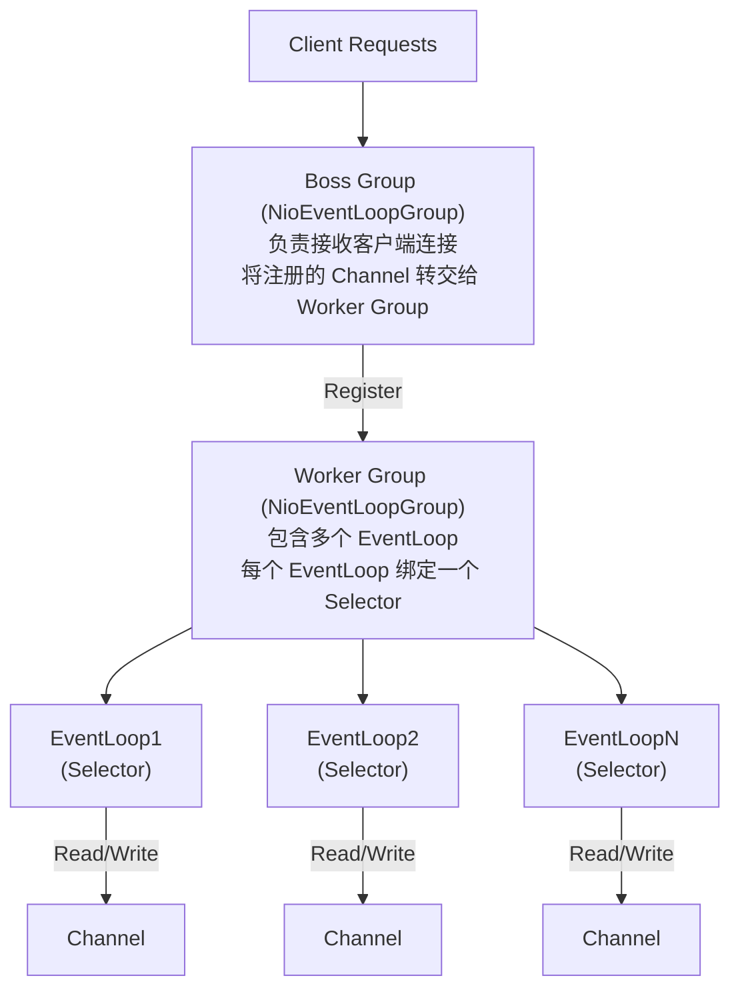

# Netty 与RPC

Netty 是一个异步的、基于事件驱动的网络应用框架，用于快速开发可维护、高性能的网络服务器和客户端。

### 1. 核心原理
- **异步非阻塞 IO**：基于 Java NIO，所有的 I/O 操作都是非阻塞的。
- **Future-Listener 机制**：操作结果通过 Future 对象返回，或通过 Listener 回调通知，避免线程阻塞等待。

### 2. 高性能设计：IO 多路复用
- **传统模式**：每个连接分配一个线程，资源消耗大，并发能力受限。
- **多路复用**：使用一个（或少量）线程监控多个连接。只有当连接真正有数据读写事件时，才进行处理。
- **Reactor 模式**：Netty 采用 Reactor 线程模型，将 IO 事件的侦测和处理分离，极大地提高了系统吞吐量和资源利用率。

### 核心组件模型
Netty 的核心组件包括 `EventLoop`（处理 I/O 操作的线程）、`Channel`（网络连接的抽象）、`ChannelPipeline`（处理链，责任链模式）和 `ChannelHandler`（具体的业务逻辑处理器）。



### 深化实战

**实战案例**：
开发高性能网关时，曾遇到因业务 Handler 处理耗时导致 Netty Worker 线程阻塞，进而导致所有连接上的请求超时（“惊群效应”的变种）。解决方案是：在 Handler 中将耗时的业务逻辑提交到独立的业务线程池执行，释放 IO 线程。

**代码示例**：
```java
// 防止 IO 线程阻塞的关键模式
@Component
public class NettyServerInitializer extends ChannelInitializer<SocketChannel> {
    @Override
    protected void initChannel(SocketChannel ch) {
        ChannelPipeline p = ch.pipeline();
        p.addLast(new HttpRequestDecoder());
        p.addLast(new HttpObjectAggregator(65536));
        p.addLast(new HttpContentCompressor());
        
        // 注意：耗时业务 Handler 必须加在业务线程池 Group 中，
        // 或者在 Handler 内部使用 EventExecutorGroup
        p.addLast(new BusinessHandler()); 
    }
}
```

**对比表格**：

| 特性 | 传统 BIO (Tomcat 8以前) | NIO (Tomcat 8/9) | Netty (NIO框架) |
| :--- | :--- | :--- | :--- |
| **线程模型** | 请求独占线程 (1:1) | 请求复用线程 (M:N) | Reactor 模式 (事件驱动) |
| **并发能力** | 低，受限于线程数 | 高，操作系统级支持 | 极高，优化程度深 |
| **开发复杂度** | 低 | 中 | 较高，需理解 Pipeline/Handler |
| **适用场景** | 简单Web应用 | 高并发Web应用 | RPC、即时通讯、网关 |

## 常见考点
1. **Netty 的零拷贝是如何实现的？**（通过 CompositeByteSlice 组合 Buffer，减少内存拷贝；使用 transferTo 实现文件传输到网卡）
2. **TCP 粘包/拆包怎么解决？**（使用 LengthFieldPrepender、DelimiterBasedFrameDecoder 等解码器在 Pipeline 处理）


## 记忆要点

- 核心机制：基于Java NIO，采用异步非阻塞IO与Future-Listener回调
- 高性能：因为采用Reactor线程模型，所以能分离IO事件侦测与处理
- 组件模型：EventLoop处理IO，Channel抽象连接，Pipeline构建责任链
- 避坑指南：耗时业务必须提交独立线程池，防止阻塞Worker线程引发超时

## 结构化回答

**30 秒电梯演讲：** 利用IO多路复用和事件驱动模型，实现高并发网络通信。打个比方，像是一个熟练的服务员（单线程）同时照看多桌客人，谁举手（有事件）就响应谁，而不是给每桌配个专属服务员。

**展开框架：**
1. **核心机制** — 基于Java NIO，采用异步非阻塞IO与Future-Listener回调
2. **高性能** — 因为采用Reactor线程模型，所以能分离IO事件侦测与处理
3. **组件模型** — EventLoop处理IO，Channel抽象连接，Pipeline构建责任链

**收尾：** 我在项目里踩过坑——开发高性能网关时，曾遇到因业务 Handler 处理耗时导致 Netty Worker 线程阻塞，进而导致所有连接上的请求超时（“惊群效应”的变种）。您想深入聊哪一段：原理、避坑还是对比选型？

## 视频脚本

> 预计时长：2 分钟 | 由浅入深

| 时间 | 画面/字幕 | 口播台词 | 讲解要点 |
|------|----------|----------|----------|
| 0:00 | 标题卡：Netty 与RPC | "Netty 与RPC？一句话——像是一个熟练的服务员（单线程）同时照看多桌客人，谁举手（有事件）就响应谁，而不是给每桌配个专属服务员。" | 开场钩子 |
| 0:40 | 概念动画/示意图 | "利用IO多路复用和事件驱动模型，实现高并发网络通信——像是一个熟练的服务员（单线程）同时照看多桌客人，谁举手（有事件）就响应谁，而不是给每桌配个专属服务员" | 核心定义 |
| 1:20 | 核心机制示意 | "基于Java NIO，采用异步非阻塞IO与Future-Listener回调" | 要点1 |
| 2:00 | 总结卡 | "记住这几条，面试不慌。下期讲进阶追问。" | 收尾 |
