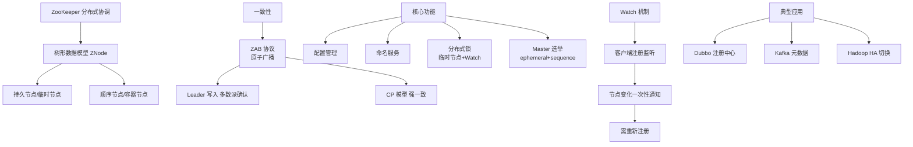

# Zookeeper

ZooKeeper 是一个分布式的协调服务框架，主要用于维护配置信息、命名服务、分布式同步和组服务。

### 1. 数据模型
- **树形结构**：类似 Linux 文件系统，由 znode（数据节点）组成。每个节点路径唯一（如 `/app/config`）。
- **节点类型**：
  - **持久节点**：创建后一直存在，直到显式删除。
  - **临时节点**：绑定客户端会话，会话结束节点自动删除（常用于服务发现）。
  - **顺序节点**：创建时自动追加递增序号。
- **内存存储**：数据存储在内存中，适合存储少量元数据，不适合存大文件。
- **Watcher 机制**：客户端可以监听节点的变化，一旦节点数据变更或子节点增减，客户端会收到通知（一次性触发，需重新注册）。

### 2. 集群角色
ZooKeeper 集群通常由多台服务器组成，角色如下：
- **Leader**：同一时间只有一个，负责处理写请求、发起提案并投票。
- **Follower**：处理读请求，转发写请求给 Leader，并参与投票。
- **Observer**：处理读请求，转发写请求，但不参与投票。用于扩展集群的读能力，不影响写性能（避免投票延迟增加）。

### 3. 一致性保证
采用 **ZAB 协议**（Zookeeper Atomic Broadcast），保证写请求在超过半数节点提交成功后才算成功。
- **原子广播**：Leader 广播事务提案，Follower 执行并回 ACK。
- **崩溃恢复**：Leader 宕机时，基于 epoch（纪元）和 ZXID（事务ID）选出新 Leader，保证数据同步。

### 架构示意图
```text
      Client
    /   |   \
   /    |    \
  /     |     \
[Observer][Follower][Follower]
   |       |       |
   +-------+-------+
           |
        [Leader] <--- 提议投票与广播
```

### 深化实战

**实战案例**：
在 Dubbo 服务治理中，ZK 常用作注册中心。某次网络抖动导致大量服务提供者 Session 断开，由于临时节点特性，服务列表瞬间清空，引发“雪崩”。经验证是客户端重连机制配置不合理。此外，Watcher 的“一次性”特性常导致代码 Bug，忘记在回调中再次注册监听，导致后续状态变更丢失。

**代码示例**：
```java
// 实现分布式锁（利用临时顺序节点）
public boolean tryLock() {
    try {
        // 创建临时顺序节点
        String currentNode = zk.create(LOCK_PATH + "/lock_", 
                data, ZooDefs.Ids.OPEN_ACL_UNSAFE, CreateMode.EPHEMERAL_SEQUENTIAL);
        
        // 获取所有子节点并排序
        List<String> children = zk.getChildren(LOCK_PATH, false);
        Collections.sort(children);
        
        // 判断是否是最小的节点
        String smallestNode = children.get(0);
        if (currentNode.equals(LOCK_PATH + "/" + smallestNode)) {
            return true; // 获取锁成功
        }
        // 否则监听前一个节点（省略监听逻辑代码）
    } catch (Exception e) {
        e.printStackTrace();
    }
    return false;
}
```

**对比表格**：

| 维度 | ZooKeeper | Eureka | Nacos (CP模式) | Etcd |
| :--- | :--- | :--- | :--- | :--- |
| **一致性协议** | ZAB (CP) | AP (最终一致性) | Raft (CP) | Raft (CP) |
| **CAP 选择** | CP (强一致性) | AP (高可用) | 支持 CP/AP 切换 | CP (强一致性) |
| **负载均衡** | 客户端轮询 | 客户端 Ribbon | 支持 DNS/客户端 | 客户端实现 |
| **适用场景** | 选主、分布式锁、Kafka | 服务发现 | 配置中心/服务发现 | Service Discovery |

## 常见考点
1. **ZAB 协议与 Paxos 的区别？**
   - ZAB 专为 ZooKeeper 设计，包含崩溃恢复和消息广播两个阶段，强调顺序性；Paxos 更通用。
2. **CP 还是 AP？**
   - ZooKeeper 是 CP（一致性+分区容错性），保证强一致性，但不可用时 Leader 选举期间服务会短暂中断。
3. **Watcher 为什么是一次性的？**
   - 为了避免服务端维护长连接导致内存压力过大，且防止客户端处理不及时导致事件堆积。
4. **部署节点数为何建议奇数？**
   - 为了避免脑裂并提高容错率。例如 3 台允许挂 1 台，2 台也只能允许挂 1 台，但 3 台的容错性价比更高（$2N+1$）。


## 核心架构图



## 记忆要点

- 本质：分布式CP协调服务，树形Znode结构，基于内存存储元数据
- 节点类型：临时节点绑会话且自删（常用于服务发现），持久节点需显式删
- 集群与一致性：Leader处理写请求，基于ZAB协议保证半数以上提交成功
- 易混对比：Watcher是一次性触发（需重新注册），而Eureka是AP最终一致

## 结构化回答

**30 秒电梯演讲：** 提供高可用的分布式协调服务，管理元数据和集群状态。打个比方，像集群的“调度中心”和“公告栏”，统一管理谁是老大、有哪些成员，出了事通知大家。

**展开框架：**
1. **本质** — 分布式CP协调服务，树形Znode结构，基于内存存储元数据
2. **节点类型** — 临时节点绑会话且自删（常用于服务发现），持久节点需显式删
3. **集群与一致性** — Leader处理写请求，基于ZAB协议保证半数以上提交成功

**收尾：** 我在项目里踩过坑——在 Dubbo 服务治理中，ZK 常用作注册中心。您想深入聊哪一段：原理、避坑还是对比选型？

## 视频脚本

> 预计时长：2 分钟 | 由浅入深

| 时间 | 画面/字幕 | 口播台词 | 讲解要点 |
|------|----------|----------|----------|
| 0:00 | 标题卡：Zookeeper | "Zookeeper？一句话——像集群的“调度中心”和“公告栏”，统一管理谁是老大、有哪些成员，出了事通知大家。" | 开场钩子 |
| 0:40 | 概念动画/示意图 | "提供高可用的分布式协调服务，管理元数据和集群状态——像集群的“调度中心”和“公告栏”，统一管理谁是老大、有哪些成员，出了事通知大家" | 核心定义 |
| 1:20 | 本质示意 | "分布式CP协调服务，树形Znode结构，基于内存存储元数据" | 要点1 |
| 2:00 | 总结卡 | "记住这几条，面试不慌。下期讲进阶追问。" | 收尾 |
