# Kafka

Kafka 是一个高吞吐量、分布式的发布/订阅消息系统，常用于日志收集、流式处理和实时数据管道。

### 1. 核心概念
- **Broker**：Kafka 服务节点，负责存储和转发消息。
- **Topic**：消息的逻辑分类，生产者发送消息到特定 Topic，消费者订阅 Topic。
- **Partition**：Topic 的物理分片，一个 Topic 可包含多个 Partition，以此实现扩展和并行处理。
- **Offset**：消息在 Partition 中的唯一序号（偏移量），标识消息的位置。消费者消费位置由自身维护或提交到 `__consumer_offsets` Topic。
- **Consumer Group**：消费者组，组内每个消费者负责消费 Partition 中的一部分数据，实现负载均衡（组内单播，组间广播）。
- **Replica**：分区的副本，包含 Leader 和 Follower，保证高可用。

### 2. 架构特点
- **高吞吐**：利用顺序磁盘读写和零拷贝技术实现高性能。
- **持久化**：消息持久化到磁盘（Log Segment），支持回溯消费。
- **依赖 ZooKeeper**：利用 ZooKeeper 管理集群元数据、Broker 故障检测和 Controller 选举（注：Kafka 2.8+ 推出 KRaft 模式，逐步去除 ZK 依赖）。

### 消息流转架构
```text
Producer                Broker Cluster               Consumer
   |                          |                         |
   +------->[Topic P0]------->[Leader Replica]        |
   |            |             | (Write)                |
   |            |             v                        +--->[Consumer Group A]
   |            |        [Follower Replica]            |      (Pull Mode)
   |            |             | (Sync)                 |
   +------->[Topic P1]...     |                        +--->[Consumer Group B]
```

### ## 常见考点
1. **如何保证消息不丢失？**
   - Producer：设置 `acks=all`（等待所有 ISR 副本确认）。
   - Broker：配置 `replication.factor >= 3` 和 `min.insync.replicas > 1`，并关闭 `unclean.leader.election.enable`。
   - Consumer：关闭 `enable.auto.commit`，业务逻辑处理成功后手动提交 offset。
2. **如何保证消息顺序？**
   - 在 Topic 内部，Partition 内部有序。确保需要有序的消息发送到同一个 Partition（如指定 Key 或自定义 Partitioner），且消费者单线程消费或按 Partition 加锁。
3. **ZooKeeper 在 Kafka 中具体作用？**
   - 存储 Broker 元数据、Controller 选举、Topic 配置、ACL 权限管理和 Consumer Offset（旧版本）。
4. **Zero Copy 原理？**
   - 数据直接从磁盘文件复制到网卡接口，跳过用户态和内核态的上下文切换（使用 `sendfile` 系统调用），减少 CPU 消耗。

### 💡 深化实战
**实战案例**：在日志采集场景中，曾遇到因业务 KeyError 导致消费线程挂起，Partition 消费进度卡住，引发 Lag 告警。**解决**：在 Consumer 端增加全局异常捕获，将无法解析的消息发送到“死信队列”（DLQ）并手动提交 Offset，保证整体链路流畅。

**代码示例（Java Producer）**：
```java
// 保证消息顺序且不丢失的关键配置
Properties props = new Properties();
props.put("acks", "all"); // 等待所有ISR副本确认
props.put("retries", 3); // 网络异常重试
props.put("max.in.flight.requests.per.connection", 1); // 限制并发数，防止乱序
props.put("enable.idempotence", "true"); // 开启幂等性，防止重试导致重复
```

**对比表格：Kafka 消费模型**
| 特性 | 点对点 (Queue) | 发布/订阅 (Pub-Sub) | Kafka (CG 模型) |
| :--- | :--- | :--- | :--- |
| **消费逻辑** | 一条消息只被一个消费者消费 | 一条消息被所有订阅者消费 | 同组内单播，不同组间广播 |
| **状态管理** | 服务端管理 | 服务端管理 | 客户端维护 Offset (灵活) |
| **扩展性** | 弱 | 强 | 极强 (增加 Group 即扩容) |


## 核心架构图

```mermaid
flowchart TD
    A[Kafka 架构] --> B[Producer 生产者]
    B --> C[Topic 主题 逻辑分类]
    C --> D[Partition 分区<br/>并行单元]
    D --> E[Replica 副本 Leader+Follower]
    E --> F[Broker 代理节点]
    F --> G[Consumer 消费者]
    G --> H[Consumer Group<br/>分区内独占消费]
    I[写入流程] --> J[选分区 key hash 或轮询]
    J --> K[Leader 接收 追加到 Log]
    K --> L[Follower 拉取同步 ISR]
    L --> M[ack 策略 0/1/all]
    N[高吞吐] --> O[顺序写磁盘]
    N --> P[零拷贝 sendfile]
    N --> Q[Page Cache 批量]
    N --> R[分区并行]
    S[消费模型] --> T[At-Most-Once]
    S --> U[At-Least-Once 默认]
    S --> V[Exactly-Once 幂等+事务]
```


## 核心知识点图


## 记忆要点

- 架构核心：Topic分多Partition，Partition内有序，多副本(Leader/Follower)保高可用
- 消费模型：Consumer Group实现组内单播，组间广播，由客户端维护Offset
- 防丢失三连：Producer配acks=all，Broker开副本机制，Consumer手动提交Offset
- 高性能：因为采用顺序读写和零拷贝(sendfile)，所以高吞吐且低CPU消耗

## 结构化回答

**30 秒电梯演讲：** 基于分区的分布式消息队列，实现高吞吐量的数据发布与订阅。打个比方，像超级高速的快递分拣中心，把包裹按类别和区域分流，保证大流量不拥堵。

**展开框架：**
1. **架构核心** — Topic分多Partition，Partition内有序，多副本(Leader/Follower)保高可用
2. **消费模型** — Consumer Group实现组内单播，组间广播，由客户端维护Offset
3. **防丢失三连** — Producer配acks=all，Broker开副本机制，Consumer手动提交Offset

**收尾：** 我在项目里踩过坑——在日志采集场景中，曾遇到因业务 KeyError 导致消费线程挂起，Partition 消费进度卡住，引发 Lag 告警。您想深入聊哪一段：原理、避坑还是对比选型？

## 视频脚本

> 预计时长：2 分钟 | 由浅入深

| 时间 | 画面/字幕 | 口播台词 | 讲解要点 |
|------|----------|----------|----------|
| 0:00 | 标题卡：Kafka | "Kafka？一句话——像超级高速的快递分拣中心，把包裹按类别和区域分流，保证大流量不拥堵。" | 开场钩子 |
| 0:40 | 概念动画/示意图 | "基于分区的分布式消息队列，实现高吞吐量的数据发布与订阅——像超级高速的快递分拣中心，把包裹按类别和区域分流，保证大流量不拥堵" | 核心定义 |
| 1:20 | 架构核心示意 | "Topic分多Partition，Partition内有序，多副本(Leader/Follower)保高可用" | 要点1 |
| 2:00 | 总结卡 | "记住这几条，面试不慌。下期讲进阶追问。" | 收尾 |
