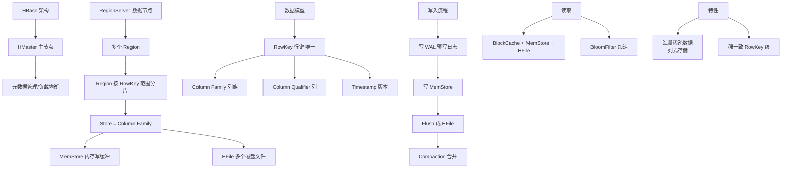

# Hbase

HBase 是一个高可靠性、高性能、面向列、可伸缩的分布式数据库，利用 Hadoop HDFS 作为其文件存储系统。

### 1. 核心概念
- **列式存储**：准确地说是面向**列族**存储。表由行和列族组成，列族下包含多个列限定符。数据按列族存储，同一列族的数据物理上在一起。
- **稀疏性**：表是稀疏的，对于为 null 的列不占用存储空间。
- **多维映射**：数据模型为 `(RowKey, ColumnFamily:Column, Timestamp) -> Value`。同一 RowKey 下不同版本数据按时间戳倒序排列。

### 2. 架构依赖
- **HDFS**：提供底层数据的持久化存储（HFile）和高容错性。
- **MapReduce**：提供海量数据的并行计算能力（用于批量计算）。
- **ZooKeeper**：负责集群的 Master 选举（Master 只是协调者，非单点瓶颈）、RegionServer 监控和元数据入口（`hbase:meta` 表位置）。

### 3. 存储优势与机制
由于数据按列族存储，查询时只需读取涉及的列，减少 I/O。
- **LSM-Tree (Log-Structured Merge-Tree)**：写入时先写 WAL（预写日志）再写 MemStore（内存），异步刷盘成 HFile。适合海量数据的随机写。
- **Region 切分**：随着数据增大，Region 会自动分裂并迁移到不同 RegionServer 实现负载均衡。
- **Bloom Filter**：在内存中维护布隆过滤器，快速判断某行数据是否不在该 HFile 中，避免无效磁盘 I/O。

### 架构读写流程
```text
Client
  |
  +---> 1. 查 ZooKeeper 找 hbase:meta 位置
  |
  +---> 2. 查 meta 表找 RegionServer (RowKey路由)
  |
  v
[RegionServer]
  |
  +---> Write: WAL -> MemStore
  |
  +---> Read: BlockCache -> MemStore -> HFile (Disk)
```

### ## 常见考点
1. **RowKey 设计原则？**
   - 长度原则：尽量短（占用内存）。
   - 散列原则：高位散列（如加盐、MD5前缀），避免热点。
   - 唯一性：必须唯一。
   - 排序原则：利用字典序特性，将经常一起读取的数据存储在相近位置。
2. **HBase 与 Hive 的区别？**
   - HBase：NoSQL，面向行/列的实时随机读写，OLTP 场景。
   - Hive：数据仓库，基于 HDFS 的批处理，SQL 查询（MR/Tez/Spark），OLAP 场景，延迟高。
3. **MemStore 刷盘机制？**
   - 达到 `hbase.hregion.memstore.flush.size`（默认 128MB）。
   - RegionServer 全局 MemStore 占用达到堆内存的 `heap * 0.4 * 0.95`，强制刷盘防止 OOM。
4. **为什么 HBase 写得快？**
   - 因为采用了 LSM-Tree 架构，将随机写转换为顺序写（追加到 MemStore 和 WAL），极大提高了写入吞吐量。

### 💡 深化实战
**实战案例**：在电商订单系统中，直接使用时间戳作为 RowKey 开头导致写入热点（所有新订单集中在最后一个 Region）。**解决**：RowKey 设计改为 `MD5(UserId) + Reverse(Timestamp)`，利用用户 ID 散列写入，同时利用倒序时间戳方便查询最近订单。

**代码示例（Java Scan 过滤器）**：
```java
// 避免全表扫描，使用 RowKey Filter 和 PageFilter 大幅提升查询效率
Scan scan = new Scan();
scan.setRowPrefixFilter(Bytes.toBytes("rowkey_prefix")); // 前缀过滤，定位Region
scan.setFilter(new PageFilter(100)); // 限制返回数量
scan.setCaching(50); // 客户端缓存 RPC 次数
try (ResultScanner scanner = table.getScanner(scan)) {
    for (Result result : scanner) { /* ... */ }
}
```

**对比表格：HBase 读路径与优化**
| 组件 | 作用 | 性能影响 | 优化手段 |
| :--- | :--- | :--- | :--- |
| **BlockCache** | 读缓存 (LRU/LRU/Elevator) | 读加速 | 调整 `hfile.block.cache.size` (默认 0.4) |
| **Bloom Filter** | 快速判断 Key 不存在 | 减少磁盘 I/O | 开启 `RowCol` 模式 (高查询精确度) |
| **MemStore** | 写缓存/读最新数据 | 写加速/读合并 | 避免频繁 Flush，减少频繁 Compaction |
| **HFile** | 磁盘数据文件 | 读瓶颈 | 开启数据压缩 (Snappy/GZ) 减少 IO |


## 核心架构图


## 核心知识点图


## 记忆要点

- 核心模型：多维映射(RowKey, CF:Column, Timestamp)->Value，面向列族稀疏存储
- 写入极快：因为采用LSM-Tree架构，先写WAL与MemStore内存，再异步刷盘
- RowKey设计：长度短、唯一、必须高位散列（如加盐/哈希），避免数据热点
- 依赖组件：HDFS负责持久化，ZooKeeper负责Master选举与meta表路由寻址

## 结构化回答

**30 秒电梯演讲：** 构建在HDFS之上的分布式列式数据库，支持海量数据实时读写。打个比方，像是个巨大的多维Excel，只把填了数据的格子存起来，且按列归类，查特定列极快。

**展开框架：**
1. **核心模型** — 多维映射(RowKey, CF:Column, Timestamp)->Value，面向列族稀疏存储
2. **写入极快** — 因为采用LSM-Tree架构，先写WAL与MemStore内存，再异步刷盘
3. **RowKey设计** — 长度短、唯一、必须高位散列（如加盐/哈希），避免数据热点

**收尾：** 我在项目里踩过坑——在电商订单系统中，直接使用时间戳作为 RowKey 开头导致写入热点（所有新订单集中在最后一个 Region）。您想深入聊哪一段：原理、避坑还是对比选型？

## 视频脚本

> 预计时长：2 分钟 | 由浅入深

| 时间 | 画面/字幕 | 口播台词 | 讲解要点 |
|------|----------|----------|----------|
| 0:00 | 标题卡：Hbase | "Hbase？一句话——像是个巨大的多维Excel，只把填了数据的格子存起来，且按列归类，查特定列极快。" | 开场钩子 |
| 0:40 | 概念动画/示意图 | "构建在HDFS之上的分布式列式数据库，支持海量数据实时读写——像是个巨大的多维Excel，只把填了数据的格子存起来，且按列归类，查特定列极快" | 核心定义 |
| 1:20 | 核心模型示意 | "多维映射(RowKey, CF:Column, Timestamp)->Value，面向列族稀疏存储" | 要点1 |
| 2:00 | 总结卡 | "记住这几条，面试不慌。下期讲进阶追问。" | 收尾 |
