# MongoDB

MongoDB 是一个基于文档的、面向集合的开源 NoSQL 数据库，由 C++ 编写，旨在为 Web 应用提供可扩展的高性能数据存储。

### 1. 数据模型
- **文档**：数据以 BSON（二进制 JSON）格式存储，类似于 JSON 对象，支持嵌套文档和数组。BSON 支持 JSON 没有的数据类型（如 Date, ObjectId, Binary）。
- **模式自由**：集合中的文档不需要具有相同的字段结构，便于灵活迭代，但建议生产环境规范模式。

### 2. 主要特点
- **高性能**：支持内存映射存储引擎，将数据文件映射到内存，提供高性能的读写速度。同时包含 WiredTiger 引擎，支持文档级锁和压缩。
- **索引支持**：支持对文档任意属性建立索引（包括嵌套字段），支持 B-Tree 结构，加快查询速度。
- **水平扩展**：支持分片，通过增加节点实现负载均衡和数据扩容。通过 Config Server 存储元数据，Mongos 做路由。
- **查询丰富**：支持丰富的查询语言，支持聚合操作和 MapReduce。

### 3. 适用场景
适合数据结构不固定、需要高吞吐量读写的场景，如内容管理系统、日志记录、物联网设备信息等。

### 分片架构示意图
```text
[Client]
    |
    v
[Mongos Router] (Query Router)
    |
    +-------------------+
    |                   |
[Shard A]          [Shard B]         [Shard C]
(Primary/Secondary) (Primary/Secondary)
    |                   |
    +-------[Config Server] (Metadata)
```

### ## 常见考点
1. **WiredTiger 与 MMAPv1 引擎区别？**
   - WiredTiger（默认）：文档级锁，支持压缩，Checkpoint 快照机制，性能更好。
   - MMAPv1（旧版）：集合级锁，内存映射文件，无压缩。
2. **MongoDB 事务支持？**
   - 4.0 版本开始支持副本集上的多文档 ACID 事务；4.2 版本支持分片集群上的分布式事务（两阶段提交）。
3. **什么是 ObjectId？**
   - 默认的主键类型，12 字节。包含：4字节时间戳 + 5字节随机值 + 3字节自增计数器。保证全局唯一且大致有序。
4. **_id 索引的作用？**
   - 默认在 `_id` 字段上创建唯一索引，如果分片，通常使用 `_id` 作为片键以保证数据分布均匀。

### 💡 深化实战
**实战案例**：在社交 Feed 流场景中，直接使用 `_id` 作为分片键导致所有数据写入集中在分片集群的某个 Chunk，产生 Jumbo Chunk（不可分块）告警。**解决**：重新设计片键为 `{ "userId": 1, "_id": 1 }` 的复合哈希索引，确保数据按用户维度均匀分片。

**代码示例（聚合管道）**：
```javascript
// 实战：多阶段聚合，先过滤再分组，减少内存消耗
db.orders.aggregate([
  { $match: { status: "COMPLETED", createTime: { $gte: ISODate("2023-01-01") } } },
  { $group: { _id: "$userId", totalSpent: { $sum: "$amount" } } },
  { $sort: { totalSpent: -1 } },
  { $limit: 10 }
]);
```

**对比表格：MongoDB 储存引擎**
| 特性 | WiredTiger (WT) | MMAPv1 (已废弃) | In-Memory (专用于) |
| :--- | :--- | :--- | :--- |
| **锁级别** | 文档级锁 | 集合/数据库级锁 | 文档级锁 |
| **压缩** | 支持 (Snappy/Zlib) | 不支持 | 不涉及 |
| **Checkpoint** | 支持快照 | 不支持 | 持久化到磁盘 |
| **适用场景** | 通用高并发生产环境 | 旧版本兼容 | 极低延迟实时计算 |


## 核心架构图

```mermaid
flowchart TD
    classDef start fill:#4CAF50,color:#fff
    classDef process fill:#2196F3,color:#fff
    classDef decision fill:#FF9800,color:#fff
    classDef special fill:#9C27B0,color:#fff
    classDef error fill:#f44336,color:#fff
    classDef info fill:#607D8B,color:#fff
    class A start
    class B process
    class BSON decision
    class C special
    class Collection error
    class D info
    class Document start
    class E process
    class F decision
    class G special
    class H error
    class I info
    class J start
    class JSON process
    class K decision
    class Key special
    class L error
    class M info
    class MongoDB start
    class MySQL process
    class N decision
    class O special
    class P error
    class Primary info
    class Q start
    class R process
    class Replica decision
    class S special
    class Schema error
    class Secondary info
    class Set start
    class Shard process
    class Sharding decision
    class T special
    class TTL error
    class Tree info
    class U start
    class V process
    class W decision
    class WiredTiger special
    class X error
    class Y info
    class Z start
    class br process
    A[MongoDB 文档数据库] --> B[BSON 二进制 JSON]
    B --> C[Collection 集合<br/>对应表]
    B --> D[Document 文档<br/>对应行]
    D --> E[动态 Schema 灵活]
    F[存储引擎] --> G[WiredTiger 默认]
    G --> H[B-Tree 索引]
    G --> I[文档级锁 高并发]
    J[索引类型] --> K[单字段/复合]
    J --> L[地理空间 2dsphere]
    J --> M[文本索引 TTL 索引]
    N[复制集 Replica Set] --> O[Primary + Secondary]
    O --> P[自动故障转移]
    O --> Q[读写分离]
    R[分片 Sharding] --> S[Shard Key 分片键]
    S --> T[数据分散到多节点]
    U[适用场景] --> V[文档结构多变]
    U --> W[快速迭代产品]
    U --> X[内容管理/日志]
    Y[对比] --> Z[MySQL 强事务<br/>MongoDB 灵活文档]
```



## 记忆要点

- 数据模型：面向集合存储，以BSON(二进制JSON)格式存储，支持嵌套且模式自由
- 存储引擎：默认WiredTiger，支持文档级锁与Snappy压缩，性能优于旧版MMAPv1
- 扩展能力：通过分片水平扩展，Mongos路由，支持4.0+版本多文档ACID事务
- 主键设计：ObjectId由(时间戳+随机值+计数器)组成，全局唯一且大致按时间有序

## 结构化回答

**30 秒电梯演讲：** 基于文档的NoSQL数据库，数据格式灵活，易于水平扩展。打个比方，像是一个超级智能的文件夹，直接存各种格式的文件，还能自动把文件夹复制多份存到不同电脑上。

**展开框架：**
1. **数据模型** — 面向集合存储，以BSON(二进制JSON)格式存储，支持嵌套且模式自由
2. **存储引擎** — 默认WiredTiger，支持文档级锁与Snappy压缩，性能优于旧版MMAPv1
3. **扩展能力** — 通过分片水平扩展，Mongos路由，支持4.0+版本多文档ACID事务

**收尾：** 我在项目里踩过坑——在社交 Feed 流场景中，直接使用 `_id` 作为分片键导致所有数据写入集中在分片集群的某个 Chunk，产生 Jumbo Chunk（不可分块）告警。您想深入聊哪一段：原理、避坑还是对比选型？

## 视频脚本

> 预计时长：2 分钟 | 由浅入深

| 时间 | 画面/字幕 | 口播台词 | 讲解要点 |
|------|----------|----------|----------|
| 0:00 | 标题卡：MongoDB | "MongoDB？一句话——像是一个超级智能的文件夹，直接存各种格式的文件，还能自动把文件夹复制多份存到不同电脑上。" | 开场钩子 |
| 0:40 | 概念动画/示意图 | "基于文档的NoSQL数据库，数据格式灵活，易于水平扩展——像是一个超级智能的文件夹，直接存各种格式的文件，还能自动把文件夹复制多份存到不同电脑上" | 核心定义 |
| 1:20 | 数据模型示意 | "面向集合存储，以BSON(二进制JSON)格式存储，支持嵌套且模式自由" | 要点1 |
| 2:00 | 总结卡 | "记住这几条，面试不慌。下期讲进阶追问。" | 收尾 |
