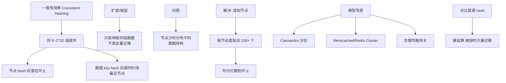

# 一致性Hash（多米诺down机）

一致性Hash（Consistent Hashing）是一种分布式哈希技术，旨在解决分布式系统中的数据定位与负载均衡问题。

### 核心概念
- **Hash 环**：将整个哈希空间（通常是 $0$ 到 $2^{32}-1$）构建成一个虚拟的闭环。
- **节点映射**：集群中的每个节点被分配一个 Token（通常是 Hash(节点IP) 或 虚拟节点 ID），映射到环上。
- **数据分布**：数据的 Primary Key 经过哈希计算后也会得到一个 Key，根据该 Key 在环上的位置，顺时针寻找第一个遇到的节点，即为该数据负责的节点。

### 虚拟节点
为了解决数据倾斜问题（节点少导致部分节点负载过高），引入虚拟节点。每个物理节点对应环上的多个虚拟节点。

### 解决的问题（多米诺 down 机）
在传统的取模哈希（Modulo Hashing）中，如果节点宕机，节点数量 $N$ 发生变化，所有数据的位置都需要重新计算（$Hash \pmod N$），导致大量数据迁移和缓存雪崩。
而在一致性哈希中，当节点宕机时，只有该节点负责的数据会迁移到顺时针的下一个节点。虽然这会导致下一个节点负载瞬间倍增（引发“多米诺骨牌”效应，导致连锁宕机），但它限制了受影响的数据范围，仅涉及相邻节点，而非全集群数据重平衡。引入虚拟节点后，负载会更均匀地分摊到环上的多个物理节点，有效缓解单点压力。

### 一致性 Hash 示意图
```text
              Hash Ring
            /          \\
       /---V---\\      /---V---\\
      |  N2    |      |  N1    |
       \\---|---/      \\---|---/
           |              |
      Key: 100  Key: 200  
        (N2)      (N1) 
```
*(Key 落在 N1 和 N2 之间，顺时针查找，由 N1 处理)*

### ## 常见考点
1. **如何保证数据均匀分布？**
   - 增加虚拟节点的数量。虚拟节点越多，数据分布越均匀，但维护成本越高（通常一个物理节点对应 150-200 个虚拟节点）。
2. **平滑扩容/缩容过程？**
   - 新增节点时，它接管环上逆时针方向第一个节点的一部分数据（或自身虚拟节点覆盖的数据范围），不需要迁移全量数据。
3. **一致性 Hash 在 Redis 集群中的应用？**
   - Redis Cluster 采用哈希槽，虽然不完全等同于一致性 Hash，但也是将数据分片到 16384 个槽位，节点负责管理一部分槽位，原理类似。
4. **如何解决节点失效后的“雪崩”风险？**
   - 结合限流、降级策略，以及快速自动扩容机制。在实现上，副本机制可以确保数据不丢失，迁移时逐步进行。

### 💡 深化实战
**实战案例**：在自研 RPC 框架中使用一致性 Hash 做负载均衡时，曾因单台物理节点对应虚拟节点过少（如仅2个），导致某高配服务器宕机后，请求全量打偏到下一台服务器，CPU 飙升至 100% 导致级联雪崩。**解决**：将虚拟节点数提升至 160，并引入“健康检查摘除”与“请求重试”机制。

**代码示例（Go 一致性 Hash）**：
```go
// 简单的一致性 Hash 实现 (不带虚拟节点逻辑)
func (m *Map) Get(key string) string {
    if len(m.hashKeys) == 0 {
        return ""
    }
    hash := int(m.hash([]byte(key)))
    // 二分查找顺时针第一个节点
    idx := sort.Search(len(m.hashKeys), func(i int) bool {
        return m.hashKeys[idx] >= hash
    })
    return m.hashMap[m.hashKeys[idx%len(m.hashKeys)]]
}
```

**对比表格：哈希算法选型**
| 算法 | 算法逻辑 | 扩容影响 | 数据分布 | 适用场景 |
| :--- | :--- | :--- | :--- | :--- |
| **Hash 取模** | `hash(key) % N` | 全部失效 (影响大) | 节点少时不均匀 | 静态集群、本地缓存 |
| **一致性 Hash** | 环状顺时针查找 | 仅邻居受影响 | 节点少时倾斜，虚拟节点改善 | 分布式缓存、RPC 负载均衡 |
| **哈希槽** | Key 映射到固定槽位 (0-16383) | 迁移指定槽位 | 易于控制 | Redis Cluster |


## 核心架构图



## 记忆要点

- 核心机制：构建首尾相连的Hash环，数据顺时针寻找环上最近节点
- 优势：节点宕机时仅影响相邻节点，对比Hash取模避免了全量数据重新迁移
- 痛点：节点少时易数据倾斜，单点宕机易压垮邻居引发多米诺级联雪崩
- 解法：引入虚拟节点，打散物理节点位置以实现数据均匀分布与压力分摊

## 结构化回答

**30 秒电梯演讲：** 将节点和数据映射到哈希环上，顺时针归属，扩缩容仅影响相邻节点。打个比方，像坐圆桌吃饭，每人负责一段菜，有人走了，他的菜顺时针给下一个人吃。

**展开框架：**
1. **核心机制** — 构建首尾相连的Hash环，数据顺时针寻找环上最近节点
2. **优势** — 节点宕机时仅影响相邻节点，对比Hash取模避免了全量数据重新迁移
3. **痛点** — 节点少时易数据倾斜，单点宕机易压垮邻居引发多米诺级联雪崩

**收尾：** 我在项目里踩过坑——在自研 RPC 框架中使用一致性 Hash 做负载均衡时，曾因单台物理节点对应虚拟节点过少（如仅2个），导致某高配服务器宕机后，请求全量打偏到下一台服务器，CPU 飙升至 100% 导致级联雪崩。您想深入聊哪一段：原理、避坑还是对比选型？

## 视频脚本

> 预计时长：3 分钟 | 由浅入深

| 时间 | 画面/字幕 | 口播台词 | 讲解要点 |
|------|----------|----------|----------|
| 0:00 | 标题卡：一致性Hash（多米诺down机） | "一致性Hash（多米诺down机）？一句话——像坐圆桌吃饭，每人负责一段菜，有人走了，他的菜顺时针给下一个人吃。" | 开场钩子 |
| 0:45 | 概念动画/示意图 | "将节点和数据映射到哈希环上，顺时针归属，扩缩容仅影响相邻节点——像坐圆桌吃饭，每人负责一段菜，有人走了，他的菜顺时针给下一个人吃" | 核心定义 |
| 1:30 | 核心机制示意 | "构建首尾相连的Hash环，数据顺时针寻找环上最近节点" | 要点1 |
| 2:15 | 优势示意 | "节点宕机时仅影响相邻节点，对比Hash取模避免了全量数据重新迁移" | 要点2 |
| 3:00 | 总结卡 | "记住这几条，面试不慌。下期讲进阶追问。" | 收尾 |
