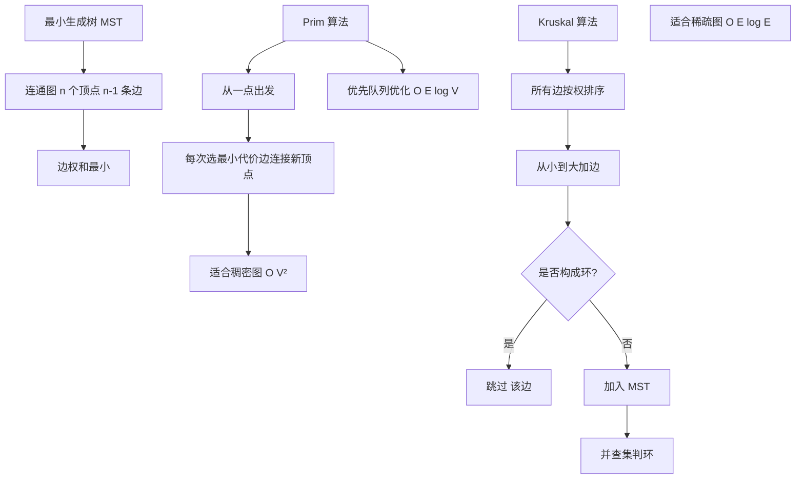

# Partitioners（计算primary key token的hash函数）

Partitioner（分区器）是 Cassandra 中用于计算数据 Primary Key 的哈希值，从而决定数据在集群中存储位置的组件。

### 核心作用
- **Hash 计算**：Partitioner 将每一行数据的 Partition Key（不仅仅是 Primary Key，若是 Composite Key 则仅用 Partition Key 部分）转换为一个 64 位或 128 位的 Token。
- **数据定位**：根据 Token 在一致性哈希环上的位置，确定数据由哪个节点负责。

### 常见分区策略
虽然 Cassandra 支持多种分区器，但最常用的是 `Murmur3Partitioner`：
- **Murmur3Partitioner**：使用 MurmurHash 算法，生成的 Token 范围是 $-2^{63}$ 到 $2^{63}-1$，分布非常均匀，是目前的默认配置。
- **RandomPartitioner**：使用 MD5 哈希，生成的 Token 范围是 0 到 $2^{127}-1$，旧版本常用，已被 Murmur3 取代。
- **ByteOrderedPartitioner**：基于字节序排列，数据有序但容易导致热点，通常不推荐。

### 数据分布图
```text
Client Request (PK: "user1")
       |
       v
[ Partitioner: Murmur3Hash ]
       |
       v
Token: 34529802345...
       |
       v
  Token Ring
   /      \
[Node A]  [Node B] (如果 Token 落在 A 的范围)
```

### 注意事项
一旦集群选定 Partitioner 并写入数据后，无法更改，因为数据位置的计算逻辑完全依赖于它。更改通常需要导出数据、清空集群、修改配置并重新导入。

### 实战案例
某业务早期使用 `ByteOrderedPartitioner` 以支持按时间前缀的 Range 查询，但随着写入量增加，最新时间段的 Token 导致单节点 CPU 打满（热点问题）。最终不得不重构代码使用 `Murmur3Partitioner` 并在应用层维护二级索引来解决分布不均问题。

### 代码示例
```java
// Java Driver 使用 Murmur3Partitioner 计算Token
import com.datastax.driver.core.Token;
import com.datastax.driver.core.TokenFactory;
import com.datastax.driver.core.Murmur3Partitioner;

Murmur3Partitioner partitioner = new Murmur3Partitioner();
Token token = partitioner.getToken("user123");
System.out.println("Calculated Token: " + token);
```

## 常见考点
- **Ordered Partitioner 的弊端**：除了导致热点，还有什么问题？（Range Scan 性能下降，因为数据分散在不同节点）。
- **Composite Key**：如果是复合主键，Partitioner 只哈希哪一部分？（只哈希 Partition Key，Clustering Key 不参与哈希，用于节点内排序）。
- **Token 计算**：如何用 `nodetool` 查看节点的 Token 范围？（`nodetool describe ring`）。


## 核心架构图



## 记忆要点

- 定位作用：Partitioner 仅哈希 Partition Key 生成 Token，从而决定数据在哈希环上的存储节点。
- 策略对比：默认用 Murmur3（均衡）；ByteOrdered 虽支持有序但极易致热点，坚决避坑。
- 复合主键：只哈希首列 Partition Key，Clustering Key 仅用于节点内排序，不参与哈希计算。
- 致命限制：因为数据物理位置依赖 Token 计算，所以集群一旦选定 Partitioner 终身不可更改。

## 结构化回答

**30 秒电梯演讲：** 通过哈希函数将主键转换为 Token，决定数据落在哈希环的哪个位置。打个比方，像给每个包裹（数据）算个邮编，根据邮编决定送到哪个邮局（节点）。

**展开框架：**
1. **定位作用** — Partitioner 仅哈希 Partition Key 生成 Token，从而决定数据在哈希环上的存储节点。
2. **策略对比** — 默认用 Murmur3（均衡）；ByteOrdered 虽支持有序但极易致热点，坚决避坑。
3. **复合主键** — 只哈希首列 Partition Key，Clustering Key 仅用于节点内排序，不参与哈希计算。

**收尾：** 我在项目里踩过坑——某业务早期使用 `ByteOrderedPartitioner` 以支持按时间前缀的 Range 查询，但随着写入量增加，最新时间段的 Token 导致单节点 CPU 打满（热点问题）。您想深入聊哪一段：原理、避坑还是对比选型？

## 视频脚本

> 预计时长：3 分钟 | 由浅入深

| 时间 | 画面/字幕 | 口播台词 | 讲解要点 |
|------|----------|----------|----------|
| 0:00 | 标题卡：Partitioners（计算pri… | "Partitioners（计算primary key token的hash函数）？一句话——像给每个包裹（数据）算个邮编，根据邮编决定送到哪个邮局（节点）。" | 开场钩子 |
| 0:45 | 概念动画/示意图 | "通过哈希函数将主键转换为 Token，决定数据落在哈希环的哪个位置——像给每个包裹（数据）算个邮编，根据邮编决定送到哪个邮局（节点）" | 核心定义 |
| 1:30 | 定位作用示意 | "Partitioner 仅哈希 Partition Key 生成 Token，从而决定数据在哈希环上的存储节点。" | 要点1 |
| 2:15 | 策略对比示意 | "默认用 Murmur3（均衡）；ByteOrdered 虽支持有序但极易致热点，坚决避坑。" | 要点2 |
| 3:00 | 总结卡 | "记住这几条，面试不慌。下期讲进阶追问。" | 收尾 |
