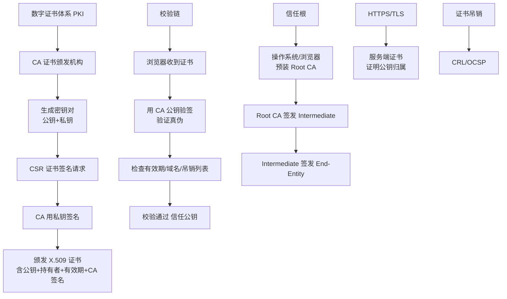

# 两种可用的复制策略

Cassandra 提供了多种数据复制策略（Replication Strategy），用于决定数据副本如何在集群中分布。策略在创建 Keyspace 时指定，一旦设置很难更改（尤其是 SimpleStrategy 转 NetworkTopologyStrategy）。

### 1. SimpleStrategy（简单策略）
- **适用场景**：仅适用于单数据中心（单 DC）部署或开发测试环境。
- **工作机制**：将第一个副本放在 Partitioner 计算出的 Token 所在节点，其余副本顺时针放置在环上的后续节点。
- **缺点**：无法感知机架拓扑，可能导致多个副本落在同一个机架或交换机下，机架故障可能导致数据丢失。
- **示例**：
  ```sql
  CREATE KEYSPACE Excelsior WITH REPLICATION = { 'class' : 'SimpleStrategy', 'replication_factor' : 3 };
  ```

### 2. NetworkTopologyStrategy（网络拓扑策略）
- **适用场景**：适用于复杂的多数据中心或多机架部署，生产环境推荐。
- **工作机制**：可以独立指定每个数据中心分别存储多少个副本。在 DC 内部，它会利用 `Snitch` 提供的拓扑信息，尽量将副本分布在不同的机架，以提高容错能力。
- **故障恢复**：即使一个数据中心完全宕机，其他 DC 的副本仍可提供服务。
- **示例**：
  ```sql
  CREATE KEYSPACE Excalibur WITH REPLICATION = { 'class' : 'NetworkTopologyStrategy', 'dc1' : 3, 'dc2' : 2 };
  ```
  上述表示在数据中心 dc1 存 3 份副本，在 dc2 存 2 份副本。

| 维度 | SimpleStrategy | NetworkTopologyStrategy |
| :--- | :--- | :--- |
| **拓扑感知** | 无（仅顺时针） | 有（感知 DC 和 Rack） |
| **多 DC 支持** | 不支持 | 原生支持，可配每个 DC 副本数 |
| **容灾能力** | 弱（机架故障可能丢数据） | 强（可容忍 DC 级故障） |
| **生产推荐** | 否 | 是 |

### 策略选择与 Snitch 的配合
复制策略必须配合 Snitch（如 `SimpleSnitch`, `RackInferringSnitch`, `GossipingPropertyFileSnitch`）工作才能获取正确的拓扑信息。

### 实战案例
某初创公司早期使用 `SimpleStrategy`，业务扩展到双机房容灾时直接修改配置为 `NetworkTopologyStrategy`，导致查询时 Coordinator 无法正确路由副本，引发大量超时。正确做法是新建 Keyspace 使用 NTS 策略，然后通过 `sstableloader` 或 `INSERT INTO ... SELECT` 迁移数据。

## 常见考点
- **策略变更**：如何从 SimpleStrategy 迁移到 NetworkTopologyStrategy？（通常需要创建新 Keyspace，利用 `sstableloader` 迁移数据）。
- **Replication Factor（RF）**：RF 最好不要超过节点数，否则写请求会报错（Unavailable）。
- **Local Quorum**：在 NetworkTopologyStrategy 下，`LOCAL_QUORUM` 是如何计算的？（基于单个 DC 内的 RF，即 `RF / 2 + 1`）。

## 技术原理

**SimpleStrategy 仅用于单数据中心，顺时针放置副本**
SimpleStrategy 不感知集群拓扑，只按 Partitioner 计算出的 Token 在环上顺时针依次放置副本。它适用于单数据中心（单 DC）或开发测试环境。缺点是无法感知机架，可能导致多个副本落在同一机架或同一交换机下，机架故障时多个副本同时丢失，存在数据丢失风险。

**NetworkTopologyStrategy 支持多数据中心和机架感知**
NetworkTopologyStrategy（NTS）是生产环境的必选项。它通过 Snitch 获取集群的 DC（数据中心）和 Rack（机架）拓扑信息，可以为每个 DC 独立指定副本数（如 `dc1: 3, dc2: 2`）。在 DC 内部，NTS 会尽量将副本分散到不同机架，避免单机架故障丢数据，同时支持跨机房容灾。

**NetworkTopologyStrategy 可指定每个 DC 的副本数**
NTS 的配置粒度细到 DC 级别：`'dc1': 3, 'dc2': 2` 表示 dc1 存 3 份副本、dc2 存 2 份。即使整条海底光缆切断导致 dc2 完全不可达，dc1 仍可独立提供服务（配合 LOCAL_QUORUM 一致性级别），实现真正的机房级容灾。

**策略在 Keyspace 级别定义**
复制策略在创建 Keyspace 时指定，一旦设定极难直接修改——因为 SimpleStrategy 和 NTS 的 Token 分布逻辑完全不同，直接 ALTER 会导致 Coordinator 路由错乱、查询超时。正确做法是新建使用 NTS 的 Keyspace，通过 `sstableloader` 迁移数据。

## 代码示例

```sql
-- 1. SimpleStrategy：单数据中心开发测试
CREATE KEYSPACE dev WITH REPLICATION = {
  'class' : 'SimpleStrategy',
  'replication_factor' : 3
};

-- 2. NetworkTopologyStrategy：生产环境多机房容灾
CREATE KEYSPACE production WITH REPLICATION = {
  'class' : 'NetworkTopologyStrategy',
  'dc1' : 3,   -- 北京机房 3 副本
  'dc2' : 2    -- 上海机房 2 副本
};
```

```sql
-- 配合 LOCAL_QUORUM 实现机房级容灾
-- 计算：单个 DC 内 RF/2 + 1 = 3/2+1 = 2 个副本确认即可
CONSISTENCY LOCAL_QUORUM;
SELECT * FROM production.users WHERE user_id = 1001;
-- 即使 dc2 完全宕机，dc1 内 2 个副本确认即可返回，不受影响
```

## 注意事项

- 策略对比：SimpleStrategy 无拓扑感知仅按环顺时针排；NetworkTopologyStrategy(NTS) 感知机架，生产必选。
- 副本配置：SimpleStrategy 统一配 RF；NTS 支持按 DC 独立指定各自的副本数。
- 容灾机制：因为 NTS 能跨机架/机房分散副本，所以能避免单点故障并提升容灾能力。
- 迁移避坑：策略一旦设定极难直接修改，因为底层路由会错乱，通常需建新 Keyspace 迁移数据。
- RF 不要超过节点数，否则写请求报 Unavailable；NTS 必须配合正确的 Snitch 才能识别拓扑。


## 核心架构图



## 记忆要点

- 策略对比：SimpleStrategy 无拓扑感知仅按环顺时针排；NetworkTopologyStrategy(NTS) 感知机架，生产必选！
- 副本配置：SimpleStrategy 统一配 RF；NTS 支持按 DC 独立指定各自的副本数。
- 容灾机制：因为 NTS 能跨机架/机房分散副本，所以能避免单点故障并提升容灾能力。
- 迁移避坑：策略一旦设定极难直接修改，因为底层路由会错乱，通常需建新 Keyspace 迁移数据。

## 结构化回答

**30 秒电梯演讲：** 定义数据副本如何在不同数据中心或机架中分布的策略。打个比方，复印文件，SimpleStrategy 就是在一排工位上发；NetworkTopologyStrategy 是在不同的办公楼里发指定份数。

**展开框架：**
1. **策略对比** — SimpleStrategy 无拓扑感知仅按环顺时针排；NetworkTopologyStrategy(NTS) 感知机架，生产必选！
2. **副本配置** — SimpleStrategy 统一配 RF；NTS 支持按 DC 独立指定各自的副本数。
3. **容灾机制** — 因为 NTS 能跨机架/机房分散副本，所以能避免单点故障并提升容灾能力。

**收尾：** 我在项目里踩过坑——某初创公司早期使用 `SimpleStrategy`，业务扩展到双机房容灾时直接修改配置为 `NetworkTopologyStrategy`，导致查询时 Coordinator 无法正确路由副本，引发大量超时。您想深入聊哪一段：原理、避坑还是对比选型？

## 视频脚本

> 预计时长：3 分钟 | 由浅入深

| 时间 | 画面/字幕 | 口播台词 | 讲解要点 |
|------|----------|----------|----------|
| 0:00 | 标题卡：两种可用的复制策略 | "两种可用的复制策略？一句话——复印文件，SimpleStrategy 就是在一排工位上发；NetworkTopologyStrategy 是在不同的办公楼里发指定份数。" | 开场钩子 |
| 0:45 | 概念动画/示意图 | "定义数据副本如何在不同数据中心或机架中分布的策略——复印文件，SimpleStrategy 就是在一排工位上发；NetworkTopologyStrategy 是在不同的办公楼里发指定份数" | 核心定义 |
| 1:30 | 策略对比示意 | "SimpleStrategy 无拓扑感知仅按环顺时针排；NetworkTopologyStrategy(NTS) 感知机架，生产必选！" | 要点1 |
| 2:15 | 副本配置示意 | "SimpleStrategy 统一配 RF；NTS 支持按 DC 独立指定各自的副本数。" | 要点2 |
| 3:00 | 总结卡 | "记住这几条，面试不慌。下期讲进阶追问。" | 收尾 |

### 视频流程图


