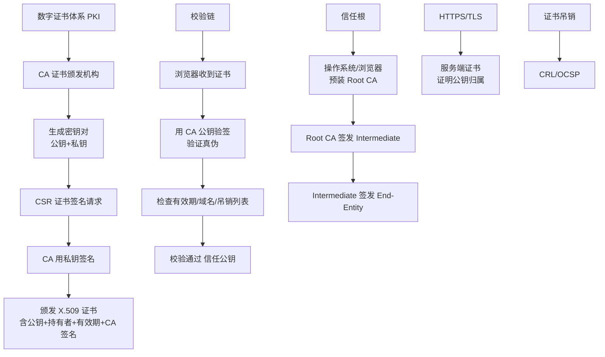

# 协调者(coordinator)

协调者是 Cassandra 客户端请求的入口节点，负责代表客户端协调读写操作的执行。客户端通常连接到集群中的任意节点，该节点即成为此次请求的 Coordinator。

### 写请求流程
1.  **定位**：客户端连接到任意节点（成为 Coordinator）。Coordinator 根据 Partitioner 计算 Token，并结合 NTS/SimpleStrategy 确定数据所有 Replica 节点。
2.  **发送**：Coordinator 将写请求发送给所有 Replica 节点。
3.  **一致性响应**：Coordinator 等待足够数量的 Replica 返回成功确认（满足 Consistency Level，如 QUORUM）。成功意味着数据已写入 Commit Log（持久化）和 MemTable（内存）。

### 读请求流程
1.  **定位与发送**：Coordinator 根据 CL 联系相应的 Replica 节点。
2.  **数据返回**：各 Replica 返回请求的数据（通常从 MemTable 和 SSTable 读取并合并）。
3.  **数据比对**：如果联系了多个节点，Coordinator 会在内存中比对返回的数据。如果发现不一致，使用带有最新时间戳的数据返回给客户端。
4.  **Read Repair**：在后台，Coordinator 会联系其余 Replica，用过时的数据更新它们，确保最终一致性。

### 架构流程图
```text
Client
   |
   +----> [ Coordinator Node ]
               |
               | 1. Calculate Token (Partitioner)
               |
               v
      [ Replica Set (Node A, B, C) ]
               |
               |
    +----------+----------+
    |                     |
[ Write Path ]        [ Read Path ]
    |                     |
    v                     v
 Send to All           Send to All
 Wait for CL           Compare Digests
 (Success)             Resolve (Latest TS)
                          |
                          v
                    Trigger Read Repair
```

### Speculative Retry
为了防止读请求在某个慢节点上阻塞，Cassandra 支持 Speculative Retry（推测重试）。当 Coordinator 检测到请求未在指定时间内完成，会向其他副本发送额外请求，谁先返回就用谁的。

### 实战案例
在进行 `QUORUM` 读操作时，遇到偶发的 99% 延迟飙升。经排查，是因为某个 Replica 节点的磁盘出现 IO 阻塞。虽然 CL 只需 2 个节点响应，但 Coordinator 默认等待所有节点响应返回 Digest 做比对。解决方案是将 `speculative_retry` 设置为 `95PERCENTILE`，在慢节点未返回时提前向其他副本发起请求，降低 P99 延迟。

## 常见考点
- **Coordinator 过载**：如果 Coordinator 节点也是 Replica，是否会先写本地？（是的，通常优先处理本地，降低延迟）。
- **hinted handoff**：如果某个 Replica 写入失败（节点宕机），Coordinator 会做什么？（将 Hint 存储在本地，待目标节点恢复时转发）。
- **Read Repair 时机**：Read Repair 是每次读都发生吗？（取决于 `read_repair_chance` 和 `dc_local_read_repair_chance` 配置）。


## 核心架构图



## 记忆要点

- 节点定位：Coordinator 是客户端连接的入口，负责计算 Token、定位副本并转发请求。
- 写一致性：Coordinator 向所有 Replica 发送写请求，只要满足指定 CL（如 QUORUM）即返回成功。
- 读修复机制：读时发现多副本数据冲突，Coordinator 以最新时间戳的数据返回，并后台触发 Read Repair。
- 推测执行：为了防止慢节点阻塞，Coordinator 可触发 Speculative Retry 向其他副本重发读请求。

## 结构化回答

**30 秒电梯演讲：** 客户端请求的代理，负责分发读写指令并合并结果，保证一致性级别。打个比方，像餐厅服务员，记录客人的点单，分发给厨房，并确保所有厨房做的菜是一致的才端上来。

**展开框架：**
1. **节点定位** — Coordinator 是客户端连接的入口，负责计算 Token、定位副本并转发请求。
2. **写一致性** — Coordinator 向所有 Replica 发送写请求，只要满足指定 CL（如 QUORUM）即返回成功。
3. **读修复机制** — 读时发现多副本数据冲突，Coordinator 以最新时间戳的数据返回，并后台触发 Read Repair。

**收尾：** 我在项目里踩过坑——在进行 `QUORUM` 读操作时，遇到偶发的 99% 延迟飙升。您想深入聊哪一段：原理、避坑还是对比选型？

## 视频脚本

> 预计时长：2 分钟 | 由浅入深

| 时间 | 画面/字幕 | 口播台词 | 讲解要点 |
|------|----------|----------|----------|
| 0:00 | 标题卡：协调者(coordinator) | "协调者(coordinator)？一句话——像餐厅服务员，记录客人的点单，分发给厨房，并确保所有厨房做的菜是一致的才端上来。" | 开场钩子 |
| 0:40 | 概念动画/示意图 | "客户端请求的代理，负责分发读写指令并合并结果，保证一致性级别——像餐厅服务员，记录客人的点单，分发给厨房，并确保所有厨房做的菜是一致的才端上来" | 核心定义 |
| 1:20 | 节点定位示意 | "Coordinator 是客户端连接的入口，负责计算 Token、定位副本并转发请求。" | 要点1 |
| 2:00 | 总结卡 | "记住这几条，面试不慌。下期讲进阶追问。" | 收尾 |
