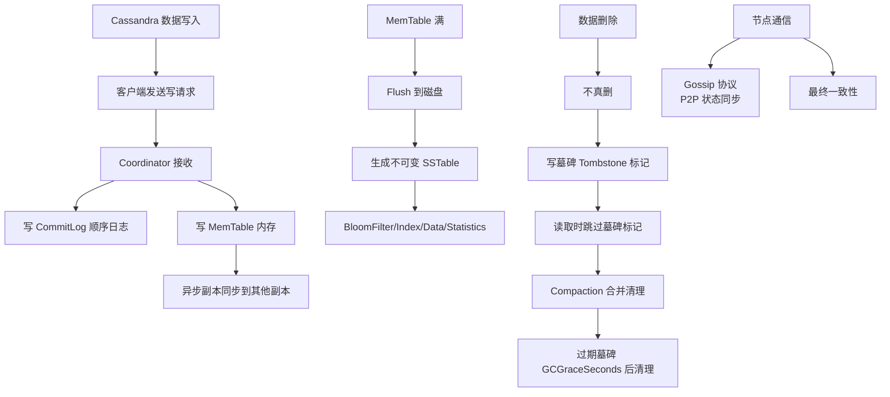

# SSTable文件构成（BloomFilter、index、data、static）

Cassandra 的数据写入流程采用 Log-Structured Merge (LSM) 树思想，主要由内存和磁盘两部分组成，SSTable 是磁盘上不可变的数据文件。

### 写入流程
1.  **Commit Log**：数据首先顺序写入磁盘上的 Commit Log（用于故障恢复）。
2.  **MemTable**：数据同时写入内存中的 MemTable（有序的数据结构，通常基于 SkipList 或红黑树）。
3.  **Flush**：当 MemTable 达到阈值，其内容被刷写到磁盘，生成一个新的 SSTable 文件，随后对应的 Commit Log 段被清空或归档。

### SSTable 文件构成与结构
SSTable 是 Sorted String Table 的缩写，一旦生成便不可修改。其物理存储通常包含以下部分（以 Cassandra 为例）：

- **Data 文件 (.db)**：存储实际的行数据，按 Partition Key 有序排列。内部被划分为默认 64KB 的数据块，便于压缩和传输。
- **Primary Index 文件 (.index)**：默认存储 Partition Key 到 Data 文件偏移量的索引。此文件常驻内存，用于快速定位数据块。
- **Bloom Filter**：一种内存中的概率型数据结构（位数组），用于快速判断某个 Key **一定不存在**于该 SSTable 中，从而大幅减少对磁盘 Index 文件的随机读取 IO。
- **Statistics (Static) 文件 (.stats)**：存储元数据和统计信息（如分区大小、列数、TTL 等），用于优化查询规划和 Compaction 策略。
- **Compression Info / Summary**：记录数据块压缩偏移量，或索引的采样摘要，进一步减少寻址时间。

### SSTable 内部逻辑结构示意图
```text
+-----------------------------------------------------------------------+
| SSTable (Logical File View)                                           |
+-----------------------------------------------------------------------+
| File Header                                                           |
+-----------------------+-----------------------+-----------------------+
| Data Block 1         | Data Block 2         | Data Block 3 ...       |
| [Row1, Row2...]      | [Row3, Row4...]      |                       |
+-----------------------+-----------------------+-----------------------+
| Index Block          | Bloom Filter         | Statistics             |
| [Key -> Offset]      | [Hash Bitmap]        | [Meta Info]            |
+-----------------------+-----------------------+-----------------------+
| File Footer                                                          |
+-----------------------------------------------------------------------+
```

### 关键参数与细节
- **Key Cache**：除了 Index，Cassandra 还有 Key Cache，直接缓存 Partition Key 对应的文件偏移量，减少反序列化 Index 的开销。
- **Bloom Filter 误判率**：Bloom Filter 存在极小的误判概率，即可能认为 Key 存在但实际不存在，此时会触发磁盘查找；但若判断 Key 不存在，则 Key 一定不存在。

### 实战案例
某集群出现读取延迟升高，检查发现磁盘 IO Util 很高但吞吐量低。分析发现是因为 `bloom_filter_fp_chance`（误判率）设置过大（默认 0.1 甚至更高），导致大量无效的磁盘 Index 查找。将配置调整为 0.01 并重启（或重建 SSTable）后，读吞吐量提升了 40%。

### 代码示例
```java
// 伪代码：使用 Bloom Filter 判断 Key 是否存在
BloomFilter filter = sstable.getBloomFilter();
if (filter.mightContain("user_unknown")) {
    // 仅当 Filter 判断可能存在时，才去磁盘查找 Index
    // 节省了昂贵的磁盘 IO
    IndexEntry entry = sstable.getIndex().get("user_unknown");
} else {
    // 100% 不存在，直接返回空
    return null;
}
```


## 核心架构图



## 记忆要点

- LSM 灵魂：Cassandra 写磁盘均生成不可变的 SSTable，核心包含 Data、Index、BloomFilter、Statistics。
- 读加速器：Bloom Filter 常驻内存，若判定 Key 不存在则 100% 不查磁盘，极大减少无效 IO。
- 索引定位：Index 存 Partition Key 到 Data 文件偏移量，快速定位 64KB 数据块。
- Stats作用：Statistics 存元数据统计，专门用于优化查询规划和 Compaction 策略。

## 结构化回答

**30 秒电梯演讲：** LSM 存储架构，数据先写内存和日志，内存满后排序刷盘为不可变的 SSTable。打个比方，像记账，先随手写在草稿纸，再登记到账本。旧的账本封存，查账时先看目录。

**展开框架：**
1. **LSM 灵魂** — Cassandra 写磁盘均生成不可变的 SSTable，核心包含 Data、Index、BloomFilter、Statistics。
2. **读加速器** — Bloom Filter 常驻内存，若判定 Key 不存在则 100% 不查磁盘，极大减少无效 IO。
3. **索引定位** — Index 存 Partition Key 到 Data 文件偏移量，快速定位 64KB 数据块。

**收尾：** 我在项目里踩过坑——某集群出现读取延迟升高，检查发现磁盘 IO Util 很高但吞吐量低。您想深入聊哪一段：原理、避坑还是对比选型？

## 视频脚本

> 预计时长：2 分钟 | 由浅入深

| 时间 | 画面/字幕 | 口播台词 | 讲解要点 |
|------|----------|----------|----------|
| 0:00 | 标题卡：SSTable文件构成（BloomF… | "SSTable文件构成（BloomFilter、index、data、static）？一句话——像记账，先随手写在草稿纸，再登记到账本。旧的账本封存，查账时先看目录。" | 开场钩子 |
| 0:40 | 概念动画/示意图 | "LSM 存储架构，数据先写内存和日志，内存满后排序刷盘为不可变的 SSTable——像记账，先随手写在草稿纸，再登记到账本。旧的账本封存，查账时先看目录" | 核心定义 |
| 1:20 | LSM 灵魂示意 | "Cassandra 写磁盘均生成不可变的 SSTable，核心包含 Data、Index、BloomFilter、Statistics。" | 要点1 |
| 2:00 | 总结卡 | "记住这几条，面试不慌。下期讲进阶追问。" | 收尾 |
