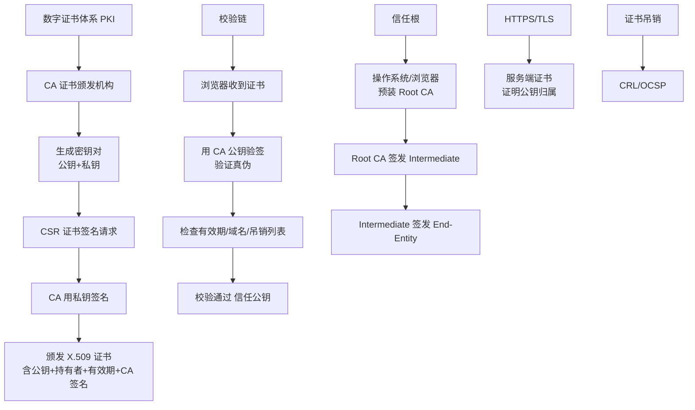

# 数据写入和更新（数据追加）

Cassandra 采用 Log-Structured 存储机制，所有的写操作（插入、更新、删除）本质上都是数据的追加。

### 数据写入和更新（追加写）
- **追加而非修改**：无论是 Insert 还是 Update，Cassandra 都不会修改磁盘上已有的旧数据，而是生成一个新的数据版本追加到 MemTable 中。
- **优势**：
  - **写入效率高**：完全是顺序写 IO，无需随机寻址，充分利用磁盘带宽。
  - **错误恢复简单**：Commit Log 记录了操作历史，无需复杂的 Undo 逻辑。
- **劣势**：
  - **读复杂度高**：读取时可能需要合并多个 SSTable 中的不同版本（包括 MemTable），取时间戳最新的那个。

### 写流程架构图
```text
Client Request
      |
      v
+-------------+     1. Append      +----------------+
| Commit Log  | <----------------- | Coordinator    |
+-------------+                   (Disk Sequential)
      ^
      | 2. Write
      |
+-------------+
| MemTable    | <----------------- (In-Memory, Sorted)
+-------------+
      |
      | (Threshold reached)
      v
+-------------+     3. Flush       +----------------+
| SSTable     | -----------------> | Disk (New File)|
+-------------+ (Immutable File)   +----------------+
```

### 二级索引实现原理
Cassandra 的二级索引本质上是另一张隐藏的表（本地索引）。
- **构建方式**：当对某列建立索引时，系统会提取该列的 Value 作为索引表的 Row Key，原数据的 Primary Key 作为索引表的 Column（或 Clustering Column）。
- **查询**：查询时先在索引表中查到对应的原数据 Primary Key，再去主表中读取完整数据。
- **局限性**：由于是本地索引，查询某索引值通常需要查询集群中的所有节点，效率较低，不适合高基数列。

### 实战案例
在高并发写入场景（如埋点日志）中，虽然吞吐量很高，但若频繁更新同一行数据，会导致 MemTable 和 SSTable 中存在大量过期版本，**读放大问题会极其严重**，甚至导致查询超时。因此，Cassandra 不适合频繁 Update 的场景。

### 代码示例（Java Driver 轻量级事务写入）
```java
// 使用轻量级事务（IF NOT EXISTS）防止并发写入覆盖
PreparedStatement stmt = session.prepare(
    "INSERT INTO users (id, name) VALUES (?, ?) IF NOT EXISTS"
);
ResultSet result = session.execute(stmt.bind(123, "Alice"));
// 只有在数据不存在时才会写入，实现了幂等性
if (!result.wasApplied()) {
    System.out.println("User already exists");
}
```

### 常见考点
1. **LSM Tree 的读写权衡**：为什么 LSM 树适合写多读少的场景？
2. **Compaction 的作用**：既然是追加写，如何回收空间和减少读取时的文件合并开销？
3. **Update 的实现**：Cassandra 中的 Update 是原地修改还是追加？


## 核心架构图



## 记忆要点

- 追加写核心：因为 Cassandra 基于 LSM 树，所以 Insert、Update、Delete 本质都是顺序追加写新版本。
- 写流程：数据先落盘 Commit Log 保底，再写内存 MemTable，满后 Flush 生成 SSTable。
- 读写权衡：顺序追加换来了极高写吞吐，但代价是读取时需合并多版本，导致读放大严重。
- LWT机制：若需防并发覆盖，可用轻量级事务（IF NOT EXISTS）实现线性一致性，但性能损耗大。

## 结构化回答

**30 秒电梯演讲：** 所有写操作都是追加新版本，不做原地修改，将随机写转为顺序写。打个比方，像修改文档不直接涂改，而是贴个修正带写新内容，看的时候找最新的那条即可。

**展开框架：**
1. **追加写核心** — 因为 Cassandra 基于 LSM 树，所以 Insert、Update、Delete 本质都是顺序追加写新版本。
2. **写流程** — 数据先落盘 Commit Log 保底，再写内存 MemTable，满后 Flush 生成 SSTable。
3. **读写权衡** — 顺序追加换来了极高写吞吐，但代价是读取时需合并多版本，导致读放大严重。

**收尾：** 我在项目里踩过坑——在高并发写入场景（如埋点日志）中，虽然吞吐量很高，但若频繁更新同一行数据，会导致 MemTable 和 SSTable 中存在大量过期版本，读放大问题会极其严重，甚至导致查询超时。您想深入聊哪一段：原理、避坑还是对比选型？

## 视频脚本

> 预计时长：3 分钟 | 由浅入深

| 时间 | 画面/字幕 | 口播台词 | 讲解要点 |
|------|----------|----------|----------|
| 0:00 | 标题卡：数据写入和更新（数据追加） | "数据写入和更新（数据追加）？一句话——像修改文档不直接涂改，而是贴个修正带写新内容，看的时候找最新的那条即可。" | 开场钩子 |
| 0:45 | 概念动画/示意图 | "所有写操作都是追加新版本，不做原地修改，将随机写转为顺序写——像修改文档不直接涂改，而是贴个修正带写新内容，看的时候找最新的那条即可" | 核心定义 |
| 1:30 | 追加写核心示意 | "因为 Cassandra 基于 LSM 树，所以 Insert、Update、Delete 本质都是顺序追加写新版本。" | 要点1 |
| 2:15 | 写流程示意 | "数据先落盘 Commit Log 保底，再写内存 MemTable，满后 Flush 生成 SSTable。" | 要点2 |
| 3:00 | 总结卡 | "记住这几条，面试不慌。下期讲进阶追问。" | 收尾 |

### 视频流程图


