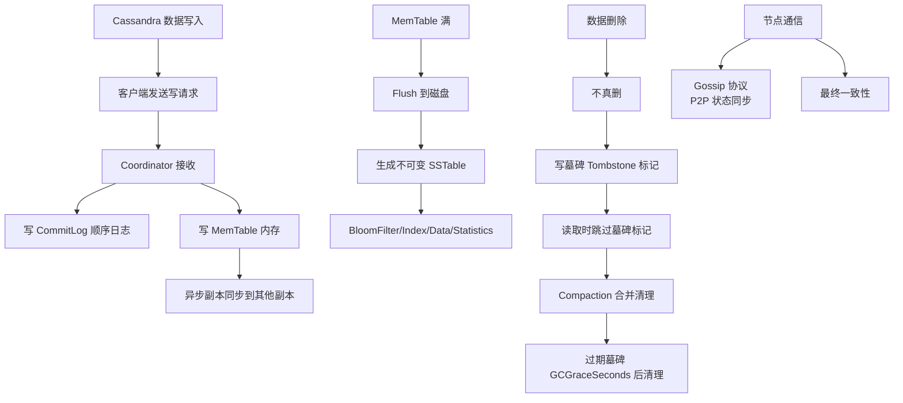
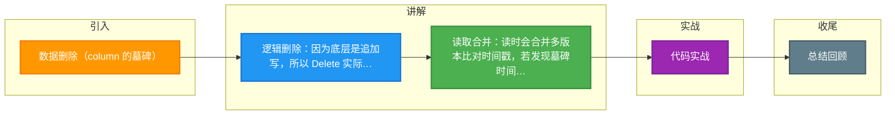

# 数据删除（column 的墓碑）

在 Cassandra 的追加写架构下，数据删除并非物理擦除，而是通过标记“墓碑”来实现。

### 为什么需要墓碑？
由于数据是追加写入的，如果物理删除某个旧数据，需要遍历并修改 SSTable，代价极大。此外，在分布式环境下，如果删除指令未到达部分副本，读操作可能会读到已被删除的旧数据（“僵尸数据”），导致不一致。

### 墓碑机制
- **逻辑删除**：执行 Delete 操作时，实际上插入了一条特殊的记录，包含一个“墓碑”标记和本地删除时间戳。
- **读操作**：读取时，系统会合并所有版本。如果发现存在墓碑，且墓碑的时间戳晚于数据版本，则该数据被视为已删除，不返回给客户端。
- **GC Grace Seconds**：墓碑不会立即消失，系统会保留墓碑一段时间（由 `gc_grace_seconds` 配置，默认 864000 秒/10天）。这是为了给节点修复或失效副本通过 Hinted Handoff 或 Read Repair 同步删除操作提供时间窗口。

### 墓碑处理流程图
```text
Time 0: [Data: A] (Written to SSTable 1)
Time 1: [Delete A] (Written as Tombstone to SSTable 2)

Read Path:
+-----------+      +-----------+
| SSTable 1 | ---> | Data: A   |
+-----------+      +-----------+
      ^                  |
      |                  v (Merge & Compare Timestamps)
+-----------+      +-----------+
| SSTable 2 | ---> | Tombstone |  --->  Result: Null (Data Hidden)
+-----------+      +-----------+

Compaction (After GC Grace Seconds):
+-----------+ +-----------+
| SSTable 1 | | SSTable 2 |  --->  Merge/Expedited Tombstones
+-----------+ +-----------+          |
                                 v
                         +----------------+
                         | SSTable New    | (Tombstone & Data Removed)
                         +----------------+
```

### 垃圾回收
- **Compaction**：当超过保留时间后，系统会将多个 SSTable 合并。在合并过程中，带有墓碑的数据行会被物理移除，回收磁盘空间。
- **Range Tombstone**：除了单个 Key 的墓碑，Cassandra 还支持范围删除，使用 Range Tombstone 标记一段 Partition Key 范围内的数据删除。

### 实战案例
某业务系统曾出现误操作需要批量删除过期数据，执行 `DELETE FROM table WHERE ...` 后发现查询性能急剧下降。**原因是一次性生成了数百万个墓碑**，Compaction 来不及清理，导致读路径需要合并大量墓碑，最终通过 `TRUNCATE` 重置表才缓解（仅适用于可丢失数据场景）。

### 代码示例（Paging 与 墓碑处理）
```java
// 读取数据时，如果遇到大量墓碑，普通查询可能超时
// 设置合理的 fetch size 并重试是必要的应对策略
SimpleStatement stmt = SimpleStatement.builder(
    "SELECT * FROM events WHERE type = ?"
).setPageSize(1000).build();

ResultSet rs = session.execute(stmt.bind("login"));
// 驱动端会自动分页处理，避免单次请求扫描过多SSTable中的墓碑
for (Row row : rs) {
    // process row
}
```

### 常见考点
1. **墓碑带来的性能问题**：如果大量删除数据，为什么查询性能会变差？（因为查询必须合并所有墓碑直到 Compaction 完成）。
2. **gc_grace_seconds 设置**：如果设置过小会发生什么？可能导致删除的数据在节点恢复后“复活”。
3. **Purge 操作**：在什么条件下墓碑可以被物理删除？


## 核心架构图



## 记忆要点

- 逻辑删除：因为底层是追加写，所以 Delete 实际是插入一条带时间戳的墓碑标记。
- 读取合并：读时会合并多版本比对时间戳，若发现墓碑时间晚于数据，则该数据视为已删不返回。
- 垃圾回收：墓碑不立即消失，必须等超过 gc_grace_seconds（默认10天）后，才在 Compaction 时物理清除。
- 性能警告：大批量删除会生成海量墓碑，拖垮读性能，必要时用 TRUNCATE 清表。

## 结构化回答

**30 秒电梯演讲：** 删除操作本质是写入墓碑标记，等待后台合并时才真正物理删除。打个比方，像扔垃圾只是贴个“已废弃”标签放在一边，等清洁工（Compaction）来了才真正运走。

**展开框架：**
1. **逻辑删除** — 因为底层是追加写，所以 Delete 实际是插入一条带时间戳的墓碑标记。
2. **读取合并** — 读时会合并多版本比对时间戳，若发现墓碑时间晚于数据，则该数据视为已删不返回。
3. **垃圾回收** — 墓碑不立即消失，必须等超过 gc_grace_seconds（默认10天）后，才在 Compaction 时物理清除。

**收尾：** 我在项目里踩过坑——某业务系统曾出现误操作需要批量删除过期数据，执行 `DELETE FROM table WHERE ...` 后发现查询性能急剧下降。您想深入聊哪一段：原理、避坑还是对比选型？

## 视频脚本

> 预计时长：4 分钟 | 由浅入深

| 时间 | 画面/字幕 | 口播台词 | 讲解要点 |
|------|----------|----------|----------|
| 0:00 | 标题卡：数据删除（column 的墓碑） | "数据删除（column 的墓碑）？一句话——像扔垃圾只是贴个“已废弃”标签放在一边，等清洁工（Compaction）来了才真正运走。" | 开场钩子 |
| 0:48 | 概念动画/示意图 | "删除操作本质是写入墓碑标记，等待后台合并时才真正物理删除——像扔垃圾只是贴个“已废弃”标签放在一边，等清洁工（Compaction）来了才真正运走" | 核心定义 |
| 1:36 | 逻辑删除示意 | "因为底层是追加写，所以 Delete 实际是插入一条带时间戳的墓碑标记。" | 要点1 |
| 2:24 | 读取合并示意 | "读时会合并多版本比对时间戳，若发现墓碑时间晚于数据，则该数据视为已删不返回。" | 要点2 |
| 3:12 | 垃圾回收示意 | "墓碑不立即消失，必须等超过 gc_grace_seconds（默认10天）后，才在 Compaction 时物理清除。" | 要点3 |
| 4:00 | 总结卡 | "记住这几条，面试不慌。下期讲进阶追问。" | 收尾 |

### 视频流程图



