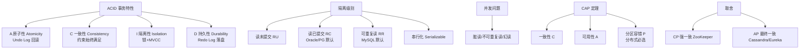

# 原子性（Atomicity）

题目涉及数据库范式与事务 ACID 属性。题目中问题为“原子性”，但答案文本包含范式与 ACID 混合内容，以下进行优化整理，并针对原子性补充实现细节。

### 数据库范式简述
- **第一范式 (1NF)**：属性不可分，确保每个原子性。
- **第二范式 (2NF)**：满足 1NF，且非主键列完全依赖于主键，消除部分依赖。
- **第三范式 (3NF)**：满足 2NF，且非主键列不传递依赖于主键，消除传递依赖。

### 事务 ACID 属性
事务是作为单个逻辑工作单元执行的一系列操作，满足 ACID 特性。

#### 1. 原子性
- **定义**：事务是一个不可分割的整体，事务中的操作要么全部成功，要么全部失败回滚。
- **目的**：防止数据部分更新导致的不一致状态。
- **实现原理**：
  - **Undo Log**：数据库在修改数据前，先将旧值写入 Undo Log。如果事务失败，利用 Undo Log 将数据回滚到修改前的状态。
  - **Commit Log (Redo Log)**：为了保证持久性，修改也会记录在 Commit Log 中。

#### 2. 一致性
- **定义**：事务执行前后，数据库必须从一个一致性状态变换到另一个一致性状态。
- **目的**：保证数据的完整性约束（如外键、唯一索引、触发器等）未被破坏。

#### 3. 隔离性
- **定义**：多个事务并发执行时，一个事务的执行不应受其他事务干扰。
- **目的**：防止脏读、不可重复读、幻读等问题。
- **实现技术**：锁机制、MVCC（多版本并发控制）。

#### 4. 持久性
- **定义**：事务一旦提交，对数据的修改是永久性的，即使系统故障也不会丢失。

### 实战案例
在金融转账场景中，系统在扣款成功后网络中断导致入款失败。如果依赖应用层重试而没有数据库事务的原子性保护，极易产生**资金差异**。必须依靠 DB 的 Undo Log 在 Crash Recovery 时自动回滚未提交的事务，确保账户余额正确。

### 代码示例（Spring 事务注解）
```java
@Transactional // 开启事务，确保 AOP 代理中的异常触发回滚
public void transferMoney(Long fromId, Long toId, BigDecimal amount) {
    accountDao.debit(fromId, amount); // 扣款
    if (amount.compareTo(new BigDecimal("10000")) > 0) {
        throw new RuntimeException("超过单笔转账限额"); // 触发回滚
    }
    accountDao.credit(toId, amount); // 入款
}
```

### 常见考点
1. **原子性与一致性的区别**：原子性强调操作的“全或无”，一致性强调数据的“正确性状态”。
2. **原子性的底层实现**：如何通过 Undo Log 实现回滚？
3. **ACID 与 BASE 的区别**：在分布式系统中（如 NoSQL），通常为了可用性而牺牲强一致性（CAP 定理）。


## 核心架构图


## 记忆要点

- 一句话定义：原子性指事务要么全部成功提交，要么全部失败回滚，是“全或无”的操作。
- 底层实现：因为修改数据前先记录 Undo Log，所以系统 Crash 时能据此逆向回滚保证原子性。
- 防不一致：原子性的目的是防止因部分更新成功而导致的数据库业务状态错乱。
- 概念对比：原子性强调“操作全或无”，而一致性强调“业务状态正确”。

## 结构化回答

**30 秒电梯演讲：** 事务的原子性保证操作集“全有或全无”，不存在中间状态。打个比方，转账要么成功双方钱都变，要么失败钱都不动，不能钱转出去了对方没收到。

**展开框架：**
1. **一句话定义** — 原子性指事务要么全部成功提交，要么全部失败回滚，是“全或无”的操作。
2. **底层实现** — 因为修改数据前先记录 Undo Log，所以系统 Crash 时能据此逆向回滚保证原子性。
3. **防不一致** — 原子性的目的是防止因部分更新成功而导致的数据库业务状态错乱。

**收尾：** 我在项目里踩过坑——在金融转账场景中，系统在扣款成功后网络中断导致入款失败。您想深入聊哪一段：原理、避坑还是对比选型？

## 视频脚本

> 预计时长：2 分钟 | 由浅入深

| 时间 | 画面/字幕 | 口播台词 | 讲解要点 |
|------|----------|----------|----------|
| 0:00 | 标题卡：原子性（Atomicity） | "原子性（Atomicity）？一句话——转账要么成功双方钱都变，要么失败钱都不动，不能钱转出去了对方没收到。" | 开场钩子 |
| 0:40 | 概念动画/示意图 | "事务的原子性保证操作集“全有或全无”，不存在中间状态——转账要么成功双方钱都变，要么失败钱都不动，不能钱转出去了对方没收到" | 核心定义 |
| 1:20 | 一句话定义示意 | "原子性指事务要么全部成功提交，要么全部失败回滚，是“全或无”的操作。" | 要点1 |
| 2:00 | 总结卡 | "记住这几条，面试不慌。下期讲进阶追问。" | 收尾 |
