# 隔离性（Isolation）

### 事务隔离性（Isolation）

隔离性要求对数据进行修改的所有并发事务是彼此隔离的。这表明事务必须是独立的，它不应以任何方式依赖于或影响其他事务。通常通过**锁机制**（Locking）或**多版本并发控制**来实现。

#### 原理与实现细节
数据库通过不同的隔离级别来平衡一致性与并发性能，从低到高依次为：

1.  **读未提交（READ UNCOMMITTED）**：允许读取其他事务未提交的数据。可能导致“脏读”。
2.  **读已提交（READ COMMITTED，RC）**：只能读取其他事务已提交的数据。解决了脏读，但可能导致“不可重复读”。
3.  **可重复读（REPEATABLE READ，RR）**：保证在一个事务内多次读取同一记录的结果一致。解决了不可重复读，但可能导致“幻读”。（注：MySQL InnoDB 通过 MVCC 和 Next-Key Lock 在 RR 级别解决了幻读）。
4.  **串行化（SERIALIZABLE）**：最高的隔离级别，强制事务串行执行。

**MVCC（多版本并发控制）原理**：
通过保存数据的历史版本，读写操作互不阻塞。
- **Read View（读视图）**：在 RC 级别下，每次 select 都会生成一个新的 Read View；在 RR 级别下，只在事务第一次 select 时生成 Read View。
- **Undo Log**：用于构建数据的历史版本。

#### 并发问题图示
```text
事务 A                 事务 B
---------             ---------

1. Read X (100)
                      
                      2. Update X = 200
                      3. Commit

4. Read X (?)
-- 结果取决于隔离级别 --
* Read Uncommitted: 200 (脏读)
* Read Committed : 200 (不可重复读)
* Repeatable Read : 100 (可重复读)
```

### 实战案例
在生成月度报表的统计任务中，如果使用默认的 RR（可重复读）级别，且任务执行时间较长，期间可能无法读取到最新产生的订单，导致**报表数据滞后**。在保证业务允许不可重复读的前提下，将隔离级别降级为 RC 可以获取更实时的数据。

### 隔离级别对比
| 隔离级别 | 脏读 | 不可重复读 | 幻读 | 锁机制 | 适用场景 |
| :--- | :---: | :---: | :---: | :--- | :--- |
| Read Uncommitted | 是 | 是 | 是 | 无 | 极少使用 |
| Read Committed | 否 | 是 | 是 | Record Lock | 大多数数据库默认 (Oracle, Postgres) |
| Repeatable Read | 否 | 否 | 是 (部分) | Record + Gap Lock | MySQL 默认 |
| Serializable | 否 | 否 | 否 | Table Lock | 强一致性要求场景 |

### 常见考点
1.  **MySQL 默认隔离级别**：Repeatable Read（可重复读），而 Oracle 等数据库默认通常是 Read Committed。
2.  **RR 级别如何解决幻读**：需要同时提到 MVCC（解决快照读下的幻读）和 Next-Key Lock（临键锁，解决当前读下的幻读）。
3.  **RC 和 RR 的区别**：除了锁机制不同，核心区别在于生成 Read View 的时机不同（RC 每次查都生成，RR 只生成一次）。


## 核心架构图

```mermaid
flowchart TD
    classDef start fill:#4CAF50,color:#fff
    classDef process fill:#2196F3,color:#fff
    classDef decision fill:#FF9800,color:#fff
    classDef special fill:#9C27B0,color:#fff
    classDef error fill:#f44336,color:#fff
    classDef info fill:#607D8B,color:#fff
    class A start
    class ACID process
    class AP decision
    class Atomicity special
    class B error
    class C info
    class CAP start
    class CP process
    class Cassandra decision
    class Consistency special
    class D error
    class Durability info
    class E start
    class Eureka process
    class F decision
    class G special
    class H error
    class I info
    class Isolation start
    class J process
    class K decision
    class L special
    class Log error
    class M info
    class MVCC start
    class MySQL process
    class N decision
    class O special
    class Oracle error
    class P info
    class PG start
    class Q process
    class R decision
    class RC special
    class RR error
    class RU info
    class Redo start
    class S process
    class Serializable decision
    class Undo special
    class ZooKeeper error
    class br info
    A[ACID 事务特性] --> B[A 原子性 Atomicity<br/>Undo Log 回滚]
    A --> C[C 一致性 Consistency<br/>约束始终满足]
    A --> D[I 隔离性 Isolation<br/>锁+MVCC]
    A --> E[D 持久性 Durability<br/>Redo Log 落盘]
    F[隔离级别] --> G[读未提交 RU]
    F --> H[读已提交 RC<br/>Oracle/PG 默认]
    F --> I[可重复读 RR<br/>MySQL 默认]
    F --> J[串行化 Serializable]
    K[并发问题] --> L[脏读/不可重复读/幻读]
    M[CAP 定理] --> N[一致性 C]
    M --> O[可用性 A]
    M --> P[分区容错 P<br/>分布式必选]
    Q[取舍] --> R[CP 强一致 ZooKeeper]
    Q --> S[AP 最终一致 Cassandra/Eureka]
```



## 记忆要点

- 四个级别：读未提交、读已提交(RC)、可重复读(RR)、串行化，并发能力依次降低，数据一致性升高。
- 默认级别：MySQL 默认是 RR（可重复读），而 Oracle/PostgreSQL 默认通常是 RC（读已提交）。
- 并发异常：RU致脏读，RC致不可重复读，RR能防这两种但可能致幻读，Serializable全防。
- RR防幻读：MySQL 在 RR 级别通过 MVCC（快照读）与 Next-Key Lock（当前读）解决了幻读。

## 结构化回答

**30 秒电梯演讲：** 并发执行的事务之间互不干扰，看起来像串行执行。打个比方，银行隔间：你在办业务时，隔壁的人看不见你的操作，也受不到影响。

**展开框架：**
1. **四个级别** — 读未提交、读已提交(RC)、可重复读(RR)、串行化，并发能力依次降低，数据一致性升高。
2. **默认级别** — MySQL 默认是 RR（可重复读），而 Oracle/PostgreSQL 默认通常是 RC（读已提交）。
3. **并发异常** — RU致脏读，RC致不可重复读，RR能防这两种但可能致幻读，Serializable全防。

**收尾：** 我在项目里踩过坑——在生成月度报表的统计任务中，如果使用默认的 RR（可重复读）级别，且任务执行时间较长，期间可能无法读取到最新产生的订单，导致报表数据滞后。您想深入聊哪一段：原理、避坑还是对比选型？

## 视频脚本

> 预计时长：3 分钟 | 由浅入深

| 时间 | 画面/字幕 | 口播台词 | 讲解要点 |
|------|----------|----------|----------|
| 0:00 | 标题卡：隔离性（Isolation） | "隔离性（Isolation）？一句话——银行隔间：你在办业务时，隔壁的人看不见你的操作，也受不到影响。" | 开场钩子 |
| 0:45 | 概念动画/示意图 | "并发执行的事务之间互不干扰，看起来像串行执行——银行隔间：你在办业务时，隔壁的人看不见你的操作，也受不到影响" | 核心定义 |
| 1:30 | 四个级别示意 | "读未提交、读已提交(RC)、可重复读(RR)、串行化，并发能力依次降低，数据一致性升高。" | 要点1 |
| 2:15 | 默认级别示意 | "MySQL 默认是 RR（可重复读），而 Oracle/PostgreSQL 默认通常是 RC（读已提交）。" | 要点2 |
| 3:00 | 总结卡 | "记住这几条，面试不慌。下期讲进阶追问。" | 收尾 |
