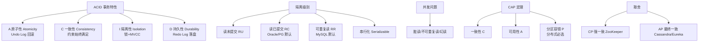

# 永久性（Durability）

### 事务永久性（Durability）

永久性是指事务一旦提交，其对数据库的修改就是永久性的。接下来的其他操作或数据库故障不应该对其有任何影响。通常通过**事务日志**来保证，只要事务日志记录成功，数据最终一定能被持久化到磁盘。

#### 原理与实现细节（以 MySQL InnoDB 为例）
为了确保持久性同时保证性能，数据库采用了 **WAL（Write-Ahead Logging）** 机制，即“先写日志，再写数据”。

**核心流程**：
1.  **修改内存**：事务执行过程中，修改 Buffer Pool 中的数据页。
2.  **写入 Redo Log**：准备提交时，将修改记录写入 Redo Log Buffer，并持久化到磁盘文件（ib_logfile）。
3.  **写入 Binlog**（可选，用于主从复制）：写入二进制日志。
4.  **提交事务**：一旦 Redo Log 落盘，事务即视为成功，无需等待数据页（脏页）立即落盘。
5.  **异步刷盘**：后台 IO 线程根据策略（如 Checkpoint）将 Buffer Pool 中的脏页刷入磁盘的数据文件（ibd）。

**如果发生崩溃**：
数据库重启时，会读取 Redo Log，重放那些已提交但尚未刷入数据文件的修改，从而保证数据不丢失。

#### 数据持久化流程图
```text
[Client] 请求
    |
    v
[Buffer Pool] (修改内存页)
    |
    +-----> [Redo Log Buffer] --fsync--> [Redo Log (Disk)] <--- 关键路径
    |                                            |
    | (提交成功)                                  | (Crash Recovery)
    |                                            v
    +-----> [Dirty Pages] --异步刷盘--> [Data File (Disk)]
```

#### 实战案例
在金融系统中，我们曾遇到过为了追求极致吞吐量将 `innodb_flush_log_at_trx_commit` 设置为 2（每秒刷盘），结果导致机房瞬时断电时丢失了整秒的交易流水，最终不得不配合业务从 Binlog 进行补偿修复。

#### 关键配置
```sql
-- MySQL InnoDB 关键持久化参数设置
-- 1 (Default): 最安全，每次事务提交都 fsync Redo Log 到磁盘
SET GLOBAL innodb_flush_log_at_trx_commit = 1;

-- 0: 每秒写入并刷盘，可能丢失1秒数据（性能最好但风险大）
-- SET GLOBAL innodb_flush_log_at_trx_commit = 0;

-- 2: 每次事务提交写到系统缓存，每秒 fsync 到磁盘（操作系统崩溃可能丢数据）
-- SET GLOBAL innodb_flush_log_at_trx_commit = 2;
```

## 常见考点
1.  **双一（Double Write）机制**：为什么需要？因为如果写数据页时发生“页断裂”（只写了一半），可以通过双写缓冲区恢复，再结合 Redo Log 恢复数据。
2.  **Redo Log 与 Binlog 的区别**：Redo Log 是物理日志（记录数据页修改），用于崩溃恢复和持久性；Binlog 是逻辑日志（记录 SQL 语句），用于主从复制和 point-in-time 恢复。
3.  **刷盘策略**：`innodb_flush_log_at_trx_commit` 参数设置为 0、1、2 时的性能与安全性差异（1 是最安全的，每次提交都 fsync）。


## 核心架构图


## 核心知识点图


## 记忆要点

- WAL机制：核心为先写日志（Redo Log）再异步刷脏页数据，以极小随机写代价保证持久性。
- 崩溃恢复：数据库 Crash 重启时，通过重放 Redo Log 即可恢复已提交但未落盘的修改。
- 双一标准：MySQL 双一配置中，innodb_flush_log_at_trx_commit=1 表示每次提交都 fsync 磁盘，最安全！
- 代价对比：双一配置极安全但性能略低，若设为 0 或 2 可能丢失未落盘的 1 秒事务数据。

## 结构化回答

**30 秒电梯演讲：** 事务一旦提交，修改将永久生效，即使系统崩溃也不会丢失。打个比方，快递签收：一旦你签收了包裹，快递公司就完成了任务，不再对它负责。

**展开框架：**
1. **WAL机制** — 核心为先写日志（Redo Log）再异步刷脏页数据，以极小随机写代价保证持久性。
2. **崩溃恢复** — 数据库 Crash 重启时，通过重放 Redo Log 即可恢复已提交但未落盘的修改。
3. **双一标准** — MySQL 双一配置中，innodb_flush_log_at_trx_commit=1 表示每次提交都 fsync 磁盘，最安全！

**收尾：** 我在项目里踩过坑——在金融系统中，我们曾遇到过为了追求极致吞吐量将 `innodb_flush_log_at_trx_commit` 设置为 2（每秒刷盘），结果导致机房瞬时断电时丢失了整秒的交易流水，最终不得不配合业务从 Binlog 进行补偿修复。您想深入聊哪一段：原理、避坑还是对比选型？

## 视频脚本

> 预计时长：3 分钟 | 由浅入深

| 时间 | 画面/字幕 | 口播台词 | 讲解要点 |
|------|----------|----------|----------|
| 0:00 | 标题卡：永久性（Durability） | "永久性（Durability）？一句话——快递签收：一旦你签收了包裹，快递公司就完成了任务，不再对它负责。" | 开场钩子 |
| 0:45 | 概念动画/示意图 | "事务一旦提交，修改将永久生效，即使系统崩溃也不会丢失——快递签收：一旦你签收了包裹，快递公司就完成了任务，不再对它负责" | 核心定义 |
| 1:30 | WAL机制示意 | "核心为先写日志（Redo Log）再异步刷脏页数据，以极小随机写代价保证持久性。" | 要点1 |
| 2:15 | 崩溃恢复示意 | "数据库 Crash 重启时，通过重放 Redo Log 即可恢复已提交但未落盘的修改。" | 要点2 |
| 3:00 | 总结卡 | "记住这几条，面试不慌。下期讲进阶追问。" | 收尾 |
