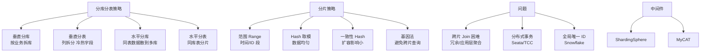

# 存储过程优化思路

### 存储过程优化思路

1.  **尽量利用集合操作**：使用 SQL 语句（如聚合函数）替代循环处理，利用 SQL 集合语言的高性能。
2.  **合理使用临时表**：将中间结果存放于临时表，并可考虑添加索引加速后续查询。
3.  **慎用游标**：SQL 是集合语言，游标是过程运算，性能较低。如必须使用，注意优化（如使用 FAST_FORWARD 游标）。
4.  **缩短事务**：事务越短越好，过长的事务会造成阻塞和死锁，导致查询极慢。在存储过程中尽量在最后阶段开启事务，操作完立即提交。
5.  **异常处理**：使用 try-catch 处理错误异常，并在 Catch 块中进行事务回滚或错误日志记录，避免系统报错中断但锁未释放。
6.  **减少 IO 操作**：查找语句尽量不要放在循环内，避免重复扫描。尽量使用参数化查询，防止 SQL 注入的同时利用执行计划缓存。

#### 优化逻辑对比图
```text
优化前（低效）：                  优化后（高效）：
---------                         ---------
Create Proc SP1                  Create Proc SP2
Begin                             Begin
  Declare Cursor C1                 -- 1. 集合操作直接计算
  Open C1                           SELECT SUM(Amt) INTO @Total
  Fetch Next ...                   FROM Orders WHERE Date > @Start
  While @@Fetch_Status = 0          
  Begin                              -- 2. 使用临时表暂存
     SELECT ...                     SELECT ... INTO #Temp
     FROM Orders                    FROM Orders ...
     WHERE ID = @Var                 CREATE INDEX idx_tmp ON #Temp(ID)
                                      -- 3. 基于临时表处理
     Set @Total = @Total + ...       UPDATE ...
     ...                            FROM #Temp T JOIN ...
     Fetch Next ...                   
  End                               DROP TABLE #Temp
  Close C1                         End
End
```

#### 实战案例
某旧系统报表存储过程运行超时，排查发现使用了游标逐行处理百万级订单。我们将游标逻辑改为批量 UPDATE 加临时表聚合，执行时间从 30 分钟降低至 15 秒。

#### 关键代码示例 (T-SQL)
```sql
-- 优化后的示例：使用临时表+索引代替循环
SELECT ProductID, SUM(Amount) as TotalAmt
INTO #TempSales
FROM OrderDetails
WHERE CreateTime > '2023-01-01'
GROUP BY ProductID;

-- 为临时表创建索引以加速后续 JOIN
CREATE INDEX idx_tmp_product ON #TempSales(ProductID);

-- 执行更新逻辑
UPDATE p SET Stock = p.Stock - t.TotalAmt
FROM Products p
JOIN #TempSales t ON p.ProductID = t.ProductID;

DROP TABLE #TempSales;
```

## 常见考点
1.  **存储过程 vs 业务层代码**：存储过程的主要优点是减少网络开销和逻辑封装；主要缺点是难以调试、版本控制困难、以及数据库层面扩展性差（数据库成为瓶颈）。现代互联网架构倾向于逻辑在应用层。
2.  **参数嗅探**：存储过程执行计划缓存可能导致“参数嗅探”问题（即第一次生成的执行计划不适用于后续传入的不同参数），如何解决（如使用 WITH RECOMPILE 或本地变量）。
3.  **重编译（Recompile）**：什么时候需要强制重编译？当数据分布极不均匀，或者临时表结构变化导致执行计划失效时。


## 核心架构图


## 记忆要点

- 核心口诀：多用集合少游标，临时表中加索引，事务越短锁越少，异常处理防死锁。
- 游标与循环：因为 SQL 优势是集合操作，所以游标逐行处理性能极低。
- 事务与异常：因为长事务易阻塞，所以操作完需立即提交并配合 try-catch 回滚。
- 高级考点：执行计划缓存可能导致参数嗅探问题，需注意重编译(WITH RECOMPILE)。

## 结构化回答

**30 秒电梯演讲：** 利用 SQL 集合特性，减少过程化操作，减少锁竞争和 IO。打个比方，批量运送：尽量用大卡车一次把货拉完，不要用小三轮一趟趟跑。

**展开框架：**
1. **核心口诀** — 多用集合少游标，临时表中加索引，事务越短锁越少，异常处理防死锁。
2. **游标与循环** — 因为 SQL 优势是集合操作，所以游标逐行处理性能极低。
3. **事务与异常** — 因为长事务易阻塞，所以操作完需立即提交并配合 try-catch 回滚。

**收尾：** 我在项目里踩过坑——某旧系统报表存储过程运行超时，排查发现使用了游标逐行处理百万级订单。您想深入聊哪一段：原理、避坑还是对比选型？

## 视频脚本

> 预计时长：3 分钟 | 由浅入深

| 时间 | 画面/字幕 | 口播台词 | 讲解要点 |
|------|----------|----------|----------|
| 0:00 | 标题卡：存储过程优化思路 | "存储过程优化思路？一句话——批量运送：尽量用大卡车一次把货拉完，不要用小三轮一趟趟跑。" | 开场钩子 |
| 0:45 | 概念动画/示意图 | "利用 SQL 集合特性，减少过程化操作，减少锁竞争和 IO——批量运送：尽量用大卡车一次把货拉完，不要用小三轮一趟趟跑" | 核心定义 |
| 1:30 | 核心口诀示意 | "多用集合少游标，临时表中加索引，事务越短锁越少，异常处理防死锁。" | 要点1 |
| 2:15 | 游标与循环示意 | "因为 SQL 优势是集合操作，所以游标逐行处理性能极低。" | 要点2 |
| 3:00 | 总结卡 | "记住这几条，面试不慌。下期讲进阶追问。" | 收尾 |
