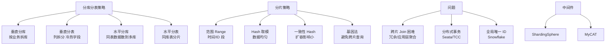

# 垂直切分(按照功能模块)

### 垂直切分（按功能模块）

垂直切分是指将表按照功能模块、关系密切程度划分出来，部署到不同的库上。

#### 关键细节与边界
- **拆分维度**：
  - **业务拆分**：基于微服务边界。例如，将用户库、订单库、商品库分别部署。
  - **字段拆分（大表拆小）**：当一个表列数过多（如大字段 Text/Blob）时，将不常用或大字段拆分到从表（扩展表）中，保证主表（热点表）的高效查询。
- **目的**：
  - **业务解耦**：便于微服务化，不同业务线对应不同数据库。
  - **IO 分散**：将密集的写操作（如订单）和读操作（如商品）分离到不同物理磁盘或实例。
  - **冷热分离**：通过字段拆分，提升热数据的内存命中率。
- **影响**：
  - **跨库 Join**：原本单库的 Join 查询失效，需要在应用层进行聚合查询或通过 API 调用获取。
  - **分布式事务**：业务操作涉及多个库，本地事务失效，需引入分布式事务（TCC、Seata 等）或最终一致性方案。

#### 架构示意图
```text
[ 单体应用 + 单库 ]
     |
     v
[ 电商大库 ]
  ├─ User 表
  ├─ Order 表
  ├─ Product 表
  └─ Pay 表

       || 垂直切分 (按业务模块)
       \/

[ 用户服务] --> [ User DB ] (User, Account)
[ 订单服务] --> [ Order DB] (Order, OrderItem)
[ 商品服务] --> [ Product DB] (Product, Category)
[ 支付服务] --> [ Pay DB   ] (Pay, Log)
```

#### 实战案例
在某社交平台重构中，我们将用户表中的 `profile_json`（大字段）和 `login_history`（高频日志）拆分到扩展表，使核心用户表的行大小减少了 60%，显著提升了 Buffer Pool 的并发访问能力。

#### 优化前后对比

| 特性 | 单体大库 | 垂直切分后 |
| :--- | :--- | :--- |
| **IO 竞争** | 所有业务读写混在一起，IO 瓶颈明显 | 按业务隔离，Order 的高写不阻塞 Product 的读 |
| **扩展性** | 只能整体扩容，成本高 | 可按业务负载独立扩容（如订单库配 SSD） |
| **耦合度** | 表关联紧密，难以拆分服务 | 业务边界清晰，易于微服务化 |
| **复杂度** | SQL 开发简单（支持 Join） | 需处理跨库 Join 和分布式事务 |

## 常见考点
1.  **垂直切分后的数据关联**：如何处理原表中的外键约束？（通常切分后应用层维护，不使用物理外键）。
2.  **字段拆分（冷热分离）**：针对包含 TEXT/BLOB 字段的表，如何优化？（将大字段迁移到扩展表，查询主表时不进行全表扫描）。
3.  **切分策略**：什么阶段进行垂直切分？（早期业务耦合度高时，通常优先于水平切分）。
4.  ** join 问题**：如果必须跨库 join，有哪些解决方案？（全局表、字段冗余、应用层组装、搜索引擎）。


## 核心架构图


## 核心知识点图


## 记忆要点

- 一句话定义：垂直切分是将表按业务模块或大字段拆分到不同库或扩展表。
- 目的对比：按业务拆库实现业务解耦与 IO 分离，按字段拆表实现冷热分离提升效率。
- 副作用：切分后单库 Join 失效，必须在应用层聚合或引入分布式事务。
- 先后顺序：通常先做垂直分库微服务化，再做水平分表。

## 结构化回答

**30 秒电梯演讲：** 把大库按业务拆成多个小库，专库专用。打个比方，大公司拆部门：把销售部、研发部、财务部搬到不同的办公楼，各忙各的。

**展开框架：**
1. **一句话定义** — 垂直切分是将表按业务模块或大字段拆分到不同库或扩展表。
2. **目的对比** — 按业务拆库实现业务解耦与 IO 分离，按字段拆表实现冷热分离提升效率。
3. **副作用** — 切分后单库 Join 失效，必须在应用层聚合或引入分布式事务。

**收尾：** 我在项目里踩过坑——在某社交平台重构中，我们将用户表中的 `profile_json`（大字段）和 `login_history`（高频日志）拆分到扩展表，使核心用户表的行大小减少了 60%，显著提升了 Buffer Pool 的并发访问能力。您想深入聊哪一段：原理、避坑还是对比选型？

## 视频脚本

> 预计时长：2 分钟 | 由浅入深

| 时间 | 画面/字幕 | 口播台词 | 讲解要点 |
|------|----------|----------|----------|
| 0:00 | 标题卡：垂直切分(按照功能模块) | "垂直切分(按照功能模块)？一句话——大公司拆部门：把销售部、研发部、财务部搬到不同的办公楼，各忙各的。" | 开场钩子 |
| 0:40 | 概念动画/示意图 | "把大库按业务拆成多个小库，专库专用——大公司拆部门：把销售部、研发部、财务部搬到不同的办公楼，各忙各的" | 核心定义 |
| 1:20 | 一句话定义示意 | "垂直切分是将表按业务模块或大字段拆分到不同库或扩展表。" | 要点1 |
| 2:00 | 总结卡 | "记住这几条，面试不慌。下期讲进阶追问。" | 收尾 |
