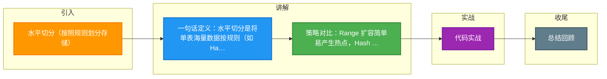

# 水平切分(按照规则划分存储)

### 水平切分（按规则划分存储）

当一个表中的数据量过大（如超过千万级）时，我们可以把该表的数据按照某种规则（如 ID 哈希、取模、范围）进行划分，然后存储到多个结构相同的表或不同的库上。

#### 关键细节与边界
- **拆分维度**：基于数据行。
  - **Range（范围）**：如按 ID 范围（0-100万, 100-200万）或时间。优点是范围查询快；缺点是数据分布不均，热点明显。
  - **Hash/Mod（取模）**：如 `user_id % N`。优点是数据分布均匀；缺点是范围查询需要遍历所有分片，扩容困难（需数据迁移）。
  - **Consistent Hashing（一致性哈希）**：解决取模扩容时大量数据迁移的问题。
  - **Geo/Enum**：如按地理位置、省份。
- **目的**：解决单表数据量过大带来的 B+ 树层级过高、查询性能下降问题，突破单机硬件瓶颈。
- **分片键**：必须包含在所有 SQL 的 WHERE 条件中，否则会路由到所有分片（全路由扫表），性能极差。
- **影响**：
  - **复杂查询**：Order By、Group By、分页 需要先在各个分片执行，再在应用层归并排序。
  - **主键生成**：不能使用自增 ID（不同分片可能冲突），需使用分布式 ID（Snowflake、UUID）。
  - **跨分片事务**：成本极高，通常尽量避免跨分片事务，或使用最终一致性。

#### 水平切分架构图
```text
[ SQL: SELECT * FROM User WHERE id = 105 ]
      |
      v
[ 分片中间件 / 路由层 ]
      |
      |  规则: id % 2
      +-----> 0 --> [ DB_Shard_0 ] -> User_0 表 (id: 2, 4, 6...)
      |
      +-----> 1 --> [ DB_Shard_1 ] -> User_1 表 (id: 1, 3, 5...) <-- 查询此库
```

#### 实战案例
某日志系统初期按“月”进行 Range 分片，导致当前月份所在的分片写入压力巨大，而历史月份数据几乎闲置。后改为按“用户ID Hash”分片，成功将写压力均匀分散到 10 个物理节点。

#### 分片策略对比

| 策略 | 优点 | 缺点 | 适用场景 |
| :--- | :--- | :--- | :--- |
| **Range (范围)** | 范围查询高效，扩容简单（只需增加新节点） | 数据分布不均，易产生热点 | 日志、订单历史查询（按时间） |
| **Hash (取模)** | 数据分布均匀，负载均衡 | 范围查询需全表扫描，扩容需迁移数据 | 用户 ID、商品 ID（读写均匀） |
| **Geo (地理位置)** | 查询局部性强 | 数据分布可能不均 | 电商按省分库、外卖配送 |

#### 代码示例 (ShardingSphere JDBC - Java)
```java
// 配置行表达式分片策略：根据 user_id 取模分片
String shardingColumn = "user_id";

// 分片算法：ds$->{user_id % 2} -> ds0, ds1
TableRuleConfiguration orderRule = new TableRuleConfiguration("t_order", "ds${0..1}.t_order_${0..1}");

orderRule.setDatabaseShardingStrategyConfig(
    new InlineShardingStrategyConfiguration(shardingColumn, "ds${user_id % 2}")
);
orderRule.setTableShardingStrategyConfig(
    new InlineShardingStrategyConfiguration(shardingColumn, "t_order_${user_id % 2}")
);
```

## 常见考点
1.  **分片扩容**：使用取模分片时，从 2 个分片扩容到 4 个分片，数据迁移量是多少？（约 75% 的数据需要重新路由）。如何优化？（采用倍增扩容法或一致性哈希）。
2.  **非分片键查询**：如果 SQL 查询条件不带分片键怎么办？（通过“冗余字段”或“映射表/索引表”实现反查，或者使用 ES 等搜索引擎）。
3.  **分页查询优化**：如何高效实现深分页（如 LIMIT 1000000, 10）？（先在各分片查出 ID，归并排序后取前 1000010 个 ID，再回表查询详情；或禁止深分页）。
4.  **垂直切分 vs 水平切分**：通常先垂直切分拆分业务，当单业务下的单表数据量过大时，再进行水平切分。


## 核心架构图

```mermaid
flowchart TD
    classDef start fill:#4CAF50,color:#fff
    classDef process fill:#2196F3,color:#fff
    classDef decision fill:#FF9800,color:#fff
    classDef special fill:#9C27B0,color:#fff
    classDef error fill:#f44336,color:#fff
    classDef info fill:#607D8B,color:#fff
    class A start
    class B process
    class C decision
    class D special
    class E error
    class F info
    class G start
    class H process
    class Hash decision
    class I special
    class ID error
    class J info
    class Join start
    class K process
    class L decision
    class M special
    class MyCAT error
    class N info
    class O start
    class P process
    class Q decision
    class Range special
    class Seata error
    class ShardingSphere info
    class Snowflake start
    class TCC process
    class br decision
    A[分库分表策略] --> B[垂直分库<br/>按业务拆库]
    A --> C[垂直分表<br/>列拆分 冷热字段]
    A --> D[水平分库<br/>同表数据散到多库]
    A --> E[水平分表<br/>同库表分片]
    F[分片策略] --> G[范围 Range<br/>时间/ID 段]
    F --> H[Hash 取模<br/>数据均匀]
    F --> I[一致性 Hash<br/>扩容影响小]
    F --> J[基因法<br/>避免跨片查询]
    K[问题] --> L[跨片 Join 困难<br/>冗余/应用层聚合]
    K --> M[分布式事务<br/>Seata/TCC]
    K --> N[全局唯一 ID<br/>Snowflake]
    O[中间件] --> P[ShardingSphere]
    O --> Q[MyCAT]
```



## 记忆要点

- 一句话定义：水平切分是将单表海量数据按规则(如 Hash、Range)拆分到多张结构相同的表/库。
- 策略对比：Range 扩容简单易产生热点，Hash 分布均匀但扩容迁移成本高。
- 分片键设计：分片键必须包含在查询条件中，否则会触发全路由扫表性能极差。
- 架构影响：切分后自增 ID 冲突需用分布式 ID，跨库 Join 和深分页需特殊改造。

## 结构化回答

**30 秒电梯演讲：** 把大表按数据行拆分成多个小表，分散存储。打个比方，分账本：账本太厚了，按姓氏笔画拆成好几本，每个人的账还在，但查起来要找不同的本子。

**展开框架：**
1. **一句话定义** — 水平切分是将单表海量数据按规则(如 Hash、Range)拆分到多张结构相同的表/库。
2. **策略对比** — Range 扩容简单易产生热点，Hash 分布均匀但扩容迁移成本高。
3. **分片键设计** — 分片键必须包含在查询条件中，否则会触发全路由扫表性能极差。

**收尾：** 我在项目里踩过坑——某日志系统初期按“月”进行 Range 分片，导致当前月份所在的分片写入压力巨大，而历史月份数据几乎闲置。您想深入聊哪一段：原理、避坑还是对比选型？

## 视频脚本

> 预计时长：2 分钟 | 由浅入深

| 时间 | 画面/字幕 | 口播台词 | 讲解要点 |
|------|----------|----------|----------|
| 0:00 | 标题卡：水平切分(按照规则划分存储) | "水平切分(按照规则划分存储)？一句话——分账本：账本太厚了，按姓氏笔画拆成好几本，每个人的账还在，但查起来要找不同的本子。" | 开场钩子 |
| 0:40 | 概念动画/示意图 | "把大表按数据行拆分成多个小表，分散存储——分账本：账本太厚了，按姓氏笔画拆成好几本，每个人的账还在，但查起来要找不同的本子" | 核心定义 |
| 1:20 | 一句话定义示意 | "水平切分是将单表海量数据按规则(如 Hash、Range)拆分到多张结构相同的表/库。" | 要点1 |
| 2:00 | 总结卡 | "记住这几条，面试不慌。下期讲进阶追问。" | 收尾 |

### 视频流程图



