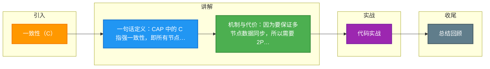

# 一致性（C）

### CAP 定理 - 一致性

CAP 定理指出，在一个分布式系统中，一致性、可用性、分区容错性这三者最多只能同时实现两点。

**一致性**：在分布式系统中的所有数据备份，在同一时刻是否同样的值。（等同于所有节点访问同一份最新的数据副本）。

### 补充细节：强一致性与线性一致性
在 CAP 的语境下，一致性通常指的是**强一致性**，更学术的术语是**线性一致性**。这意味着：

1.  **原子性**：写操作在所有副本看来要么全成功，要么全失败。
2.  **时序性**：系统的操作看起来像是在单一原子时钟下执行的。任何客户端读取到最新数据后，随后的读取必须也能读到该数据或更新的数据，不能读到旧数据。

**实现代价**：为了保证强一致性，系统在写入数据时，通常需要利用诸如 **2PC（两阶段提交）** 或 **Paxos/Raft** 等协议，确保大多数节点（或全部节点）同步成功后才能向客户端返回“写入成功”。这会引入较大的网络延迟。

### ASCII 架构示意图

    Client
       │
       ▼
┌──────────────┐
│   Load       │
│   Balancer   │
└──────┬───────┘
       │ (Write Request)
       ├──────────────────────────┐
       ▼                          ▼
┌──────────────┐          ┌──────────────┐
│   Node A     │◄────────►│   Node B     │
│ (Leader/     │  Sync    │ (Follower/   │
│  Primary)    │          │  Replica)    │
└──────┬───────┘          └──────┬───────┘
       │                          │
       └──────────┬───────────────┘
                  ▼
         (Ack after Majority Commit)
                  │
                  ▼
            Return Success to Client

#### 实战案例
在电商库存扣减场景中，如果为了满足高可用（AP）允许缓存写入但不强一致性同步 DB，可能导致超卖。为了保证数据准确性，我们采用了 CP 模型，利用 Redis + Lua 脚本或 Redisson 分布式锁，在获取锁期间阻塞写请求，确保库存强一致，虽然牺牲了部分响应时间，但避免了资损。

#### CAP 模型对比

| 模型 | 关注点 | 典型技术 | 缺点 | 适用场景 |
| :--- | :--- | :--- | :--- | :--- |
| **CP** (强一致) | 数据正确性，宁可不可用也不给错数据 | ZooKeeper, HBase, Redis (Cluster 模式等待) | 写入延迟高，服务可能降级 | 金融转账、库存扣减、配置中心 |
| **AP** (高可用) | 系统服务能力，允许数据短时不一致 | Cassandra, DynamoDB, DNS | 数据不一致，需处理冲突 | 社交动态、电商商品详情（最终一致） |
| **BASE** | 折中方案，基本可用+软状态+最终一致 | MQ 消息队列、Seata (TCC/Saga) | 逻辑复杂，开发成本高 | 跨系统业务通知、非核心数据 |

## 常见考点
1.  **CAP 与 ACID 的 C 区别**：ACID 中的 C 指的是数据库事务内部的原子性，相关数据要么全改要么全不改；而 CAP 中的 C 指的是分布式多节点间的数据副本一致性。
2.  **BASE 理论**：往往追问如果放弃强一致性（C），通常选择 AP，此时如何保证数据最终一致？需结合 BASE（Basically Available, Soft state, Eventually consistent）和最终一致性模型回答。
3.  **读写一致性策略**：追问如何通过客户端路由或版本号向量实现“读己之写”或“单调读”等一致性级别。

## 核心架构图

```mermaid
flowchart TD
    classDef start fill:#4CAF50,color:#fff
    classDef process fill:#2196F3,color:#fff
    classDef decision fill:#FF9800,color:#fff
    classDef special fill:#9C27B0,color:#fff
    classDef error fill:#f44336,color:#fff
    classDef info fill:#607D8B,color:#fff
    class A start
    class ACID process
    class AP decision
    class Atomicity special
    class B error
    class C info
    class CAP start
    class CP process
    class Cassandra decision
    class Consistency special
    class D error
    class Durability info
    class E start
    class Eureka process
    class F decision
    class G special
    class H error
    class I info
    class Isolation start
    class J process
    class K decision
    class L special
    class Log error
    class M info
    class MVCC start
    class MySQL process
    class N decision
    class O special
    class Oracle error
    class P info
    class PG start
    class Q process
    class R decision
    class RC special
    class RR error
    class RU info
    class Redo start
    class S process
    class Serializable decision
    class Undo special
    class ZooKeeper error
    class br info
    A[ACID 事务特性] --> B[A 原子性 Atomicity<br/>Undo Log 回滚]
    A --> C[C 一致性 Consistency<br/>约束始终满足]
    A --> D[I 隔离性 Isolation<br/>锁+MVCC]
    A --> E[D 持久性 Durability<br/>Redo Log 落盘]
    F[隔离级别] --> G[读未提交 RU]
    F --> H[读已提交 RC<br/>Oracle/PG 默认]
    F --> I[可重复读 RR<br/>MySQL 默认]
    F --> J[串行化 Serializable]
    K[并发问题] --> L[脏读/不可重复读/幻读]
    M[CAP 定理] --> N[一致性 C]
    M --> O[可用性 A]
    M --> P[分区容错 P<br/>分布式必选]
    Q[取舍] --> R[CP 强一致 ZooKeeper]
    Q --> S[AP 最终一致 Cassandra/Eureka]
```

## 记忆要点

- 一句话定义：CAP 中的 C 指强一致性，即所有节点同一时刻读取的数据完全一致。
- 机制与代价：因为要保证多节点数据同步，所以需要 2PC 或 Paxos 协议，导致高延迟。
- CP 与 AP 权衡：金融扣款选 CP 宁可阻塞报错，社交浏览选 AP 允许短时不一致。
- 易混对比：CAP 的 C 是多节点间的数据副本一致性，而 ACID 的 C 是事务的约束一致性。

## 结构化回答

**30 秒电梯演讲：** 所有节点在同一时刻看到的数据必须完全一样。打个比方，看新闻：所有人打开新闻APP看到的都是最新的一条，没有延迟。

**展开框架：**
1. **一句话定义** — CAP 中的 C 指强一致性，即所有节点同一时刻读取的数据完全一致。
2. **机制与代价** — 因为要保证多节点数据同步，所以需要 2PC 或 Paxos 协议，导致高延迟。
3. **CP 与 AP 权衡** — 金融扣款选 CP 宁可阻塞报错，社交浏览选 AP 允许短时不一致。

**收尾：** 我在项目里踩过坑——在电商库存扣减场景中，如果为了满足高可用（AP）允许缓存写入但不强一致性同步 DB，可能导致超卖。您想深入聊哪一段：原理、避坑还是对比选型？

## 视频脚本

> 预计时长：2 分钟 | 由浅入深

| 时间 | 画面/字幕 | 口播台词 | 讲解要点 |
|------|----------|----------|----------|
| 0:00 | 标题卡：一致性（C） | "一致性（C）？一句话——看新闻：所有人打开新闻APP看到的都是最新的一条，没有延迟。" | 开场钩子 |
| 0:40 | 概念动画/示意图 | "所有节点在同一时刻看到的数据必须完全一样——看新闻：所有人打开新闻APP看到的都是最新的一条，没有延迟" | 核心定义 |
| 1:20 | 一句话定义示意 | "CAP 中的 C 指强一致性，即所有节点同一时刻读取的数据完全一致。" | 要点1 |
| 2:00 | 总结卡 | "记住这几条，面试不慌。下期讲进阶追问。" | 收尾 |

### 视频流程图

