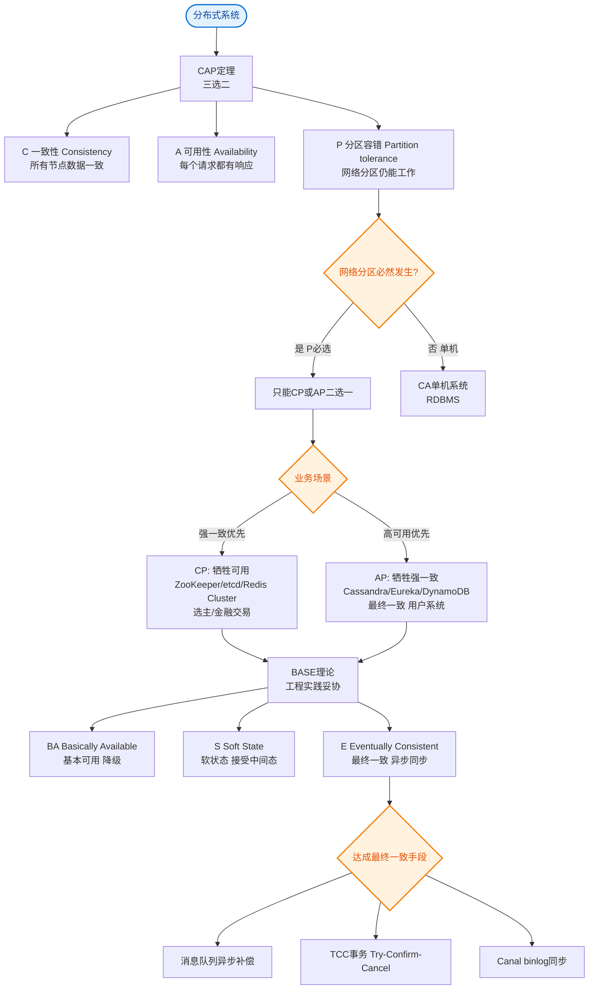

# 可用性（A）

CAP 定理 - 可用性

CAP 定理指出，在一个分布式系统中，一致性、可用性、分区容错性这三者最多只能同时实现两点。

**可用性**：在集群中一部分节点故障后，集群整体是否还能响应客户端的读写请求。（对数据更新具备高可用性）。

*注：这里强调“每次请求都能获取到非错的响应”，但不保证获取的数据是最新的。

### 补充细节：高可用的度量与实现

在分布式系统中，高可用不仅意味着“服务不挂”，更意味着**响应时间在可接受范围内**。

1.  **无状态设计**：为了实现高可用，服务节点通常设计为无状态，任何一个节点挂掉，负载均衡器可以立即将流量切换到其他健康节点。
2.  **故障自动转移**：系统必须具备自动检测节点故障并剔除的能力（如 K8s 的探活机制、心跳检测）。
3.  **降级与限流**：在极端流量下，为了保证核心服务可用，可能会牺牲部分非核心功能（降级）或拒绝部分请求（限流），这也是保护可用性的手段。

**AP 系统的权衡**：在选择 AP 的系统中，为了保证“不报错”，当网络分区发生导致无法同步数据时，节点可能会返回本地旧数据，导致数据不一致，但保证了服务一直可用。

### 实战案例
在电商大促场景下，为了追求高可用（AP），商品详情页的“库存”显示可能会与数据库实际库存不一致。例如，Redis 节点因网络分区未能同步扣减库存，用户看到“有货”而下单失败。虽然牺牲了实时一致性，但保证了浏览服务不崩溃。

### 代码示例（Go）
```go
// 模拟 AP 架构下的降级读取：优先读本地缓存，失败则返回默认值而非报错
func GetProductStock(productID string) int64 {
    if val, err := redis.Get(productID); err == nil {
        return val
    }
    // 当 Redis 不可用时，AP 策略选择返回兜底值而非阻塞或报错，保证可用性
    log.Warn("Redis unavailable, returning fallback stock")
    return 0 
}
```

### 对比表格

| 维度 | 高可用 (AP) | 强一致 (CP) |
| :--- | :--- | :--- |
| **核心目标** | 服务一直在线，随时可响应 | 数据严格准确，绝无偏差 |
| **故障表现** | 返回旧数据或默认值 | 拒绝请求或阻塞等待 |
| **典型场景** | 社交媒体点赞、商品浏览 | 银行转账、支付扣款 |
| **用户体验** | 流畅，但可能看到瞬时脏数据 | 卡顿或报错，但数据可信 |

### ASCII 架构示意图

    Client
       │
       ▼
┌──────────────┐
│   Gateway /  │
│   Load       │
│   Balancer   │
└──────┬───────┘
       │
       ├──────────────────────────┐
       ▼ (Healthy)                ▼ (Failed)
┌──────────────┐          ┌──────────────┐
│   Node A     │          │   Node B     │
│    [UP]      │          │   [DOWN]     │
│              │          │ (Timed out/  │
│ Response OK  │          │  Network Err)│
└──────────────┘          └──────────────┘
       │
       │ (Traffic automatically re-routed to A)
       ▼
   Return OK (Latency increased but success)

## 常见考点
1.  **可用性指标**：通常会问如何量化可用性？回答：SLA（Service Level Agreement），如 99.99%（4个9）代表全年允许停机时间约 52.56 分钟。
2.  **剔除故障节点的时间**：面试官可能会问，节点刚挂掉，流量切过去报错了怎么办？这涉及到“健康检查间隔”与“超时时间”的配置（如 Ribbon 的超时设置）。
3.  **区别于可靠性**：可用性强调“随时可访问”，可靠性强调“系统运行正确无误”。在面试中要区分这两个概念。


## 核心流程图


## 记忆要点

- 一句话定义：CAP 中的 A 指高可用性，即集群部分节点故障时仍能保证非错响应。
- 实现手段：无状态设计、故障自动转移、以及合理的限流降级策略。
- AP 系统的权衡：为了随时响应，网络分区时可能返回本地旧数据，牺牲了强一致性。
- 指标与对比：高可用可用 SLA(如4个9) 量化，可用强调随时访问，可靠强调运行正确。

## 结构化回答

**30 秒电梯演讲：** 系统无论是否出现故障，每次请求都能得到响应。打个比方，自动售货机：哪怕里面缺货了，机器也能亮灯回应你（虽然买不到东西），而不是直接黑屏。

**展开框架：**
1. **一句话定义** — CAP 中的 A 指高可用性，即集群部分节点故障时仍能保证非错响应。
2. **实现手段** — 无状态设计、故障自动转移、以及合理的限流降级策略。
3. **AP 系统的权衡** — 为了随时响应，网络分区时可能返回本地旧数据，牺牲了强一致性。

**收尾：** 我在项目里踩过坑——在电商大促场景下，为了追求高可用（AP），商品详情页的“库存”显示可能会与数据库实际库存不一致。您想深入聊哪一段：原理、避坑还是对比选型？

## 视频脚本

> 预计时长：2 分钟 | 由浅入深

| 时间 | 画面/字幕 | 口播台词 | 讲解要点 |
|------|----------|----------|----------|
| 0:00 | 标题卡：可用性（A） | "可用性（A）？一句话——自动售货机：哪怕里面缺货了，机器也能亮灯回应你（虽然买不到东西），而不是直接黑屏。" | 开场钩子 |
| 0:40 | 概念动画/示意图 | "系统无论是否出现故障，每次请求都能得到响应——自动售货机：哪怕里面缺货了，机器也能亮灯回应你（虽然买不到东西），而不是直接黑屏" | 核心定义 |
| 1:20 | 一句话定义示意 | "CAP 中的 A 指高可用性，即集群部分节点故障时仍能保证非错响应。" | 要点1 |
| 2:00 | 总结卡 | "记住这几条，面试不慌。下期讲进阶追问。" | 收尾 |
