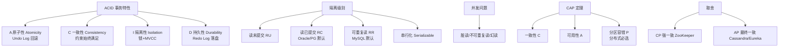

# 分区容忍性（P）

CAP 定理 - 分区容错性

CAP 定理指出，在一个分布式系统中，一致性、可用性、分区容错性这三者最多只能同时实现两点。

**分区容错性**：以实际效果而言，分区相当于对通信的时限要求。系统如果不能在时限内达成数据一致性，就意味着发生了分区的情况，必须就当前操作在 C 和 A 之间做出选择。

在分布式系统中，P 是客观存在的（网络必然可能通断），因此架构通常是在 CP 和 AP 之间做权衡。

### 补充细节：分区的本质与应对

1.  **网络分区的本质**：在分布式系统中，节点之间通过网络通信。网络是不可靠的，可能出现丢包、延迟、断连。当集群被分割成多个无法互相通信的区域时，就发生了“分区”。
2.  **P 是必须的**：既然我们设计的是“分布式”系统，节点必然部署在不同机器上，物理上的网络故障是不可避免的。因此，你**无法**放弃 P。一旦放弃 P，系统就退化为了单机系统。
3.  **P 发生时的抉择**：
    *   **选择 CP（一致性优先）**：当分区发生，系统为了保持数据一致，会拒绝写入请求或阻塞等待，直到网络恢复。这牺牲了可用性（如传统的 RDBMS 强一致性模式，Zookeeper）。
    *   **选择 AP（可用性优先）**：当分区发生，系统允许继续读写，但可能出现数据冲突（脑裂）或脏读，待网络恢复后再进行数据同步。这牺牲了一致性（如 Cassandra, DynamoDB, DNS）。

### 实战案例
在微服务架构中，若核心数据库与下单服务处于不同的可用区，发生光纤挖断导致网络分区（P发生）。此时如果系统是 CP 设计（如 etcd），下单服务会因拿不到分布式锁而直接报错；如果是 AP 设计（如 Eureka 老版本），服务注册中心可能仍然允许注册，导致请求路由到已故障的节点。

### 对比表格

| 特性 | CP 系统 (Consistency + Partition) | AP 系统 (Availability + Partition) |
| :--- | :--- | :--- |
| **分区发生时** | 阻塞或报错，拒绝非一致写 | 接受写请求，标记为“未同步” |
| **数据状态** | 任何时刻都是强一致的 | 可能存在脏读或写入冲突 |
| **恢复策略** | 网络恢复后直接继续 | 需要进行数据冲突解决（Merge） |
| **典型代表** | ZooKeeper, HBase, Redis (Cluster) | Cassandra, DynamoDB, Eureka |

### ASCII 架构示意图

    ┌───────────────────────────────────────────┐
    │           Network Fabric (P)              │
    │  ┌───────────┐       Partition       ┌──────▼──────┐
    │  │  Zone 1   │  ───────────────────  │   Zone 2    │
    │  │ (Nodes)   │   Link Broken /      │  (Nodes)    │
    │  │           │   High Latency       │             │
    │  └─────┬─────┘                       └──────┬──────┘
    └────────┼──────────────────────────────────┼───────────┘
             │                                  │
    ┌────────▼──────┐                   ┌────────▼──────┐
    │   Choice:     │                   │   Choice:     │
    │  1. Lock/Wait │                   │  1. Accept    │
    │     (CP)      │                   │     (AP)      │
    │               │                   │               │
    │ Result:       │                   │ Result:       │
    │ Error / Timeout│                   │ Success (Old  │
    │               │                   │ Data)         │
    └───────────────┘                   └───────────────┘

## 常见考点
1.  **CP vs AP 的典型场景**：
    *   CP：金融系统、支付系统（不能有金额错误，宁可挂掉也不能算错），ZooKeeper、HBase。
    *   AP：社交媒体点赞、商品详情页浏览（允许短时不一致，用户体验优先），Cassandra、Eureka（AP 设计，保证注册中心可用）。
2.  **BASE 理论**：在 AP 系统中，如何通过“最终一致性”来弥补放弃 C 带来的问题。
3.  **分区恢复后的处理**：AP 系统在网络恢复后如何解决数据冲突（如向量时钟、CRDT 数据结构或 Last Write Wins 策略）。

## 核心架构图

## 核心知识点图

## 记忆要点

- 一句话定义：P 指网络分区容忍性，即系统遇到网络断连时仍能对外提供服务。
- 客观必然性：因为分布式网络必然可能故障，所以 P 是无法放弃的，必须存在。
- 抉择本质：发生网络分区时，架构实际上只能在 CP(一致性与报错) 和 AP(可用性与旧数据) 中二选一。
- 常见场景：ZooKeeper 属于 CP 系统，Eureka 和 Cassandra 属于 AP 系统。

## 结构化回答

**30 秒电梯演讲：** 系统在网络断开或消息丢失时，仍能继续运行。打个比方，断网聊天：手机没信号时，电脑端依然能收发消息，等有网了再同步。

**展开框架：**
1. **一句话定义** — P 指网络分区容忍性，即系统遇到网络断连时仍能对外提供服务。
2. **客观必然性** — 因为分布式网络必然可能故障，所以 P 是无法放弃的，必须存在。
3. **抉择本质** — 发生网络分区时，架构实际上只能在 CP(一致性与报错) 和 AP(可用性与旧数据) 中二选一。

**收尾：** 我在项目里踩过坑——在微服务架构中，若核心数据库与下单服务处于不同的可用区，发生光纤挖断导致网络分区（P发生）。您想深入聊哪一段：原理、避坑还是对比选型？

## 视频脚本

> 预计时长：2 分钟 | 由浅入深

| 时间 | 画面/字幕 | 口播台词 | 讲解要点 |
|------|----------|----------|----------|
| 0:00 | 标题卡：分区容忍性（P） | "分区容忍性（P）？一句话——断网聊天：手机没信号时，电脑端依然能收发消息，等有网了再同步。" | 开场钩子 |
| 0:40 | 概念动画/示意图 | "系统在网络断开或消息丢失时，仍能继续运行——断网聊天：手机没信号时，电脑端依然能收发消息，等有网了再同步" | 核心定义 |
| 1:20 | 一句话定义示意 | "P 指网络分区容忍性，即系统遇到网络断连时仍能对外提供服务。" | 要点1 |
| 2:00 | 总结卡 | "记住这几条，面试不慌。下期讲进阶追问。" | 收尾 |
