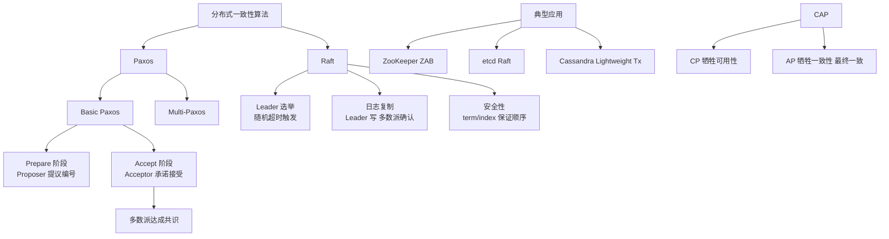

# 一致性算法

Paxos 与 Zab 算法

**Paxos 算法**
Paxos 算法解决的问题是：在一个可能发生故障的分布式系统中，如何就某个值（决议）达成一致。它是基于消息传递的一致性算法。

**三种角色**：
1.  **Proposer（提议者）**：提出提案，只要提案被半数以上 Acceptor 接受，即认为被选定。
2.  **Acceptor（接受者）**：对提案进行投票表决。
3.  **Learner（学习者）**：获取最终达成一致的提案值。

**执行阶段（两阶段提交）**：
1.  **准备阶段**：Proposer 选择一个提案编号 N，向超过半数的 Acceptor 发送 Prepare 请求。Acceptor 承诺不再接受编号小于 N 的提案。
2.  **接受阶段**：如果 Proposer 收到半数以上响应，则发送 Accept 请求。Acceptor 在未承诺过更大编号的情况下接受该提案。

**Zab 算法**
ZAB (ZooKeeper Atomic Broadcast) 协议是 Zookeeper 专用的原子消息广播协议，旨在保证分布式数据的一致性。它包含两种模式：
1.  **崩溃恢复**：当 leader 崩溃时，通过选举产生新 leader，并同步数据状态。
2.  **消息广播**：类似于 Paxos，Leader 接收请求并广播给 Follower，保证事务顺序一致性。

### 补充细节：活锁与 Zxid

1.  **Paxos 的活锁问题**：如果在 Prepare 阶段，两个 Proposer 恰好提出了递增的编号 N 和 N+1，导致互相打断，始终无法达成决议。Multi-Paxos 通过选出一个固定的 Leader 来解决这个问题。
2.  **Zab 的核心保证**：
    *   **全局有序**：所有事务请求必须通过 Leader 处理，Leader 分配全局唯一的 **Zxid (Zookeeper Transaction Id)**（64位：高32位是纪元 epoch，低32位是计数器）。
    *   **Epoch 变化**：每次 Leader 重新选举，epoch 都会加 1。这保证了旧 Leader 即使恢复也无法提交新数据（因为 epoch 小）。

### 实战案例
在使用 ZooKeeper 做分布式锁时，如果 Leader 宕机，Zab 协议会进入崩溃恢复模式。此时客户端请求会被阻塞直到新 Leader 选举完成并完成数据同步（Truncation 或 Catch up）。如果业务对锁的持有时间非常敏感，需要调优 `initLimit` 和 `syncLimit` 参数以适应网络延迟。

### 对比表格

| 对比项 | Paxos 算法 | Zab 算法 |
| :--- | :--- | :--- |
| **定位** | 通用的分布式一致性协议 | 专为 ZooKeeper 设计的原子广播协议 |
| **角色** | Proposer, Acceptor, Learner | Leader, Follower, Observer |
| **阶段划分** | Prepare (Promise) -> Accept | Discovery (选举) -> Broadcast (同步) -> Broadcast (写) |
| **性能优化** | 允许多个 Proposer (理论)，Multi-Paxos 选主 | 强制 Leader，简化了流程，吞吐量高 |
| **一致性保证** | 只要大多数存活就能达成一致 | 保证同一历史事务顺序，严格有序 |

### ASCII 架构示意图 (Zab 消息广播)

    Client
       │
       ▼
┌───────────────┐
│    Leader     │ (Assign Zxid)
│  (Proposer)   │
└───────┬───────┘
        │
        │ 1. Proposal (Zxid)
        ├───────────────────────┬──────────────────────┐
        ▼                       ▼                      ▼
┌───────────────┐       ┌───────────────┐      ┌───────────────┐
│   Follower 1  │       │   Follower 2  │      │   Follower 3  │
└───────┬───────┘       └───────┬───────┘      └───────┬───────┘
        │                       │                      │
        │ 2. ACK                │ 2. ACK               │ 2. ACK
        │                       │                      │
        └───────────┬───────────┴──────────────────────┘
                    ▼
            ┌───────────────┐
            │    Leader     │ (Received > Majority ACKs)
            └───────┬───────┘
                    │
                    │ 3. Commit
                    ├───────────────────────┬──────────────────────┐
                    ▼

## 核心架构图

## 记忆要点

- 算法对比：Paxos 是通用的且难实现，而 Zab 是 ZooKeeper 专用的主备原子广播协议。
- Zab 两大模式：日常运行用消息广播(类似两阶段提交)，Leader 宕机用崩溃恢复。
- Zab 核心保障：因为 Leader 分配了全局唯一的 Zxid，所以保证了事务的全局严格有序。
- 防脑裂机制：每次重新选举 epoch(纪元) 都会加 1，从而屏蔽旧 Leader 的错误指令。

## 结构化回答

**30 秒电梯演讲：** 分布式系统通过投票和提案机制在多个节点间达成数据一致。打个比方，议会表决：提案人发起议题，议员投票，只要过半同意，决议就生效。

**展开框架：**
1. **算法对比** — Paxos 是通用的且难实现，而 Zab 是 ZooKeeper 专用的主备原子广播协议。
2. **Zab 两大模式** — 日常运行用消息广播(类似两阶段提交)，Leader 宕机用崩溃恢复。
3. **Zab 核心保障** — 因为 Leader 分配了全局唯一的 Zxid，所以保证了事务的全局严格有序。

**收尾：** 我在项目里踩过坑——在使用 ZooKeeper 做分布式锁时，如果 Leader 宕机，Zab 协议会进入崩溃恢复模式。您想深入聊哪一段：原理、避坑还是对比选型？

## 视频脚本

> 预计时长：3 分钟 | 由浅入深

| 时间 | 画面/字幕 | 口播台词 | 讲解要点 |
|------|----------|----------|----------|
| 0:00 | 标题卡：一致性算法 | "一致性算法？一句话——议会表决：提案人发起议题，议员投票，只要过半同意，决议就生效。" | 开场钩子 |
| 0:45 | 概念动画/示意图 | "分布式系统通过投票和提案机制在多个节点间达成数据一致——议会表决：提案人发起议题，议员投票，只要过半同意，决议就生效" | 核心定义 |
| 1:30 | 算法对比示意 | "Paxos 是通用的且难实现，而 Zab 是 ZooKeeper 专用的主备原子广播协议。" | 要点1 |
| 2:15 | Zab 两大模式示意 | "日常运行用消息广播(类似两阶段提交)，Leader 宕机用崩溃恢复。" | 要点2 |
| 3:00 | 总结卡 | "记住这几条，面试不慌。下期讲进阶追问。" | 收尾 |
