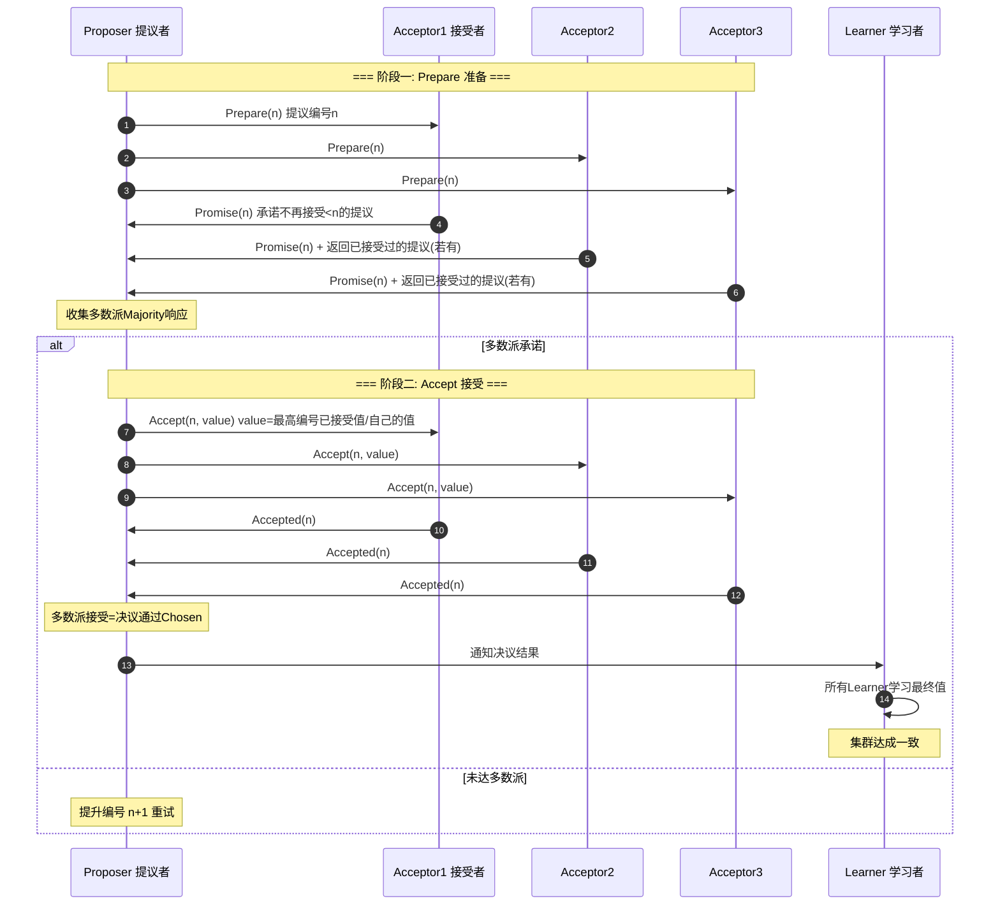

# Paxos三种角色：Proposer，Acceptor，Learners

Paxos 三种角色：Proposer，Acceptor，Learners

Paxos 算法解决的问题是一个分布式系统如何就某个值（决议）达成一致。一个典型的场景是，在一个分布式数据库系统中，如果各节点的初始状态一致，每个节点执行相同的操作序列，那么他们最后能得到一个一致的状态。为保证每个节点执行相同的命令序列，需要在每一条指令上执行一个“一致性算法”以保证每个节点看到的指令一致。zookeeper 使用的zab 算法是该算法的一个实现。

**Paxos 三种角色**：

*   **Proposer**：只要Proposer 发的提案被半数以上Acceptor 接受，Proposer 就认为该提案里的value 被选定了。
*   **Acceptor**：只要Acceptor 接受了某个提案，Acceptor 就认为该提案里的value 被选定了。
*   **Learner**：Acceptor 告诉Learner 哪个value 被选定，Learner 就认为那个value 被选定。

**Paxos 算法分为两个阶段**：

**阶段一（准leader 确定 / Prepare）**：
(a) Proposer 选择一个提案编号N，然后向半数以上的Acceptor 发送编号为N 的Prepare 请求。
(b) 如果一个Acceptor 收到一个编号为N 的Prepare 请求，且N 大于该Acceptor 已经响应过的所有Prepare 请求的编号，那么它就会将它已经接受过的编号最大的提案（如果有的话）作为响应反馈给Proposer，同时该Acceptor 承诺不再接受任何编号小于N 的提案。

**阶段二（leader 确认 / Accept）**：
(a) 如果Proposer 收到半数以上Acceptor 对其发出的编号为N 的Prepare 请求的响应，那么它就会发送一个针对[N,V]提案的Accept 请求给半数以上的Acceptor。注意：V 就是收到的响应中编号最大的提案的value，如果响应中不包含任何提案，那么V 就由Proposer 自己决定。
(b) 如果Acceptor 收到一个针对编号为N 的提案的Accept 请求，只要该Acceptor 没有对编号大于N 的Prepare 请求做出过响应，它就接受该提案。

### 补充细节：编号生成与多数派约束

1.  **提案编号 N 的全局唯一性**：Paxos 的正确性依赖于提案编号 N 的唯一性和全序性。通常 N 可以生成，其中 `timestamp` 保证单调递增，`server_id` 解决并发冲突。
2.  **P1b 约束的必要性**：阶段一(b)中，Acceptor 返回“已接受过的最大编号提案的 value”是 Paxos 算法的核心。这保证了如果有某个 value 已经被选定（被多数派接受），后续的 Proposer 必须提交相同的 value，从而保证一致性（即“少数服从多数”的传递性）。
3.  **Learner 优化**：当 Acceptor 数量很多时，让每个 Acceptor 通知所有 Learner 会导致消息爆炸。通常优化为：Acceptor 只通知主 Learner，由主 Learner 广播给其他 Learner。

### 实战案例
在分布式配置中心（如 Chubby）中，Acceptor 通常运行在少数几个核心节点上，而大量的客户端作为 Learner。为了避免所有 Acceptor 向所有客户端广播变更造成网络风暴，通常会选取一个“主 Learner”或者由主 Acceptor 负责推送更新给其他 Learner。

### 对比表格

| 角色 | 职责 | 关键行为 | 并发影响 |
| :--- | :--- | :--- | :--- |
| **Proposer** | 发起提案 | 生成递增的 N，发起 Prepare/Accept | 多 Proposer 竞争会导致“活锁” |
| **Acceptor** | 投票表决 | 响应 Prepare，接受 Accept | 必须持久化已接受的 N 和 Value |
| **Learner** | 获取结果 | 接受被选定的 Value | 被动接收，不参与共识过程 |

### 代码示例（Python - 逻辑模拟）
```python
class Acceptor:
    def __init__(self):
        self.max_promised = 0
        self.accepted_n = 0
        self.accepted_v = None

    def prepare(self, n):
        # P1b: 拒绝小于当前承诺的编号
        if n < self.max_promised:
            return False, None
        self.max_promised = n
        # 返回之前已接受的值（如果有），保证一致性传递
        return True, (self.accepted_n, self.accepted_v)
```

### ASCII 流程图

    Client
       │
       ▼
┌───────────────────────────────────────────────┐
│              Proposer (New Proposal N=5)       │
└───────────────────┬───────────────────────────┘
                    │
      Prepare(N=5)  │
                    ▼
      ┌─────────────────────────────────────┐
      │           Acceptor Set               │
      │  ┌─────────┐  ┌─────────┐  ┌─────────┐
      │  │  A1     │  │  A2     │  │  A3     │
      │  │Promise  │  │Promise  │  │Promise  │
      │  │ N<5     │  │ N<5     │  │ (Reject │
      │  │         │  │         │  │  if N<5)│
      │  └────┬


## 核心流程图


## 记忆要点

- 三角色定义：Proposer 提案，Acceptor 批准投票，Learner 被动学习最终结果。
- 核心约束：Proposer 的提案只要被半数以上 Acceptor 接受，即认为该决议被选定。
- 多数派传递：Acceptor 必须返回已接受的最大编号提案，从而保证后续 Proposer 提交相同值。
- 优化机制：多 Proposer 竞争会导致活锁，Multi-Paxos 通过选固定 Leader 解决此问题。

## 结构化回答

**30 秒电梯演讲：** 通过提议者、接受者、学习者三种角色协作，在不可靠网络中达成共识。打个比方，像议会表决：Proposer提提案，Acceptor半数以上投票通过，Learner记录结果。

**展开框架：**
1. **三角色定义** — Proposer 提案，Acceptor 批准投票，Learner 被动学习最终结果。
2. **核心约束** — Proposer 的提案只要被半数以上 Acceptor 接受，即认为该决议被选定。
3. **多数派传递** — Acceptor 必须返回已接受的最大编号提案，从而保证后续 Proposer 提交相同值。

**收尾：** 我在项目里踩过坑——在分布式配置中心（如 Chubby）中，Acceptor 通常运行在少数几个核心节点上，而大量的客户端作为 Learner。您想深入聊哪一段：原理、避坑还是对比选型？

## 视频脚本

> 预计时长：3 分钟 | 由浅入深

| 时间 | 画面/字幕 | 口播台词 | 讲解要点 |
|------|----------|----------|----------|
| 0:00 | 标题卡：Paxos三种角色：Proposer… | "Paxos三种角色：Proposer，Acceptor，Learners？一句话——像议会表决：Proposer提提案，Acceptor半数以上投票通过，Learner记录结果。" | 开场钩子 |
| 0:45 | 概念动画/示意图 | "通过提议者、接受者、学习者三种角色协作，在不可靠网络中达成共识——像议会表决：Proposer提提案，Acceptor半数以上投票通过，Learner记录结果" | 核心定义 |
| 1:30 | 三角色定义示意 | "Proposer 提案，Acceptor 批准投票，Learner 被动学习最终结果。" | 要点1 |
| 2:15 | 核心约束示意 | "Proposer 的提案只要被半数以上 Acceptor 接受，即认为该决议被选定。" | 要点2 |
| 3:00 | 总结卡 | "记住这几条，面试不慌。下期讲进阶追问。" | 收尾 |
