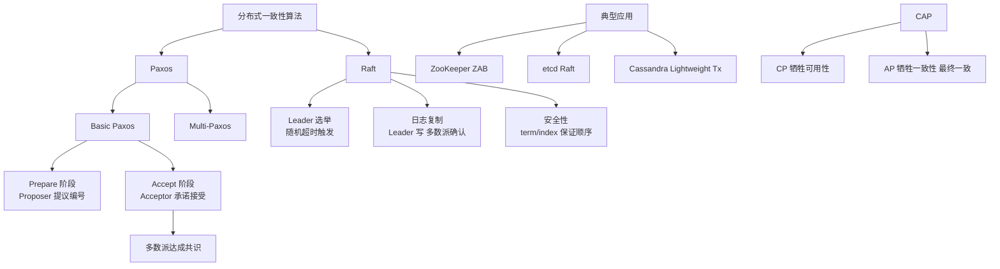

# Paxos算法分为两个阶段。具体如下

Paxos 算法解决的问题是一个分布式系统如何就某个值（决议）达成一致。在一个分布式数据库系统中，如果各节点的初始状态一致，每个节点执行相同的操作序列，那么他们最后能得到一个一致的状态。为保证每个节点执行相同的命令序列，需要在每一条指令上执行一个“一致性算法”以保证每个节点看到的指令一致。ZooKeeper 使用的 ZAB 算法是该算法的一个实现。

### Paxos 三种角色
- **Proposer（提议者）**：只要 Proposer 发的提案被半数以上 Acceptor 接受，Proposer 就认为该提案里的 value 被选定。
- **Acceptor（接受者）**：只要 Acceptor 接受了某个提案，Acceptor 就认为该提案里的 value 被选定了。
- **Learner（学习者）**：Acceptor 告诉 Learner 哪个 value 被选定，Learner 就认为那个 value 被选定。

### Paxos 算法两个阶段详解

#### 阶段一（Prepare 阶段 / 准 Leader 确定）
1. **Proposer 行为**：选择一个提案编号 N（全局唯一且递增），然后向超过半数以上的 Acceptor 发送编号为 N 的 Prepare 请求。
2. **Acceptor 行为**：
   - 如果收到的编号 N 大于该 Acceptor 已经响应过的所有 Prepare 请求的编号，它就会承诺（Promise）不再接受任何编号小于 N 的提案。
   - 同时，将它已经接受过的编号最大的提案（如果有的话，设为 <M, V>）作为响应反馈给 Proposer；如果之前没有接受过提案，则返回空。
   - 如果 N 小于已响应的最大编号，则拒绝请求。

#### 阶段二（Accept 阶段 / Leader 确认）
1. **Proposer 行为**：如果 Proposer 收到了半数以上 Acceptor 对其发出的编号为 N 的 Prepare 请求的响应（响应中可能包含旧的提案），它就会发送一个针对 [N, V] 提案的 Accept 请求给半数以上的 Acceptor。
   - **V 的选择规则**：V 就是收到的响应中编号最大的提案的 value；如果响应中不包含任何提案，那么 V 可以由 Proposer 自己自由决定。
2. **Acceptor 行为**：如果 Acceptor 收到一个针对编号为 N 的提案的 Accept 请求，只要该 Acceptor 没有对编号大于 N 的 Prepare 请求做出过响应（即没有破坏在阶段一的承诺），它就接受该提案。

### 实战案例
在 Multi-Paxos 的实际落地（如 Google Chubby）中，为了避免每次提案都走两阶段带来的 RTT 延迟，系统会选举出一个长期的 Leader。Leader 可以直接跳过 Prepare 阶段发送 Accept 请求（前提是它持有 Lease）。只有在 Leader 宕机或怀疑它失效时，才会重新发起 Prepare 竞争。如果此时出现网络抖动导致双主（脑裂），竞争激烈的 Prepare 阶段会消耗大量 CPU 和带宽。

### 代码示例（Java - 逻辑核心）
```java
// Proposer 决定提交的 Value
public PaxosValue decideValue(List<PrepareResponse> responses) {
    PaxosValue finalValue = myProposedValue; // 默认值
    long maxAcceptedId = -1;

    for (PrepareResponse res : responses) {
        if (res.hasAcceptedValue() && res.getAcceptedId() > maxAcceptedId) {
            maxAcceptedId = res.getAcceptedId();
            finalValue = res.getAcceptedValue(); // 遵循“多数派中最大的已接受值”规则
        }
    }
    return finalValue;
}
```

### 流程示意图
```
   Proposer                 Acceptor 1           Acceptor 2
      |                         |                    |
      |---- Prepare(N) --------->|                    |
      |                         |--- Promise(N, <M,V>) (如果有旧提案)
      |<-------------------------|                    |
      |---- Prepare(N) ----------------------------->|
      |                         |                    |--- Promise(N, null)
      |<---------------------------------------------|
      | (收到多数派响应)        |                    |
      |---- Accept(N, V) ------>| (检查 N >= maxPromised)
      |                         |--- Accepted(N, V)  |
      |---- Accept(N, V) --------------------------->|
      |                         |                    |--- Accepted(N, V)
```

### 关键细节与边界条件
1. **活锁问题**：如果有两个 Proposer 同时提出 Prepare 请求，编号递增交错，可能导致双方都无法达成一致。通常在实际工程中引入 Leader 选举来解决（即 Multi-Paxos），保证同一时间只有一个 Proposer 在工作。
2. **数据持久化**：Acceptor 在响应 Promise 之前，必须将 maxPromised 和 acceptedValue 持久化到磁盘。否则节点重启后，可能会违反“不再接受编号小于 N 的提案”的承诺，破坏一致性。


## 核心架构图


## 记忆要点

- 两阶段口诀：一阶段 Prepare 预提案，二阶段 Accept 确认提交。
- 阶段一逻辑：Proposer 发送递增编号 N，Acceptor 承诺不再接受小编号并返回历史已接受值。
- 阶段二逻辑：Proposer 获多数响应后发 Accept，Value 必须采纳响应中编号最大的旧值。
- 防冲突保障：因为提案编号 N 全局唯一递增，且遵循多数派约束，所以最终必定达成一致。

## 结构化回答

**30 秒电梯演讲：** 分两个阶段达成共识：先询问承诺，再提交确认。打个比方，像发提案前先打招呼：第一阶段问“能否接受我的提案？”，第二阶段发“正式提案”。

**展开框架：**
1. **两阶段口诀** — 一阶段 Prepare 预提案，二阶段 Accept 确认提交。
2. **阶段一逻辑** — Proposer 发送递增编号 N，Acceptor 承诺不再接受小编号并返回历史已接受值。
3. **阶段二逻辑** — Proposer 获多数响应后发 Accept，Value 必须采纳响应中编号最大的旧值。

**收尾：** 我在项目里踩过坑——// Proposer 决定提交的 Value。您想深入聊哪一段：原理、避坑还是对比选型？

## 视频脚本

> 预计时长：3 分钟 | 由浅入深

| 时间 | 画面/字幕 | 口播台词 | 讲解要点 |
|------|----------|----------|----------|
| 0:00 | 标题卡：Paxos算法分为两个阶段。具体如下 | "Paxos算法分为两个阶段。具体如下？一句话——像发提案前先打招呼：第一阶段问“能否接受我的提案？”，第二阶段发“正式提案”。" | 开场钩子 |
| 0:45 | 概念动画/示意图 | "分两个阶段达成共识：先询问承诺，再提交确认——像发提案前先打招呼：第一阶段问“能否接受我的提案？”，第二阶段发“正式提案”" | 核心定义 |
| 1:30 | 两阶段口诀示意 | "一阶段 Prepare 预提案，二阶段 Accept 确认提交。" | 要点1 |
| 2:15 | 阶段一逻辑示意 | "Proposer 发送递增编号 N，Acceptor 承诺不再接受小编号并返回历史已接受值。" | 要点2 |
| 3:00 | 总结卡 | "记住这几条，面试不慌。下期讲进阶追问。" | 收尾 |
