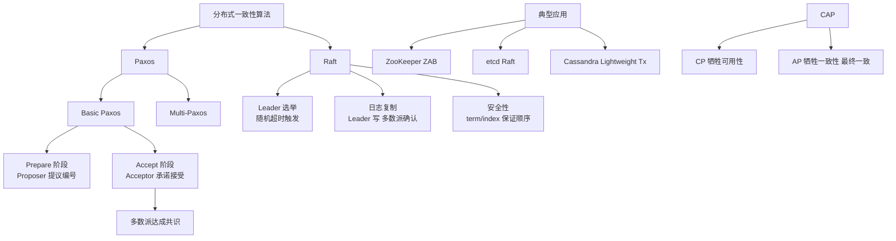
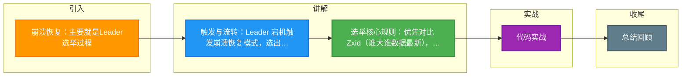

# 崩溃恢复：主要就是Leader选举过程

当整个服务框架在启动过程中，或是当 Leader 服务器出现网络中断、崩溃退出与重启等异常情况时，ZAB 就会进入恢复模式并选举产生新的 Leader 服务器。

当选举产生了新的 Leader 服务器，同时集群中已经有过半的机器与该 Leader 服务器完成了状态同步之后，ZAB 协议就会退出崩溃恢复模式，进入消息广播模式。

当有新的服务器加入到集群中去，如果此时集群中已经存在一个 Leader 服务器在负责进行消息广播，那么新加入的服务器会自动进入数据恢复模式，找到 Leader 服务器，并与其进行数据同步，然后一起参与到消息广播流程中去。

以上其实大致经历了三个步骤：
1. **崩溃恢复**：主要就是 Leader 选举过程。
2. **数据同步**：Leader 服务器与其他服务器进行数据同步。
3. **消息广播**：Leader 服务器将数据发送给其他服务器。

### 崩溃恢复与 Leader 选举细节
在崩溃恢复阶段，ZAB 协议主要做两件事：
1. **选举新的 Leader**：基于 ZXID（64 位事务 ID，高 32 位是 epoch，低 32 位是计数器）比较，通常选择 ZXID 最大的节点作为 Leader，因为其拥有的数据最新。
2. **数据同步与修正**：新 Leader 确保集群中所有节点的数据状态一致。如果发现 Follower 的数据落后或包含 Leader 没有的数据（极端情况），Leader 会进行相应的同步或丢弃操作。

### 状态流转图
```
     (启动/Leader崩溃)          (选举成功)           (数据同步完成)
  ---------------->  [崩溃恢复模式]  ------------>  [数据同步阶段]  ------------> [消息广播模式]
                          ^                                  |
                          |                                  | (新节点加入/数据不一致)
                          |----------------------------------
```

### 实战案例
在双十一大促期间，某 ZooKeeper 集群因 Leader 节点 Full GC 导致长时间停顿，集群触发选举。由于旧 Leader 恢复后 ZXID 依然很大，导致部分 Follower 在 epoch 递增后短暂连接了“旧 Leader”，造成了“脑裂”假象，最终通过确认 epoch 最大值才重新稳定。

### 代码示例
```java
// ZooKeeper 服务器启动时，根据 ZXID 初始化 voting 视图
public class QuorumPeer {
    synchronized void startLeaderElection() {
        // 获取本地最新的 ZXID (epoch + counter)
        long myZxid = getLastLoggedZxid();
        // 创建投票提议：sid (myid), zxid (数据新鲜度), epoch (选举轮次)
        currentVote = new Vote(mySid, myZxid, getPeerEpoch());
    }
}
```

### 模式对比
| 特性 | 崩溃恢复模式 | 消息广播模式 |
| :--- | :--- | :--- |
| **触发时机** | 集群启动、Leader 崩溃、半数节点失联 | 集群正常运行，Leader 已确立 |
| **核心目标** | 选举新 Leader，数据一致性修复 | 高效处理客户端写请求，数据复制 |
| **消息类型** | LOOKING, FOLLOWING, LEADING | PROPOSAL, ACK, COMMIT |
| **性能特点** | 阻塞服务，不可写入 | 高吞吐，低延迟 |

### 常见考点
1.  **ZAB 协议中 Leader 选举的标准是什么？**（考察对 ZXID 的理解，优先选数据最新的节点以保证数据完整性）。
2.  **Zookeeper 集群为什么建议奇数台节点？**（考察过半机制，如 3 台允许挂 1 台，4 台也只允许挂 1 台，奇数性价比高）。
3.  **崩溃恢复模式中，如果 Leader 发送了 Proposal 但未收到半数 Ack 就挂了，新 Leader 怎么处理？**（考察事务回滚机制，即丢弃未提交的事务）。
4.  **ZAB 的两种模式分别是什么？**（考察崩溃恢复模式 Election 和消息广播模式 Broadcast）。


## 核心架构图



## 记忆要点

- 触发与流转：Leader 宕机触发崩溃恢复模式，选出 Leader 并完成数据同步后进入广播模式。
- 选举核心规则：优先对比 Zxid(谁大谁数据最新)，其次对比 myid(谁大谁当选)。
- 节点数建议：因为决策依赖过半机制，所以集群部署奇数台(如3或5)性价比最高。
- 数据一致性保障：新 Leader 会丢弃旧 Leader 未提交的事务，确保集群状态强一致。

## 结构化回答

**30 秒电梯演讲：** ZAB协议在Leader崩溃时，通过选举新Leader并同步数据来恢复服务。打个比方，CEO挂了，董事会选新CEO，新CEO上任后先核对账本，确保大家记录一致再开工。

**展开框架：**
1. **触发与流转** — Leader 宕机触发崩溃恢复模式，选出 Leader 并完成数据同步后进入广播模式。
2. **选举核心规则** — 优先对比 Zxid(谁大谁数据最新)，其次对比 myid(谁大谁当选)。
3. **节点数建议** — 因为决策依赖过半机制，所以集群部署奇数台(如3或5)性价比最高。

**收尾：** 我在项目里踩过坑——在双十一大促期间，某 ZooKeeper 集群因 Leader 节点 Full GC 导致长时间停顿，集群触发选举。您想深入聊哪一段：原理、避坑还是对比选型？

## 视频脚本

> 预计时长：3 分钟 | 由浅入深

| 时间 | 画面/字幕 | 口播台词 | 讲解要点 |
|------|----------|----------|----------|
| 0:00 | 标题卡：崩溃恢复：主要就是Leader选举过… | "崩溃恢复：主要就是Leader选举过程？一句话——CEO挂了，董事会选新CEO，新CEO上任后先核对账本，确保大家记录一致再开工。" | 开场钩子 |
| 0:45 | 概念动画/示意图 | "ZAB协议在Leader崩溃时，通过选举新Leader并同步数据来恢复服务——CEO挂了，董事会选新CEO，新CEO上任后先核对账本，确保大家记录一致再开工" | 核心定义 |
| 1:30 | 触发与流转示意 | "Leader 宕机触发崩溃恢复模式，选出 Leader 并完成数据同步后进入广播模式。" | 要点1 |
| 2:15 | 选举核心规则示意 | "优先对比 Zxid(谁大谁数据最新)，其次对比 myid(谁大谁当选)。" | 要点2 |
| 3:00 | 总结卡 | "记住这几条，面试不慌。下期讲进阶追问。" | 收尾 |

### 视频流程图



