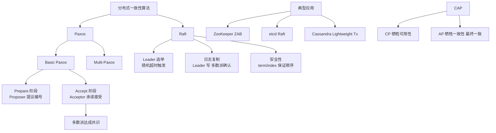

# 数据同步：Leader服务器与其他服务器进行数据同步

当整个服务框架在启动过程中，或是当 Leader 服务器出现网络中断、崩溃退出与重启等异常情况时，ZAB 就会进入恢复模式并选举产生新的 Leader 服务器。

当选举产生了新的 Leader 服务器，同时集群中已经有过半的机器与该 Leader 服务器完成了状态同步之后，ZAB 协议就会退出崩溃恢复模式，进入消息广播模式。

当有新的服务器加入到集群中去，如果此时集群中已经存在一个 Leader 服务器在负责进行消息广播，那么新加入的服务器会自动进入数据恢复模式，找到 Leader 服务器，并与其进行数据同步，然后一起参与到消息广播流程中去。

以上其实大致经历了三个步骤：
1. **崩溃恢复**：主要就是 Leader 选举过程。
2. **数据同步**：Leader 服务器与其他服务器进行数据同步。
3. **消息广播**：Leader 服务器将数据发送给其他服务器。

### 数据同步详细机制
新 Leader 产生后，会与 Follower 进行数据同步，以确保所有节点状态一致。同步主要有以下几种情况：
1. **差异化同步**：Follower 数据落后不多，Leader 发送差异 Proposal 给 Follower。
2. **全量同步**：Follower 数据落后太多或根本没有数据，Leader 发送快照给 Follower。

在同步过程中，Leader 会为每个 Follower 维护一个队列，将未被该 Follower 同步的消息 Proposal 逐一发送，直到 Follower 的数据状态与 Leader 一致（称为 Catch up）。当 Follower 确认同步完成后，Leader 会更新该 Follower 的状态，正式开始接收其心跳和新的消息确认。

### 数据同步流程图
```
    New Leader                Follower A               Follower B
       |                         |                         |
       |---- Determine Epoch ---->|---- Determine Epoch --->|
       |<--- Ack(Epoch, Hist) ----|<--- Ack(Epoch, Hist) ---|
       | (比对ZXID)              | (落后多)                | (落后少)
       |                         |                         |
       |---- Snapshot (Truncate) |--- Diff Proposal ------>|
       |                         |                         |
       |<---- Ack Synced ---------|<---- Ack Synced --------|
       | (Wait for Quorum)       |                         |
       | (Quorum reached) -> Broadcast Mode Active
```

### 实战深化
**实战案例**：在高并发写入场景下，若 Leader 刚选举完成但数据同步尚未完成（即未达到 Quorum）就开始接收写请求，这部分请求会阻塞或超时，导致业务抖动。生产环境曾遇到新 Leader 上因全量同步（DAT 文件传输）占用大量带宽，导致正常的心跳包丢包，引发集群重新选举的“雪崩”现象。解决方法是调整 `initLimit` 和 `syncLimit` 参数，并优化 `snapshot` 存储格式。

**代码示例**：
```java
// Zookeeper Leader 处理 Follower 连接与同步的核心逻辑 (伪代码)
public void run() {
    synchronized (follower) {
        // 1. 获取 Follower 的历史状态 (lastLoggedZxid)
        long lastLoggedZxid = follower.getLastLoggedZxid();
        
        // 2. 决定同步类型: 差异(DIFF), 截断(TRUNC), 全量(SNAP)
        PacketType syncType = determineSyncType(lastLoggedZxid, leaderZxid);
        
        if (syncType == PacketType.SNAP) {
            // 3. 全量同步：序列化并发送快照数据流 (耗时操作)
            leader.zk.snapshotManager.serializeSnapshot(leader.zk.getZKDatabase().getSnapShot(), os);
            os.flush(); // 确保快照发送完毕
        } else if (syncType == PacketType.DIFF) {
            // 4. 增量同步：发送 Proposal 队列中未 Commit 的数据包
            leader.proposeProcessor.committedRequests.stream()
                .filter(p -> p.getZxid() > lastLoggedZxid)
                .forEach(follower::queuePacket);
        }
    }
}
```

### 同步类型对比表
| 同步类型 | 触发条件 | 传输内容 | 优缺点 | 适用场景 |
| :--- | :--- | :--- | :--- | :--- |
| **差异化同步 (DIFF)** | Follower 略微落后，事务日志在 Leader 内存中 | 差异 Proposal 数据包 | 速度快，网络消耗小 | 正常重启，网络短暂抖动 |
| **全量同步 (SNAP)** | Follower 落后太多，或数据版本不一致 | 完整的数据快照文件 | 速度慢，IO/网络压力大，可能阻塞集群 | 新节点上线，数据严重损坏 |
| **截断同步 (TRUNC)** | Follower 包含了 Leader 未提交的事务（脏数据） | 截断指令，丢弃冲突日志 | 防止数据冲突，需回滚 | Follower 曾是伪 Leader |

### ## 常见考点
1.  **Zookeeper 的数据同步是强一致性的吗？**（考察对 ZAB 保证顺序一致性的理解，写入后读取必须保证读到最新数据）。
2.  **新加入的 Follower 如何同步数据？**（考察全量同步与增量同步的选择策略）。
3.  **ZAB 协议中“事务 ID”（ZXID）的结构和作用？**（高 32 位 epoch 代表纪元，低 32 位计数，用于判断数据新旧）。
4.  **Zookeeper 节点间如何保证数据顺序一致性？**（FIFO 队列和全局递增的 ZXID）。


## 核心架构图



## 记忆要点

- ZAB三步曲：因为崩溃需恢复，所以先选举Leader，再同步，后广播。
- 对比同步方式：落后少用差异化同步(DIFF)，落后多用全量同步(SNAP)。
- 因为同步需时，所以必须达到Quorum（过半）才能退出恢复模式。

## 结构化回答

**30 秒电梯演讲：** 新Leader选举产生后，将其数据同步给其他节点以保证集群一致。打个比方，新老板上台，把最新的公司章程和文件同步给所有部门，确保大家按最新规则办事。

**展开框架：**
1. **ZAB三步曲** — 因为崩溃需恢复，所以先选举Leader，再同步，后广播。
2. **对比同步方式** — 落后少用差异化同步(DIFF)，落后多用全量同步(SNAP)。
3. **必须达到Quorum（过半）才能退出恢复模式** — 因为同步需时，所以必须达到Quorum（过半）才能退出恢复模式。

**收尾：** 这三点都能配合实战聊。您想深入聊原理、对比还是避坑？

## 视频脚本

> 预计时长：3 分钟 | 由浅入深

| 时间 | 画面/字幕 | 口播台词 | 讲解要点 |
|------|----------|----------|----------|
| 0:00 | 标题卡：数据同步：Leader服务器与其他服… | "数据同步：Leader服务器与其他服务器进行数据同步？一句话——新老板上台，把最新的公司章程和文件同步给所有部门，确保大家按最新规则办事。" | 开场钩子 |
| 0:45 | 概念动画/示意图 | "新Leader选举产生后，将其数据同步给其他节点以保证集群一致——新老板上台，把最新的公司章程和文件同步给所有部门，确保大家按最新规则办事" | 核心定义 |
| 1:30 | ZAB三步曲示意 | "因为崩溃需恢复，所以先选举Leader，再同步，后广播。" | 要点1 |
| 2:15 | 对比同步方式示意 | "落后少用差异化同步(DIFF)，落后多用全量同步(SNAP)。" | 要点2 |
| 3:00 | 总结卡 | "记住这几条，面试不慌。下期讲进阶追问。" | 收尾 |
