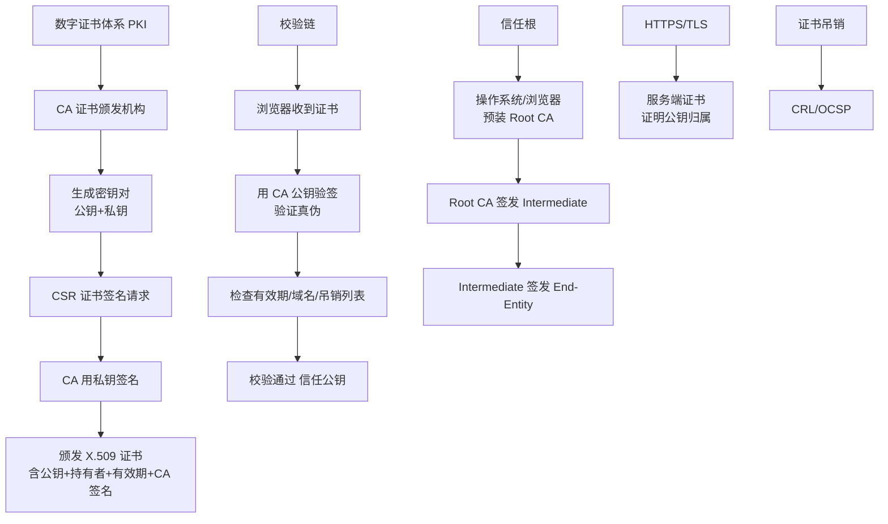

# R： 代表一次成功的读数据操作要求至少有R份数据成功读取

NWR 策略详细解析：
- **N (Replicas)**：在分布式存储系统中，有多少份备份数据。
- **W (Write Quorum)**：代表一次成功的更新操作要求至少有 W 份数据写入成功。
- **R (Read Quorum)**：代表一次成功的读数据操作要求至少有 R 份数据成功读取。

### 一致性原理
NWR 值的不同组合会产生不同的一致性效果：
1. **强一致性**：当 **W + R > N** 时，写集合与读集合的交集非空。根据抽屉原理，这意味着读操作必然能读到包含最新写入数据的副本，从而保证强一致性。
2. **弱一致性/最终一致性**：如果 **R + W <= N**，则读写可能发生在不相交的副本集合上，无法保证读取到最新数据，只能保证最终一致性。

### 典型配置场景
1. **N=3, W=2, R=2**：
   - 写需要 2 个副本成功，读需要 2 个副本成功。
   - **W+R=4 > 3**，保证强一致性。
   - 容错能力：允许 1 个节点损坏（W=2 时还剩 2 个可写，R=2 时还剩 2 个可读）。

2. **N=3, W=2, R=1**：
   - 写需要 2 个副本成功，读只需要 1 个副本成功。
   - **W+R=3 = N**，通常视为弱一致性或可能读到旧数据（取决于具体实现是否等待 W 完成）。
   - 适合读多写少，性能好。

3. **N=3, W=1, R=3**：
   - 写只需 1 个，读需要 3 个（全读）。
   - **W+R=4 > 3**，通过全读来获取最新数据，保证强一致性。
   - 适合写频繁但读很少的场景。

### NWR 逻辑图
```
       写操作             读操作
    (需写入 W 份)      (需读取 R 份)
         |                  |
   [Replica 1] <----+   +-----> [Replica 1]
   [Replica 2] <----+---+-----> [Replica 2]  <-- 交集节点
   [Replica 3] <----+---+-----> [Replica 3]
                      |
               (交集节点确保了 R 读到了 W 写入的数据)
```

### 实战深化
**实战案例**：在构建全球多活的消息系统时，我们遇到跨洲读取延迟过高的问题。为了解决这个问题，采用了 DynamoDB 的 Global Tables 思路，利用 NWR 中的动态 R 值策略：默认读取本地数据中心（R=LOCAL_QUORUM，低延迟但可能非强一致），但在检测到数据冲突或用户显式要求“最新数据”时，动态升级为读取所有副本（R=ALL，高延迟但绝对一致）。这种策略在“查看未读消息数”场景下效果显著。

**代码示例**：
```java
// 模拟实现 NWR 读取逻辑：根据配置 R 值决定读取响应
public String readData(String key, int r, List<ReplicaNode> replicas) {
    List<String> results = new ArrayList<>();
    int successCount = 0;
    
    // 并行从 R 个副本读取数据
    CountDownLatch latch = new CountDownLatch(r);
    for (ReplicaNode node : replicas) {
        executor.submit(() -> {
            String data = node.get(key); // 网络调用
            synchronized (results) {
                results.add(data);
                successCount++;
            }
            latch.countDown();
        });
    }
    
    try {
        latch.await(); // 等待 R 个响应返回
        // 简单的版本号/时间戳比较，取最新值
        return results.stream().max(Comparator.comparing(this::extractVersion)).orElse(null);
    } catch (InterruptedException e) {
        throw new RuntimeException("Read failed: timeout");
    }
}
```

### NWR 场景选型对比表
| 场景描述 | 推荐配置 (N=3) | 一致性级别 | 理由 |
| :--- | :--- | :--- | :--- |
| **银行账户余额** | W=2, R=2 (或 ALL) | 强一致性 | 绝对不能读到脏数据，宁可牺牲性能 |
| **商品库存显示** | W=2, R=1 | 最终一致性 | 写后快速读，容忍短暂的显示错误，但在下单时需二次校验 |
| **用户评论/点赞** | W=1, R=1 | 最终一致性 | 数据丢失影响极小，追求最大吞吐量 |
| **系统配置项** | W=3, R=1 | 弱一致性 | 修改极罕见，要求写入极高可靠性，读取要求极低延迟 |

### ## 常见考点
1.  **解释为什么 W+R>N 能保证强一致性？**（考察集合论原理，读写集合必有交集）。
2.  **Dynamo/Cassandra 中的 Hinted Handoff 与 NWR 的关系？**（考察节点临时不可用时的写入策略，虽然 W 未满足，但会暂存 Hint 以保证后续恢复）。
3.  **如果网络分区发生，NWR 配置如何影响可用性？**（如 W=2, N=3，分区导致只有 1 个节点可用时，写入会失败，CP 优先；若配置 W=1 则仍可写，AP 优先）。
4.  **什么是 Sloppy Quorum？**（考察在节点故障或网络隔离时，系统选择“备用”节点凑够 W 或 R 的数量以提高可用性，常用于 Dynamo）。


## 核心架构图


## 核心知识点图


## 记忆要点

- 一句话定核心：R代表一次成功读取所需的最小副本数。
- 因为抽屉原理，所以 W+R>N 时读写必有交集，防读到旧数据。
- 配置对比：R=1性能高但可能弱一致；R=ALL延迟高但数据绝对最新。

## 结构化回答

**30 秒电梯演讲：** 定义读取操作所需的最小副本数，用于读取最新数据或保证可用性。打个比方，打听消息时至少问R个人，以此拼凑出最接近真相的答案。

**展开框架：**
1. **一句话定核心** — R代表一次成功读取所需的最小副本数。
2. **W+R>N 时读写必有交集** — 因为抽屉原理，所以W+R>N 时读写必有交集，防读到旧数据。
3. **配置对比** — R=1性能高但可能弱一致；R=ALL延迟高但数据绝对最新。

**收尾：** 这三点都能配合实战聊。您想深入聊原理、对比还是避坑？

## 视频脚本

> 预计时长：2 分钟 | 由浅入深

| 时间 | 画面/字幕 | 口播台词 | 讲解要点 |
|------|----------|----------|----------|
| 0:00 | 标题卡：R： 代表一次成功的读数据操作要求至… | "R： 代表一次成功的读数据操作要求至少有R份数据成功读取？一句话——打听消息时至少问R个人，以此拼凑出最接近真相的答案。" | 开场钩子 |
| 0:40 | 概念动画/示意图 | "定义读取操作所需的最小副本数，用于读取最新数据或保证可用性——打听消息时至少问R个人，以此拼凑出最接近真相的答案" | 核心定义 |
| 1:20 | 一句话定核心示意 | "R代表一次成功读取所需的最小副本数。" | 要点1 |
| 2:00 | 总结卡 | "记住这几条，面试不慌。下期讲进阶追问。" | 收尾 |

---

## 延伸：W：代表一次成功的更新操作要求至少有w份数据写入成功

> 合并自 `jkc-077`（相似度 66%）

ZAB 与 Raft 的一些区别细节：
- **epoch 与 term**：ZAB 用的是 epoch 和 count 的组合来唯一表示一个值，而 Raft 用的是 term 和 index。
- **投票日志约束**：ZAB 的 follower 在投票给一个 leader 之前必须和 leader 的日志达成一致，而 Raft 的 follower 则简单地说是谁的 term 高就投票给谁（但 Raft 也有 Log Matching Property，通常 Candidate 会带上日志信息争取选票）。
- **心跳方向**：Raft 协议的心跳是从 leader 到 follower，而 ZAB 协议则相反（由 Follower 向 Leader 发送心跳/PING，或者 Leader 发送 PING 给 Follower，实际上两者都是双向保持活性，但触发机制略有不同，通常 ZAB 是 Follower 定期检测 Leader 失活）。
- **数据同步**：Raft 协议数据只有单向地从 leader 到 follower（成为 leader 的条件之一就是拥有最新的 log），而 ZAB 协议在 discovery 阶段，一个 prospective leader 需要将自己的 log 更新为 quorum 里面最新的 log，然后才好在 synchronization 阶段将 quorum 里的其他机器的 log 都同步到一致。

### NWR 策略
NWR 是一种在分布式存储系统中控制一致性和可用性的策略：
- **N (Replicas)**：在分布式存储系统中，有多少份备份数据。
- **W (Write Quorum)**：代表一次成功的更新操作要求至少有 W 份数据写入成功。
- **R (Read Quorum)**：代表一次成功的读数据操作要求至少有 R 份数据成功读取。

NWR 值的不同组合会产生不同的一致性效果：
1. **强一致性**：当 **W + R > N** 时，读和写的集合必有交集，因此整个系统对于客户端来讲能保证强一致性。
2. **弱一致性**：如果 **R + W <= N**，则读写可能发生在不相交的副本集合上，无法保证数据的强一致性（可能会读到旧数据）。

以常见的 **N=3、W=2、R=2** 为例：
- N=3：任何一个对象都必须有三个副本。
- W=2：对数据的修改操作只需要在 3 个 Replica 中的 2 个上面完成就返回。
- R=2：从三个对象中要读取到 2 个数据对象，才能返回。
此时 2 + 2 > 3，保证读到的至少有一个是写入成功的副本，保证一致性。

### NWR 读写交集示意图
```
    [Replica 1]  [Replica 2]  [Replica 3]
    -----------------------------
    Write (W=2):  [X]    [X]       [ ]
    Read  (R=2):   [X]    [ ]      [X]
    -----------------------------
    Intersection: Replica 1 (必须包含最新数据)
```

### 实战深化
**实战案例**：在电商大促场景下，为了追求极致的写入吞吐量，我们将 Cassandra 的 NWR 配置临时调整为 `W=1, R=1`（牺牲强一致性换取高可用和低延迟）。但在结算时，曾出现“用户余额扣减成功但后续读取仍为旧余额”的严重数据不一致问题，导致超额消费。后续复盘发现是在网络抖动导致副本间同步延迟过大时读取了未同步的节点。最终修复方案是在关键业务代码层面显式调用 `QUORUM` 级别的读取。

**代码示例**：
```java
// Cassandra (Java Driver) 中设置 NWR 级别的实战代码
import com.datastax.driver.core.ConsistencyLevel;
import com.datastax.driver.core.querybuilder.QueryBuilder;

// 场景：写入库存，要求强一致性 (W=2, N=3)
Statement updateStock = QueryBuilder.update("product_inventory")
    .set(QueryBuilder.decr("count"), 1)
    .where(QueryBuilder.eq("product_id", "p1001"))
    .setConsistencyLevel(ConsistencyLevel.QUORUM); // 对应 W > N/2

session.execute(updateStock);

// 场景：前台读取商品详情，允许弱一致性 (R=1, N=3)
Statement readProduct = QueryBuilder.select()
    .from("product_info")
    .where(QueryBuilder.eq("product_id", "p1001"))
    .setConsistencyLevel(ConsistencyLevel.ONE); // 对应 R = 1，性能优先
```

### 一致性级别对比表 (以 N=3 为例)
| 配置策略 | 写操作(W) | 读操作(R) | 一致性保证 | 性能表现 | 典型应用场景 |
| :--- | :--- | :--- | :--- | :--- | :--- |
| **强一致 (默认)** | QUORUM (2) | QUORUM (2) | 强一致性 (R+W > N) | 中等 | 金融转账、库存扣减 |
| **读优化** | QUORUM (2) | ONE (1) | 最终一致性 | 读高性能，写低延迟 | 商品详情页、评论列表 |
| **写优化** | ONE (1) | QUORUM (2) | 最终一致性 | 写高性能，读高延迟 | 日志记录、点赞数 |
| **极致性能** | ONE (1) | ONE (1) | 弱一致性 (可能脏读) | 最高 | 缓存失效、临时数据 |

### ## 常见考点
1.  **N=3, W=1, R=1 时的一致性级别？**（此时 W+R=2 < 3，为弱一致性，性能最高，可能读脏数据）。
2.  **如何配置 NWR 以兼顾一致性和性能？**（例如 N=3, W=2, R=1，适合写多读少场景）。
3.  **NWR 策略与 CAP 理论的关系？**（W+R>N 倾向于 CP，W+R<=N 倾向于 AP）。
4.  **Gossip 协议与 NWR 结合使用的场景？**（Dynamo 风格的数据库，通常使用 NWR 配置 Gossip 进行反熵同步）。

## 记忆要点

- 口诀定强弱：W+R>N 必有交集，保证强一致性；反之则是弱一致。
- 对比参数本质：N=副本总数，W=写成功数，R=读成功数。
- 实战避坑：金融等关键业务必选 QUORUM(W=2,R=2)，追求吞吐量才用 ONE。

## 结构化回答

**30 秒电梯演讲：** 定义写入操作成功所需的最小副本数，平衡一致性与性能。打个比方，发通知必须得到至少W个人的确认回复才算成功，比如发三人群消息必须两人回。

**展开框架：**
1. **口诀定强弱** — W+R>N 必有交集，保证强一致性；反之则是弱一致。
2. **对比参数本质** — N=副本总数，W=写成功数，R=读成功数。
3. **实战避坑** — 金融等关键业务必选 QUORUM(W=2,R=2)，追求吞吐量才用 ONE。

**收尾：** 这三点都能配合实战聊。您想深入聊原理、对比还是避坑？

## 视频脚本

> 预计时长：2 分钟 | 由浅入深

| 时间 | 画面/字幕 | 口播台词 | 讲解要点 |
|------|----------|----------|----------|
| 0:00 | 标题卡：W：代表一次成功的更新操作要求至少有… | "W：代表一次成功的更新操作要求至少有w份数据写入成功？一句话——发通知必须得到至少W个人的确认回复才算成功，比如发三人群消息必须两人回。" | 开场钩子 |
| 0:40 | 概念动画/示意图 | "定义写入操作成功所需的最小副本数，平衡一致性与性能——发通知必须得到至少W个人的确认回复才算成功，比如发三人群消息必须两人回" | 核心定义 |
| 1:20 | 口诀定强弱示意 | "W+R>N 必有交集，保证强一致性；反之则是弱一致。" | 要点1 |
| 2:00 | 总结卡 | "记住这几条，面试不慌。下期讲进阶追问。" | 收尾 |
