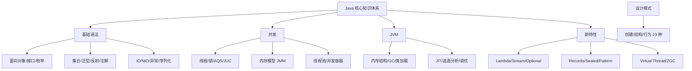

# JAVA算法

Java算法通常指Java集合框架（`java.util.Collections`）中提供的工具类算法，如排序（`sort`）、二分查找（`binarySearch`）、洗牌（`shuffle`）等，也指使用Java实现的经典计算机科学算法。

### 1. 二分查找
**原理**：又叫折半查找，要求待查找的序列必须是有序的（通常按升序排列）。
**步骤**：
1.  取中间位置的值 `mid` 与待查关键字 `key` 进行比较。
2.  如果 `arr[mid] == key`，查找成功。
3.  如果 `arr[mid] > key`，说明关键字在左半部分，将查找范围缩小为 `[low, mid-1]`。
4.  如果 `arr[mid] < key`，说明关键字在右半部分，将查找范围缩小为 `[mid+1, high]`。
5.  重复上述过程，直到找到 `key` 或 `low > high`（表示不存在）。

**时间复杂度**：O(log n)。

### 2. 冒泡排序
**原理**：一种简单的排序算法，通过重复遍历要排序的数列，一次比较两个元素，如果它们的顺序错误就把它们交换过来。
**步骤**：
1.  比较相邻的前后两个数据，如果前面数据大于后面的数据，就将这两个数据交换。
2.  对数组的第 0 个数据到 N-1 个数据进行一次遍历后，最大的一个数据就“沉”到数组第 N-1 个位置。
3.  针对 N-1 个元素重复上述步骤，直到排序完成。

**优化**：可以增加一个标志位，记录某次遍历是否发生了交换，如果一次遍历中没有发生交换，说明数组已经有序，提前结束排序。

**时间复杂度**：最好 O(n)，平均和最坏 O(n²)。

### Java 代码实现示例
```java
// 二分查找 (Java Collections 实现)
int index = Collections.binarySearch(list, key);

// 冒泡排序
void bubbleSort(int[] arr) {
    boolean swapped;
    for (int i = 0; i < arr.length - 1; i++) {
        swapped = false;
        for (int j = 0; j < arr.length - 1 - i; j++) {
            if (arr[j] > arr[j + 1]) {
                int temp = arr[j];
                arr[j] = arr[j + 1];
                arr[j + 1] = temp;
                swapped = true;
            }
        }
        if (!swapped) break; // 优化：未发生交换则提前结束
    }
}
```

### 实战深化
**实战案例**：在生产环境中排查线上 OOM（内存溢出）故障时，发现某微服务在处理大数据量列表时使用了自定义的冒泡排序而非 `Collections.sort`。当列表长度超过 5000 时，CPU 飙升导致服务不可用。将排序算法替换为 `TimSort`（Java 默认）后，耗时从秒级降低至毫秒级。这提醒我们在处理通用业务逻辑时，优先使用 JDK 成熟工具类，避免造轮子带来的性能陷阱。

**代码示例**：
```java
// 实战：自定义对象列表的二分查找 (需实现 Comparable 或提供 Comparator)
List<User> users = getOrderedUsers(); 

// 1. 使用 Comparator 进行二分查找
User target = new User("unknown_id", "ZhangSan");
Comparator<User> cmp = Comparator.comparing(User::getName);
int index = Collections.binarySearch(users, target, cmp);

// 2. 利用 Arrays.parallelSort 处理大数组并行排序 (Java 8+)
int[] largeArray = getLargeData();
Arrays.parallelSort(largeArray); // 多核并行排序，优于单线程快排

// 3. 避免死循环的边界写法 (二分查找变体：查找第一个大于等于 target 的位置)
public int lowerBound(int[] arr, int target) {
    int low = 0, high = arr.length;
    while (low < high) { // 注意是 < 而不是 <=
        int mid = low + (high - low) / 2;
        if (arr[mid] < target) {
            low = mid + 1;
        } else {
            high = mid; // 收紧右边界
        }
    }
    return low;
}
```

### 常见排序算法对比表
| 算法 | 平均时间复杂度 | 最坏时间复杂度 | 稳定性 | 适用场景 |
| :--- | :--- | :--- | :--- | :--- |
| **冒泡排序** | O(n²) | O(n²) | 稳定 | 数据量极小，教学演示 |
| **快速排序** | O(n log n) | O(n²) | 不稳定 | 大数据量，内存排序，追求平均速度 |
| **归并排序** | O(n log n) | O(n log n) | 稳定 | 大数据量，外部排序，要求稳定性 |
| **TimSort (JDK默认)**| O(n log n) | O(n log n) | 稳定 | 实际工程最优（混合了归并和插入），对部分有序数据极快 |
| **二分查找** | O(log n) | O(log n) | - | 静态有序数据查找，插入/删除成本高 |

## 常见考点
1. **二分查找的边界条件**：计算 mid 时使用 `mid = low + (high - low) / 2` 而不是 `(low + high) / 2`，为什么？（防止整数溢出）。
2. **排序算法的稳定性**：冒泡排序是稳定的吗？（是，当相邻元素相等时不交换）。Java 集合框架中的 `sort` 是什么排序？（TimSort，归并排序的优化版，稳定）。
3. **快速排序 vs 冒泡排序**：为什么工程中常用快排而不常用冒泡？（快排平均复杂度 O(nlogn)，冒泡 O(n²)）。


## 核心架构图



## 记忆要点

- 二分查找前提：必须有序，每次折半，时间复杂度为O(log n)。
- 冒泡排序：相邻比较大值后沉，最佳O(n)需加无交换标志位，平均O(n²)。
- 实战避坑：生产环境优先用JDK默认工具类(如TimSort)而非手写低效排序。

## 结构化回答

**30 秒电梯演讲：** 利用集合工具类高效处理数据，或实现排序查找等基础逻辑。打个比方，像用瑞士军刀，内置了排序、二分查找等常用工具，不用自己造轮子。

**展开框架：**
1. **二分查找前提** — 必须有序，每次折半，时间复杂度为O(log n)。
2. **冒泡排序** — 相邻比较大值后沉，最佳O(n)需加无交换标志位，平均O(n²)。
3. **实战避坑** — 生产环境优先用JDK默认工具类(如TimSort)而非手写低效排序。

**收尾：** 我在项目里踩过坑——在生产环境中排查线上 OOM（内存溢出）故障时，发现某微服务在处理大数据量列表时使用了自定义的冒泡排序而非 `Collections.sort`。您想深入聊哪一段：原理、避坑还是对比选型？

## 视频脚本

> 预计时长：2 分钟 | 由浅入深

| 时间 | 画面/字幕 | 口播台词 | 讲解要点 |
|------|----------|----------|----------|
| 0:00 | 标题卡：JAVA算法 | "JAVA算法？一句话——像用瑞士军刀，内置了排序、二分查找等常用工具，不用自己造轮子。" | 开场钩子 |
| 0:40 | 概念动画/示意图 | "利用集合工具类高效处理数据，或实现排序查找等基础逻辑——像用瑞士军刀，内置了排序、二分查找等常用工具，不用自己造轮子" | 核心定义 |
| 1:20 | 二分查找前提示意 | "必须有序，每次折半，时间复杂度为O(log n)。" | 要点1 |
| 2:00 | 总结卡 | "记住这几条，面试不慌。下期讲进阶追问。" | 收尾 |
