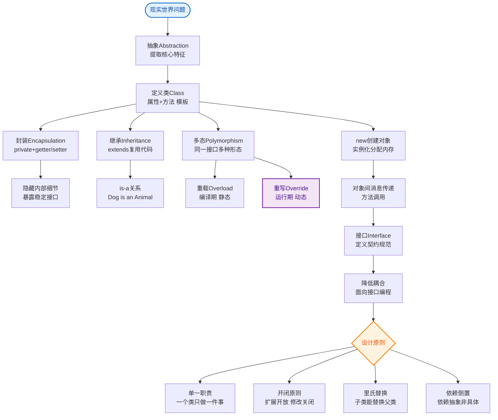
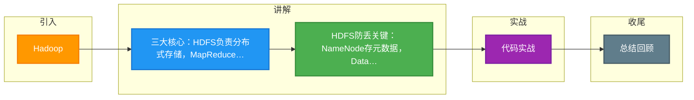

# Hadoop

Hadoop 是一个由 Apache 基金会开发的分布式系统基础架构，它允许用户在不了解分布式底层细节的情况下，开发分布式程序，利用集群的威力进行高速运算和存储。

### 核心组件
Hadoop 1.x 核心包含 HDFS（存储）和 MapReduce（计算）。Hadoop 2.x 引入了 YARN（资源调度），解决了 1.x 中 JobTracker 的扩展性问题。

### 实战案例
在某离线数仓项目中，曾因 HDFS 默认副本数设为 3 且数据量激增导致存储水位告警。通过分析冷热数据，将冷数据的副本数动态调整为 2，并在 NameNode 内存优化后，成功释放了 30% 的存储空间且未影响读取性能。

### 架构图
```text
      ┌───────────────────────────────────────────────┐
│                  Hadoop Ecosystem                │
├───────────────────────────────────────────────┤
│                                               │
│  ┌───────────────┐      ┌──────────────────┐ │
│  │  MapReduce    │      │       YARN       │ │  (Hadoop 2.x+)
│  │ (Compute)     │      │ (Resource Mgmt)  │ │
│  └───────┬───────┘      └────────┬─────────┘ │
│          │                       │           │
├──────────┼───────────────────────┼───────────┤
│          │         HDFS          │           │
│          └───────────┬───────────┘           │
│                      │                       │
│  ┌───────────────────┼───────────────────┐   │
│  │                   │                   │   │
│  │  NameNode (Master)│  DataNodes (Slaves)│  │
│  │  (Metadata/Mgr)   │  (Data Storage)    │  │
│  │                   │                   │   │
│  └───────────────────┴───────────────────┘   │
└───────────────────────────────────────────────┘
```

### 1. HDFS (Hadoop Distributed File System)
HDFS 是主从架构。
*   **NameNode (Master)**：
    *   **职责**：管理文件系统的命名空间（目录树）和元数据（文件由哪些 Block 组成，Block 位于哪个 DataNode）。
    *   **存储**：元数据存储在内存中以便快速访问，同时持久化到本地磁盘的 `fsimage`（镜像文件）和 `editlog`（操作日志）。
    *   **高可用风险**：Hadoop 1.x 中 NameNode 是单点故障（SPOF）。
*   **Secondary NameNode**：
    *   **误解**：它不是 NameNode 的热备。
    *   **职责**：辅助 NameNode，定期合并 `fsimage` 和 `editlog`，推送给 NameNode，减少 NameNode 重启时的恢复时间。
*   **DataNode (Slave)**：
    *   **职责**：存储实际的数据块。默认 Block 大小为 128MB（Hadoop 2.x 后，1.x 为 64MB）。
    *   **机制**：通过心跳向 NameNode 汇报存储状态和 Block 信息。

### 2. MapReduce (Hadoop 1.x)
*   **JobTracker (Master)**：
    *   **职责**：负责作业的调度、资源管理和任务监控。将作业分解为 Task，分发给 TaskTracker。
*   **TaskTracker (Slave)**：
    *   **职责**：执行具体的 Map 或 Reduce 任务，并通过心跳向 JobTracker 汇报进度。

### 版本对比
| 特性 | Hadoop 1.x | Hadoop 2.x (及 3.x) |
| :--- | :--- | :--- |
| **核心组件** | HDFS + MapReduce | HDFS + YARN + MapReduce (on YARN) |
| **资源管理** | JobTracker (资源+调度耦合) | ResourceManager + ApplicationMaster (分离) |
| **扩展性** | 较差 (JobTracker 内存瓶颈, 4000节点上限) | 高 (RM 仅管资源, 万节点级支持) |
| **HA 支持** | NameNode 单点故障 | NameNode/ResourceManager 均支持 HA |
| **计算框架** | 仅 MapReduce | 支持 MapReduce, Spark, Flink 等多种引擎 |

### 关键代码 (Java API - 判断文件是否存在)
```java
Configuration conf = new Configuration();
FileSystem fs = FileSystem.get(URI.create("hdfs://namenode:8020"), conf);
Path path = new Path("/user/data/input.txt");

// 实战：在写入前检查文件是否存在，避免意外覆盖
if (fs.exists(path)) {
    System.out.println("File already exists.");
} else {
    FSDataOutputStream os = fs.create(path);
    os.writeBytes("Hello Hadoop");
    os.close();
}
```


## 核心流程图


## 记忆要点

- 三大核心：HDFS负责分布式存储，MapReduce负责计算，YARN管资源调度。
- HDFS防丢关键：NameNode存元数据，DataNode存实体，默认块大小128MB。
- 避坑常识：Secondary NameNode不是热备，而是辅助合并镜像和日志。

## 结构化回答

**30 秒电梯演讲：** 分布式系统基础架构，通过HDFS存储海量数据，MapReduce计算海量数据。打个比方，像个大仓库（HDFS）存货物，再配一群搬运工（MapReduce）分拣处理货物。

**展开框架：**
1. **三大核心** — HDFS负责分布式存储，MapReduce负责计算，YARN管资源调度。
2. **HDFS防丢关键** — NameNode存元数据，DataNode存实体，默认块大小128MB。
3. **避坑常识** — Secondary NameNode不是热备，而是辅助合并镜像和日志。

**收尾：** 我在项目里踩过坑——在某离线数仓项目中，曾因 HDFS 默认副本数设为 3 且数据量激增导致存储水位告警。您想深入聊哪一段：原理、避坑还是对比选型？

## 视频脚本

> 预计时长：3 分钟 | 由浅入深

| 时间 | 画面/字幕 | 口播台词 | 讲解要点 |
|------|----------|----------|----------|
| 0:00 | 标题卡：Hadoop | "Hadoop？一句话——像个大仓库（HDFS）存货物，再配一群搬运工（MapReduce）分拣处理货物。" | 开场钩子 |
| 0:45 | 概念动画/示意图 | "分布式系统基础架构，通过HDFS存储海量数据，MapReduce计算海量数据——像个大仓库（HDFS）存货物，再配一群搬运工（MapReduce）分拣处理货物" | 核心定义 |
| 1:30 | 三大核心示意 | "HDFS负责分布式存储，MapReduce负责计算，YARN管资源调度。" | 要点1 |
| 2:15 | HDFS防丢关键示意 | "NameNode存元数据，DataNode存实体，默认块大小128MB。" | 要点2 |
| 3:00 | 总结卡 | "记住这几条，面试不慌。下期讲进阶追问。" | 收尾 |

### 视频流程图



