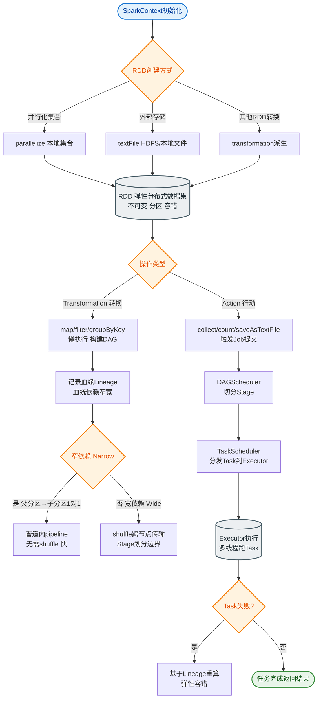
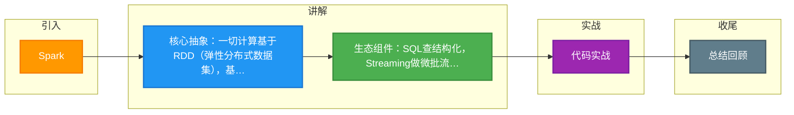

# Spark

### Spark 概述与核心架构

Apache Spark 是一个基于内存的快速、通用、可扩展的大数据分析计算引擎。它提供了一个全面的统一框架，用于管理各种具有不同性质（文本数据、图数据等）和数据源（批量数据、实时流数据）的大数据处理需求。相比于 Hadoop MapReduce，Spark 显著减少了磁盘 I/O，利用内存进行迭代计算，从而大幅提升性能。

#### 核心组件架构
Spark 生态系统包含以下核心模块，均构建在 Spark Core 之上：

1.  **Spark Core**
    *   **功能**：实现了 Spark 的基本功能，是整个生态系统的基础。
    *   **核心概念**：定义了 **RDD (Resilient Distributed Dataset，弹性分布式数据集)** 的抽象及其相关 API（Transformation 和 Action）。它负责内存管理、任务调度、故障恢复以及与存储系统的交互。

2.  **Spark SQL**
    *   **功能**：提供结构化数据处理能力。
    *   **交互**：支持通过标准 SQL 或 Apache Hive 的 SQL 方言（HiveQL）进行查询。
    *   **原理**：它将 SQL 查询或 DataFrame/Dataset 操作经过 Catalyst 优化器优化后，转换为底层的 RDD 操作执行。每个数据库表或 DataFrame 在逻辑上被视为一个 RDD。

3.  **Spark Streaming**
    *   **功能**：对实时数据流进行可扩展、高吞吐量、容错的流式处理。
    *   **原理**：采用 **微批处理** 架构。它将实时流数据按时间间隔（如 5 秒）切分为离散的流（DStream），DStream 本质上是一系列 RDD 的序列。这使得用户可以使用处理批数据相同的 RDD 操作 API 来处理实时数据。

4.  **MLlib (Machine Learning Library)**
    *   **功能**：提供可扩展的机器学习算法库。
    *   **特性**：包含常见的算法，如分类、回归、聚类、协同过滤等。这些算法被实现为在 RDD 上进行的 Spark 操作，能够利用 Spark 的内存计算和并行能力高效迭代，适用于大规模数据集的机器学习任务。

5.  **GraphX**
    *   **功能**：用于图计算和并行图操作的分布式计算框架。
    *   **扩展**：GraphX 扩展了 RDD API，引入了 **RDD** (Resilient Distributed Property Graph，弹性分布式属性图）。它提供了一组基础算子（如 subgraph, joinVertices）以及 Pregel 等高级图算法（如 PageRank），用于简化图分析任务。

```text
┌─────────────────────────────────────────────────────┐
│                  Spark Applications                 │
├───────────┬──────────┬──────────────┬───────────────┤
│ Spark SQL │ Streaming│    MLlib     │    GraphX     │
├───────────┴──────────┴──────────────┴───────────────┤
│                   Spark Core (RDD)                   │
│        (Scheduling, Memory Management, etc.)         │
├─────────────────────────────────────────────────────┤
│      Cluster Managers (Standalone, YARN, K8s)       │
├─────────────────────────────────────────────────────┤
│          Storage (HDFS, S3, HBase, Local)           │
└─────────────────────────────────────────────────────┘
```

#### 实战案例：数据倾斜调优
在进行大表 Join 操作时，曾遇到某个 Task 处理时间远超其他 Task（数据倾斜）。解决方案是针对倾斜的 Key 添加随机前缀将其打散到多个 Task，处理后再去除前缀，从而将执行时间从 1 小时优化至 5 分钟。

#### 代码示例：RDD 的持久化与检查点
在迭代计算（如机器学习）中，若多次重复计算同一个 RDD，会造成性能浪费。使用 `persist` 将数据缓存在内存中。

```scala
val data = sc.textFile("hdfs://...").map(_.split("\t")).map(x => (x(0), x(1)))

// 只有第一次 action 触发计算，后续 action 直接从内存读取
// 级别：MEMORY_ONLY (默认), MEMORY_AND_DISK, DISK_ONLY
data.persist(StorageLevel.MEMORY_AND_DISK)

val count1 = data.count()
val count2 = data.filter(_._2.nonEmpty).count()

// 长 lineage 链条建议使用 checkpoint 切断依赖，保存到 HDFS
sc.setCheckpointDir("hdfs:/checkpoint")
data.checkpoint()
```

## 常见考点
1.  **Spark 为什么比 MapReduce 快？**
    *   基于内存计算，减少磁盘 I/O：MapReduce 中间结果写入 HDFS，Spark 尽量保留在内存中（迭代算法优势明显）。
    *   DAG 调度优化：Spark 将作业构建为 DAG（有向无环图），可以将多个阶段的任务合并执行，减少调度开销；MapReduce 只能线性执行 Map-Reduce。
    *   线程模型开销低：MapReduce 启动新进程（JVM）执行 Task，Spark 使用线程池（Executor 内线程）执行任务。

2.  **RDD、DataFrame 和 Dataset 的区别与选型**

| 特性 | RDD (Spark 1.x+) | DataFrame (Spark 1.3+) | Dataset (Spark 1.6+) |
| :--- | :--- | :--- | :--- |
| **数据表示** | 分布式 Java/Scala 对象集合 | 分布式 Row 对象集合（类似表结构） | 分布式类型化对象集合（JVM对象+Schema）
| **类型安全** | **编译时安全** | **不安全**（运行时才报错） | **编译时安全** |
| **性能/优化** | 低（Spark 难以优化对象内部结构） | **高**（使用 Catalyst 优化器，生成优化后的物理计划） | **高**（同样享受 Catalyst 优化）
| **序列化** | Java/Kryo 序列化（开销大） | Tungsten 二进制格式（堆外内存，快） | Tungsten 编码（高性能） |
| **垃圾回收** | 频繁创建对象导致 GC 压力大 | 对象少，GC 压力小 | GC 压力小 |
| **API 易用性** | 面向对象，适合底层操作 | 类似 SQL，易上手 | 兼具类型安全和 Lambda 表达式易用性 |
    *   **选型建议**：优先使用 **Dataset**（Scala/Java）或 **DataFrame**（Python/Java），RDD 仅在需要底层操作或无法用 SQL 表达的逻辑时使用。

3.  **Spark 的宽窄依赖与 Stage 划分**
    *   **窄依赖**：父 RDD 的一个分区最多被子 RDD 的一个分区使用（一对一，如 map, filter）。不发生 Shuffle，可以流水线执行。
    *   **宽依赖**：父 RDD 的一个分区被子 RDD 的多个分区使用（一对多，如 groupByKey, reduceByKey）。发生 Shuffle，是划分 Stage 的边界。
    *   **Stage 划分**：Spark 根据 Shuffle 依赖将 DAG 划分为不同的 Stage。Stage 内部是窄依赖，可以并行高效执行；Stage 之间依赖通过 Shuffle 完成。

4.  **算子区别：Transformation vs Action**
    *   **Transformation（转换算子）**：**懒执行**。仅记录 RDD 的转换逻辑（Lineage 血缘关系），不立即触发计算（如 map, filter, join）。
    *   **Action（行动算子）**：**触发作业提交**。真正执行计算并返回结果给 Driver 或写入存储（如 count, collect, saveAsTextFile）。
    *   **实战踩坑**：避免在 Executor 端（如 map 算子内）使用 `collect` 或 `count`，这会引发极大的网络传输开销或 Driver OOM。


## 核心流程图


## 记忆要点

- 核心抽象：一切计算基于RDD(弹性分布式数据集)，基于内存计算极快。
- 生态组件：SQL查结构化，Streaming做微批流式，MLlib搞机器学习。
- 性能优化：迭代计算必须persist缓存，大表Join遇倾斜需加随机前缀打散。

## 结构化回答

**30 秒电梯演讲：** 基于内存的统一大数据快速处理框架。打个比方，像瑞士军刀一样，能切各种数据类型的快刀。

**展开框架：**
1. **核心抽象** — 一切计算基于RDD(弹性分布式数据集)，基于内存计算极快。
2. **生态组件** — SQL查结构化，Streaming做微批流式，MLlib搞机器学习。
3. **性能优化** — 迭代计算必须persist缓存，大表Join遇倾斜需加随机前缀打散。

**收尾：** 我在项目里踩过坑——在进行大表 Join 操作时，曾遇到某个 Task 处理时间远超其他 Task（数据倾斜）。您想深入聊哪一段：原理、避坑还是对比选型？

## 视频脚本

> 预计时长：2 分钟 | 由浅入深

| 时间 | 画面/字幕 | 口播台词 | 讲解要点 |
|------|----------|----------|----------|
| 0:00 | 标题卡：Spark | "Spark？一句话——像瑞士军刀一样，能切各种数据类型的快刀。" | 开场钩子 |
| 0:40 | 概念动画/示意图 | "基于内存的统一大数据快速处理框架——像瑞士军刀一样，能切各种数据类型的快刀" | 核心定义 |
| 1:20 | 核心抽象示意 | "一切计算基于RDD(弹性分布式数据集)，基于内存计算极快。" | 要点1 |
| 2:00 | 总结卡 | "记住这几条，面试不慌。下期讲进阶追问。" | 收尾 |

### 视频流程图



