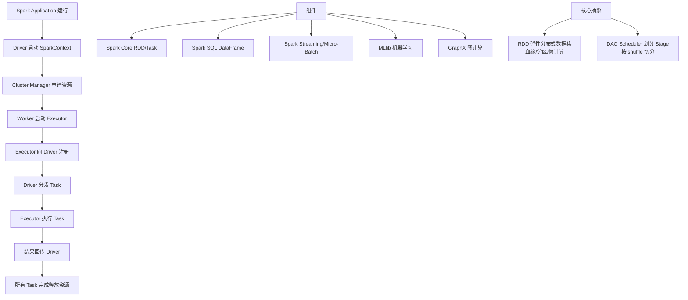

# Spark Core

### Spark Core 概念与架构

Spark 提供了一个全面、统一的框架用于管理各种有着不同性质（文本数据、图表数据等）的数据集和数据源（批量数据或实时的流数据）的大数据处理的需求。Spark Core 包含 Spark 的基本功能；尤其是定义 RDD 的 API、操作以及这两者上的动作。其他 Spark 的库都是构建在 RDD 和 Spark Core 之上的。

**实战案例**：在电商大促实时看板中，利用 Spark Core 的 RDD 内存计算特性，将离线的历史点击流数据与实时 Kafka 流数据进行 Join，通过 `persist(MEMORY_ONLY)` 缓存热点维表，避免频繁 HDFS 读取，将计算延迟从分钟级降至秒级。

**代码示例**：
```scala
val conf = new SparkConf().setAppName("RDD Example")
val sc = new SparkContext(conf)
// 创建RDD并缓存到内存，加速后续迭代计算
val dataRDD = sc.textFile("hdfs://path/to/data").map(_.split(" "))
val cachedRDD = dataRDD.persist(StorageLevel.MEMORY_ONLY)
cachedRDD.count() // Action 1: 触发缓存
cachedRDD.take(10) // Action 2: 直接从内存读取
```

| 组件 | 核心功能 | 对应底层抽象 | 典型应用场景 |
| :--- | :--- | :--- | :--- |
| **Spark Core** | 内存计算、任务调度、RDD管理 | RDD (Resilient Distributed Dataset) | 离线ETL、复杂清洗 |
| **Spark SQL** | 结构化数据查询、SQL优化 | DataFrame / Dataset | 交互式查询、报表生成 |
| **Spark Streaming** | 微批处理流计算 | DStream (RDD序列) | 实时日志分析、流式ETL |
| **MLlib** | 机器学习算法库 | RDD (基于MLlib) / DataFrame (基于spark.ml) | 推荐系统、分类回归 |
| **GraphX** | 图并行计算 | Graph (VertexRDD + EdgeRDD) | 社交网络分析、路劲规划 |

## 技术原理

Spark Core 的核心抽象是 **RDD（Resilient Distributed Dataset，弹性分布式数据集）**——一个不可变、分区的、容错的分布式集合。理解 RDD 是理解整个 Spark 生态的钥匙：

- **RDD 的"血统（Lineage）"容错机制**：RDD 是不可变的，每次 Transformation（如 `map`、`filter`）都会生成一个新的 RDD，并记录父 RDD 的引用和转换函数，形成 DAG（有向无环图）。某个分区的数据丢失时，Spark 不需要做检查点（Checkpoint），只需沿着血统从源数据重新计算这个分区即可。这就是"Resilient（弹性）"的含义——容错靠重算而非副本。
- **懒执行（Lazy Evaluation）的本质**：所有 Transformation（`map`、`filter`、`join`、`groupByKey`）只是构建 DAG，不触发计算；只有 Action（`count`、`collect`、`saveAsTextFile`）才会把 DAG 提交给 DAGScheduler 划分 Stage、再由 TaskScheduler 分发到 Executor 执行。这种设计让 Spark 能全局优化执行计划（如谓词下推、Stage 融合），避免中间结果落盘。
- **内存计算相比 MapReduce 的本质优势**：MapReduce 每个作业（Job）之间必须把中间结果写 HDFS（磁盘 I/O），迭代算法（如机器学习、PageRank）每个迭代都要读写磁盘，性能极差。Spark RDD 通过 `persist(MEMORY_ONLY)` 把中间结果缓存在 Executor 内存里，下一个作业直接从内存读，迭代场景下能比 MapReduce 快 10-100 倍。
- **窄依赖 vs 宽依赖（决定 Stage 划分）**：窄依赖（`map`、`filter`）父分区一对一映射到子分区，可在同一 Stage 内流水线执行；宽依赖（`groupByKey`、`reduceByKey`、`join`）需要 Shuffle，父分区的数据要跨网络分发到多个子分区，必然产生 Stage 边界。DAGScheduler 按宽依赖切分 Stage，同一 Stage 内的窄依赖可链式融合。

## 代码示例

```scala
import org.apache.spark.{SparkConf, SparkContext}
import org.apache.spark.storage.StorageLevel

object RDDExample {
  def main(args: Array[String]): Unit = {
    val conf = new SparkConf().setAppName("WordCount").setMaster("local[*]")
    val sc = new SparkContext(conf)

    // Transformation 阶段（懒执行，只构建 DAG）
    val lines = sc.textFile("hdfs:///data/input.txt")
    val words = lines.flatMap(_.split(" "))              // 窄依赖
    val pairs = words.map(word => (word, 1))             // 窄依赖
    val counts = pairs.reduceByKey(_ + _)                // 宽依赖（触发 Shuffle）

    // 缓存中间结果到内存，避免下游 Action 重算
    counts.persist(StorageLevel.MEMORY_ONLY)

    // Action 阶段（触发整个 DAG 执行）
    val top10 = counts.top(10)(Ordering.by(_._2))
    top10.foreach(println)

    // 多次 Action 复用缓存：不重新读 HDFS
    println(s"Total words: ${counts.map(_._2).reduce(_ + _)}")

    sc.stop()
  }
}
```

```scala
// 血统容错演示：分区丢失自动重算
val expensive = sc.parallelize(1 to 1000).map { x =>
  Thread.sleep(10)  // 模拟耗时计算
  x * 2
}.persist(StorageLevel.MEMORY_ONLY)

expensive.count()   // 触发计算并缓存
// 假设某 Executor 挂掉，对应分区丢失
expensive.checkpoint()  // 可选：切断血统，避免长 Lineage 重算
println(expensive.sum())  // 缓存命中或仅重算丢失的分区
```

## 注意事项

- **`groupByKey` 是性能杀手**：它把所有相同 key 的 value 拉到一台机器上，没有本地聚合，数据量大时直接 OOM。应该用 `reduceByKey` 或 `aggregateByKey`，它们在每个分区先做本地聚合（MapReduce 里的 Combiner 思路），再 Shuffle，能减少 90%+ 网络传输。
- **缓存策略选择**：`MEMORY_ONLY` 不够时降级到 `MEMORY_AND_DISK_SER`（序列化后存内存，溢出落盘），不要盲目用 `MEMORY_ONLY_2`（两副本），内存翻倍但容错靠血统重算其实更划算。机器学习迭代场景建议序列化缓存，节省内存。
- **Shuffle 调优最关键**：`spark.sql.shuffle.partitions`（默认 200）在小数据下太多导致 task 调度开销大，大数据下太少导致 OOM。要按数据量动态调整：分区数 ≈ 总数据量 / 每分区目标大小（128MB 左右）。Shuffle 写盘使用 Sort-based Shuffle，配 `spark.shuffle.compress=true` 压缩传输。
- **数据倾斜是常见坑**：某个 key 的数据量是其他 key 的 100 倍，导致单个 task 拖慢整个 Stage。排查：看 Spark UI 的 Task 时间分布；解决：加盐打散（给热 key 加随机后缀）、两阶段聚合、或用 Broadcast Join 避免 Shuffle。
- **RDD 已不是首选 API**：Spark 2.0+ 推荐 DataFrame/Dataset API（基于 Catalyst 优化器和 Tungsten 引擎），比原生 RDD 快 2-10 倍（有统一逻辑计划优化、Whole-Stage CodeGen、堆外内存）。只有在非结构化数据或需要细粒度控制时才用 RDD。


## 核心架构图



## 记忆要点

- Spark Core 是底层基石，核心抽象是 RDD，所有上层组件均构建其上。
- 包含两大核心操作：Transformation（懒执行）与 Action（触发计算）。
- 因为基于内存计算，所以相比 MapReduce 极大加速了迭代任务的收敛。

## 结构化回答

**30 秒电梯演讲：** Spark的基础核心，定义RDD及基本调度。打个比方，汽车的引擎和底盘，支撑所有上层功能。

**展开框架：**
1. **Spark Core 是底层基石** — 核心抽象是 RDD，所有上层组件均构建其上。
2. **包含两大核心操作** — Transformation（懒执行）与 Action（触发计算）。
3. **相比 MapReduce 极大加速了迭代任务的收** — 因为基于内存计算，所以相比 MapReduce 极大加速了迭代任务的收敛。

**收尾：** 我在项目里踩过坑——在电商大促实时看板中，利用 Spark Core 的 RDD 内存计算特性，将离线的历史点击流数据与实时 Kafka 流数据进行 Join，通过 `persist(MEMORY_ONLY)` 缓存热点维表，避免频繁 HDFS 读取，将计算延迟从分钟级降至秒级。您想深入聊哪一段：原理、避坑还是对比选型？

## 视频脚本

> 预计时长：2 分钟 | 由浅入深

| 时间 | 画面/字幕 | 口播台词 | 讲解要点 |
|------|----------|----------|----------|
| 0:00 | 标题卡：Spark Core | "Spark Core？一句话——汽车的引擎和底盘，支撑所有上层功能。" | 开场钩子 |
| 0:40 | 概念动画/示意图 | "Spark的基础核心，定义RDD及基本调度——汽车的引擎和底盘，支撑所有上层功能" | 核心定义 |
| 1:20 | 要点1图解示意 | "核心抽象是 RDD，所有上层组件均构建其上。" | 要点1 |
| 2:00 | 总结卡 | "记住这几条，面试不慌。下期讲进阶追问。" | 收尾 |
