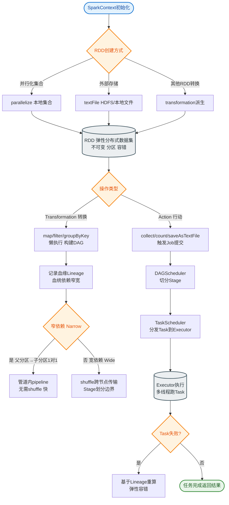

# Spark Streaming

### Spark Streaming

Spark Streaming 是 Spark 生态系统中用于处理实时流数据的核心组件。它提供了一种高吞吐量、容错的流式处理方案。

#### 核心原理：微批处理
Spark Streaming 的核心思想是将实时流数据在时间上切分成微小的时间间隔（即批处理间隔，Batch Interval，如 500ms, 1s, 5s）。
- **DStream (Discretized Stream)**：这是 Spark Streaming 中的基本抽象。DStream 实际上就是一系列连续的 RDD 组成的序列。
- **处理流程**：每经过一个 Batch Interval，Spark Streaming 生成一个新的 Batch（对应一个 RDD），并将该 RDD 提交给 Spark Core 引擎进行处理。处理结果可以以批的形式输出，也可以写到外部系统。

这种架构允许开发者复用 Spark Core 的强大 API，既能处理实时数据，也能方便地与批处理作业结合（Lambda 架构）。

#### 关键特性
1.  **易用性**：支持 Scala, Java, Python 和 SQL，提供高级算子（如 map, reduce, join, window）。
2.  **容错性**：基于 RDD 的 Lineage 机制，如果节点故障，可以通过重新计算丢失的分区数据来恢复状态。同时支持通过 Write Ahead Logs (WAL) 将接收到的数据持久化到日志中，实现“精确一次”的语义（配合可靠的接收器和输出端）。
3.  **集成性**：无缝支持 Kafka, Flume, Kinesis, HDFS/S3 等多种数据源输入和输出。

```text
Real-time Data Stream
   │
   ▼
┌─────────────────────┐
│  Stream Receiver    │ (Collect data over intervals)
└──────────┬──────────┘
           │ Blocks stored in Memory/Disk
           ▼
┌─────────────────────┐     ┌─────────────────────┐
│      Batch 1        │     │      Batch 2        │  ---> DStream = RDD Sequence
│    (RDD @ t=0)      │ ... │    (RDD @ t=1)      │
└──────────┬──────────┘     └──────────┬──────────┘
           │                           │
           └───────────────┬───────────┘
                           ▼
                ┌─────────────────────┐
                │   Spark Core Engine │ (Process RDDs)
                └─────────────────────┘
```

**实战案例**：在实时风控系统中，曾遇到因背压机制配置不当，导致下游数据库写入拥堵进而阻塞 Spark Streaming Receiver，最终引发数据积压甚至超时崩溃。解决方法是监控 `processingDelay` 并结合 `spark.streaming.backpressure.enabled` 动态调整消费速率。

**代码示例**：
```scala
val ssc = new StreamingContext(sparkConf, Seconds(1))
val kafkaStream = KafkaUtils.createDirectStream[String, String](
  ssc, PreferConsistent, Subscribe[String, String](topics, kafkaParams)
)
// 幂等写入操作，配合 Exactly-Once 语义
kafkaStream.foreachRDD { rdd =>
  rdd.foreachPartition { iter =>
    // 使用事务或幂等ID写入数据库
    saveToDBWithTransaction(iter)
  }
}
ssc.start()
ssc.awaitTermination()
```

| 特性 | Spark Streaming | Flink |
| :--- | :--- | :--- |
| **计算模型** | 微批处理 | 逐事件处理 |
| **延迟** | 秒级 (500ms+) | 亚秒级/毫秒级 |
| **吞吐量** | 极高 | 高 |
| **状态管理** | Checkpoint (基于RDD Lineage) | State Backend (RocksDB 等) |
| **流批一体** | 弱 (需分开API) | 强 (统一 API) |
| **容错机制** | Write Ahead Logs (WAL) + Checkpoint | 分布式快照 |

## 常见考点
1.  **Spark Streaming 和 Flink 的区别？**
    *   Spark Streaming 是微批处理，延迟较高（秒级），吞吐量大；Flink 支持逐事件处理，延迟低（毫秒级）。
2.  **什么是 DStream？它与 RDD 的关系是什么？**
    *   DStream 是离散化的流，在时间维度上连续的 RDD 序列。操作 DStream 本质上是在操作其内部的 RDD。
3.  **如何实现 Spark Streaming 的“精确一次”语义？**
    *   需要三方面配合：开启 Write Ahead Logs (WAL) 预写日志保证数据不丢失；使用支持幂等操作的输出端；利用 Checkpoint 保存算子状态（在 updateStateByKey 中）。
4.  **Window Operations（窗口操作）的基本概念？**
    *   包含窗口长度和滑动间隔。例如：每 10 秒统计过去 30 秒的数据，窗口长度为 30 秒，滑动间隔为 10 秒。


## 核心流程图


## 记忆要点

- 核心思想是微批处理，将流切分为 Batch Interval（如1秒）。
- 核心抽象 DStream 本质是连续的 RDD 序列。
- Spark Streaming 是微批（秒级）吞吐高，而 Flink 是原生流（毫秒级）延迟低。
- 容错与语义：基于 RDD 血统与 WAL 机制实现 Exactly-Once 精确一次语义。

## 结构化回答


**30 秒电梯演讲：** 像切片机把流水切成一片片小蛋糕处理。

**展开框架：**
1. **微批处理架构** — 微批处理架构（核心概念）
2. **RDD** — 实时数据流转RDD
3. **高吞吐量容错** — 高吞吐量容错（核心概念）

**收尾：** 这是我实战中的理解，您想深入哪一段？


## 视频脚本

> 预计时长：2 分钟 | 由浅入深

| 时间 | 画面/字幕 | 口播台词 | 讲解要点 |
|------|----------|----------|----------|
| 0:00 | 标题卡：Spark Streaming | "Spark Streaming？一句话——像切片机把流水切成一片片小蛋糕处理。" | 开场钩子 |
| 0:40 | 概念动画/示意图 | "将实时流数据微批处理为RDD进行计算——像切片机把流水切成一片片小蛋糕处理" | 核心定义 |
| 1:20 | 核心思想是微批处理示意 | "将流切分为 Batch Interval（如1秒）。" | 要点1 |
| 2:00 | 总结卡 | "记住这几条，面试不慌。下期讲进阶追问。" | 收尾 |
