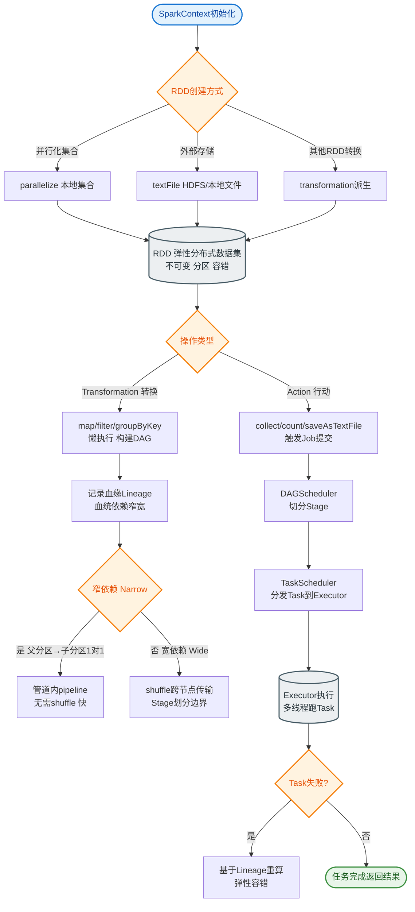

# Mllib

### MLlib (Machine Learning Library)

MLlib 是 Spark 的机器学习库，旨在简化大规模机器学习的工程实现。它提供了常用的机器学习算法和实用工具，使得算法能够运行在分布式集群上。

#### 核心特点
1.  **基于 RDD 的实现**：在 Spark 2.0 之前，MLlib 基于 RDD API 构建。算法被实现为对 RDD 的一系列 Transformation 和 Action 操作。
2.  **高性能迭代**：机器学习算法（如逻辑回归、K-Means）通常需要多次迭代。Spark 的内存计算特性使得中间结果可以缓存在内存中，避免了迭代过程中的频繁磁盘读写，极大地加速了收敛过程。
3.  **丰富的算法库**：包含以下主要算法类型：
    *   **分类**：逻辑回归、决策树、随机森林、朴素贝叶斯。
    *   **回归**：线性回归、广义线性回归。
    *   **聚类**：K-Means、高斯混合模型（GMM）。
    *   **协同过滤**：交替最小二乘法（ALS）。
    *   **降维**：PCA、SVD。
    *   **特征处理**：标准化、归一化、TF-IDF、Word2Vec。
4.  **工具支持**：包括统计基础功能（如相关系数、假设检验）、模型评估指标和线性代数优化包（如 Breeze）。

#### API 演进
- **MLlib (RDD-based)**：原始 API，主要面向 Pipeline 的底层操作，目前处于维护模式。
- **ML (DataFrame-based)**：Spark 1.2 之后引入的主要 API，基于 DataFrame 和 Dataset。它提供了更高级的 Pipeline（管道）API，结构化更强，且能利用 Catalyst 优化器进行性能优化，是目前的推荐用法。

```text
┌───────────────────────────────────────┐
│         ML Pipelines API (High)        │
│   (DataFrame / Dataset based API)     │
└───────────────┬───────────────────────┘
                │ Built on top of
┌───────────────▼───────────────────────┐
│     RDD-based API (Legacy/MLlib)      │
└───────────────┬───────────────────────┘
                │ Implemented via
┌───────────────▼───────────────────────┐
│          Spark Core (RDD)             │
│         (Memory Iteration)            │
└───────────────────────────────────────┘
```

**实战案例**：在使用 ALS 进行商品推荐时，曾遇到由于数据倾斜导致部分 Executor OOM。解决方案是在训练前对用户或商品 ID 进行加盐采样过滤，或者调整 `spark.sql.shuffle.partitions` 增加并行度，同时使用 L-BFGS 优化器替代 SGD 以减少迭代次数。

**代码示例**：
```scala
import org.apache.spark.ml.Pipeline
import org.apache.spark.ml.classification.LogisticRegression
import org.apache.spark.ml.feature.{HashingTF, Tokenizer}

// 设置 Pipeline
val tokenizer = new Tokenizer().setInputCol("text").setOutputCol("words")
val hashingTF = new HashingTF().setNumFeatures(1000).setInputCol("words").setOutputCol("features")
val lr = new LogisticRegression().setMaxIter(10).setRegParam(0.01)
val pipeline = new Pipeline().setStages(Array(tokenizer, hashingTF, lr))

// 训练模型
val model = pipeline.fit(trainingData)
```

| 特性 | spark.mllib (Legacy) | spark.ml (Current Standard) |
| :--- | :--- | :--- |
| **底层抽象** | RDD | DataFrame / Dataset |
| **主要 API** | 底层算法调用 | Pipeline API (Estimator, Transformer) |
| **性能优化** | 依赖手动缓存 | Catalyst 优化器 (Tungsten) |
| **维护状态** | 维护模式 (不推荐新项目使用) | 活跃开发 (支持 ML 流) |
| **类型安全** | 较弱 | 强 |

## 常见考点
1.  **为什么 Spark 适合做机器学习？**
    *   因为机器学习算法（尤其是迭代算法）需要多次读取数据。Spark 将数据保存在内存中，迭代速度快于基于磁盘的 MapReduce。
2.  **MLlib 和 spark.ml 的区别？**
    *   **spark.mllib**：基于 RDD 的旧版库，主要提供底层算法接口。
    *   **spark.ml**：基于 DataFrame 的新版库，提供了 Pipeline（管道）机制，用于构建、评估和调优机器学习工作流，是未来的主流。
3.  **什么是 L-BFGS 或 SGD？**
    *   这些是 MLlib 中常见的优化算法。L-BFGS 是拟牛顿法的一种，收敛快；SGD（随机梯度下降）适用于大规模数据，每次迭代只使用部分数据计算梯度。


## 核心流程图


## 记忆要点

- 对比记忆：spark.mllib 基于 RDD（已过时维护），而 spark.ml 基于 DataFrame（当前主推）。
- 因为支持内存计算，所以 Spark 极度适合需要高频迭代的机器学习算法。
- 核心特性：提供 Pipeline API（Estimator 和 Transformer），支持分布式机器学习。

## 结构化回答

**30 秒电梯演讲：** 可扩展的机器学习算法库。打个比方，工具箱里的一整套精密测量和分析工具。

**展开框架：**
1. **对比记忆** — spark.mllib 基于 RDD（已过时维护），而 spark.ml 基于 DataFrame（当前主推）。
2. **Spark 极度适合需要高频迭代的机器学习算法** — 因为支持内存计算，所以Spark 极度适合需要高频迭代的机器学习算法。
3. **核心特性** — 提供 Pipeline API（Estimator 和 Transformer），支持分布式机器学习。

**收尾：** 我在项目里踩过坑——在使用 ALS 进行商品推荐时，曾遇到由于数据倾斜导致部分 Executor OOM。您想深入聊哪一段：原理、避坑还是对比选型？

## 视频脚本

> 预计时长：2 分钟 | 由浅入深

| 时间 | 画面/字幕 | 口播台词 | 讲解要点 |
|------|----------|----------|----------|
| 0:00 | 标题卡：Mllib | "Mllib？一句话——工具箱里的一整套精密测量和分析工具。" | 开场钩子 |
| 0:40 | 概念动画/示意图 | "可扩展的机器学习算法库——工具箱里的一整套精密测量和分析工具" | 核心定义 |
| 1:20 | 对比记忆示意 | "spark.mllib 基于 RDD（已过时维护），而 spark.ml 基于 DataFrame（当前主推）。" | 要点1 |
| 2:00 | 总结卡 | "记住这几条，面试不慌。下期讲进阶追问。" | 收尾 |
