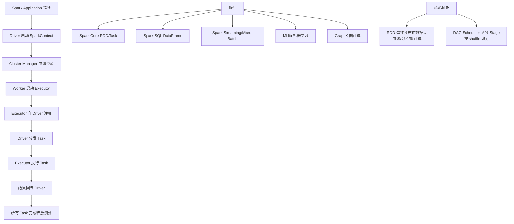

# GraphX

### GraphX 核心解析

#### 1. 概念与定位
GraphX 是 Spark 生态系统中用于图计算和图并行计算的组件。它将 RDD（弹性分布式数据集）进行了扩展，引入了**属性图**的概念，即一种带有顶点和边属性的有向多重图。GraphX 通过统一的 API 将图视图与集合视图无缝结合，使得用户既可以像操作图一样操作数据，也可以像操作 RDD 一样处理图数据。

#### 2. 核心抽象：属性图
GraphX 的核心数据结构是 `Graph[VD, ED]`，其中：
- **VD (Vertex Data)**：顶点属性类型。
- **ED (Edge Data)**：边属性类型。

图在物理存储上被拆分为两个 RDD：
- `VertexRDD[VD]`：存储顶点 ID 和属性。
- `EdgeRDD[ED]`：存储源顶点 ID、目标顶点 ID 和边属性。

这种分离使得 GraphX 能够利用 RDD 的容错性和分区策略。

#### 3. 核心算子与原理
GraphX 提供了一组核心算子，遵循 **Vertex-Centric**（顶点中心）或 **Gather-Apply-Scatter (GAS)** 编程模型：

1.  **结构操作**：
    - `subgraph`：根据顶点或边的属性过滤图，返回子图。
    - `mask`：限制当前图以匹配另一个图的结构和属性。
    - `groupEdges`：合并并行边（多重图处理）。

2.  **计算操作（核心）**：
    - `joinVertices`：将 RDD 与顶点属性结合。
    - `mapReduceTriplets` (旧版) / `aggregateMessages` (新版)：这是图迭代的引擎。它允许用户沿着边发送消息，并聚合目标顶点的消息。

#### 4. Pregel API
GraphX 实现了 Google Pregel 的变体，用于实现经典的图算法（如 PageRank、连通分量、最短路径）。

**算法流程**：
1.  **超步**：图计算在一系列迭代（超步）中进行。
2.  **消息发送**：每个顶点向其邻居发送消息。
3.  **消息合并**：每个顶点接收并合并收到的消息（`MergeMsg`）。
4.  **顶点更新**：根据合并后的消息更新顶点状态（`VProg`）。
5.  **终止条件**：当没有消息传递或达到最大迭代次数时停止。

```text
     超步
  
  +--------+
  | Vertices |                           
  +----+---+--+
       |   |  \
       |   |   \  发送消息
  接收 |   |    v (Messages)
       |   |  +-------+
       v   v  | Edge  |
    合并消息  +-------+
       |   |
  更新状态  |
       v   v
  (Next Superstep)
```

#### 5. 优化技术
- **分区策略**：GraphX 支持不同的分区策略（如 `PartitionStrategy.EdgePartition2D`、`RandomVertexCut`）来减少跨网络通信，特别是在幂律分布的社交网络图中。
- **索引构建**：为了加速连接操作，GraphX 会自动构建索引，将顶点 ID 映射到具体的存储位置。

**实战案例**：在计算十亿级节点社交图的 PageRank 时，遇到了严重的长尾现象（某些超级节点有数千万粉丝），导致单一 Executor 内存溢出。通过切换到 `PartitionStrategy.CanonicalRandomVertexCut` 分区策略，将超级节点的边分散到不同分区，成功解决了倾斜问题并缩短了 40% 的运行时间。

**代码示例**：
```scala
import org.apache.spark.graphx._
import org.apache.spark.rdd.RDD

// 构建图
val vertices: RDD[(VertexId, String)] = sc.parallelize(Array((1L, "A"), (2L, "B")))
val edges: RDD[Edge[String]] = sc.parallelize(Array(Edge(1L, 2L, "friend")))
val graph = Graph(vertices, edges)

// 运行 PageRank
val ranks = graph.pageRank(0.0001).vertices
// 关键：使用 aggregateMessages 计算出度
val degrees = graph.aggregateMessages[Int](
  ctx => ctx.sendToDst(1), 
  _ + _
)
```

| 特性 | GraphX | GraphFrames |
| :--- | :--- | :--- |
| **API 基础** | RDD (底层 API) | DataFrame / Dataset (高层 API) |
| **语言支持** | Scala / Java (为主) | Python / Scala / Java (Python友好) |
| **查询能力** | 需编写算子 | 支持 Spark SQL 查询图数据 |
| **性能** | 底层优化更强，适合超大规模图 | 依赖 Catalyst，一般场景性能优 |
| **算法库** | 丰富 (PageRank, ConnectedComponents 等) | 常用算法 ( BFS, PageRank ) |

## 常见考点
1.  **GraphX 的底层数据结构是什么？**
    *   答案：GraphX 的底层依然基于 RDD。具体来说，一个图被拆分为 `VertexRDD` 和 `EdgeRDD`。
2.  **GraphX 与 GraphFrames 的区别？**
    *   答案：GraphX 是基于 RDD 的底层 API，类型安全但操作较繁琐；GraphFrames 是基于 DataFrame/Dataset 的 API，支持更强大的 SQL 查询和 Python 支持，且利用 Catalyst 优化器进行了性能优化。
3.  **如何解决数据倾斜？**
    *   答案：在图计算中，数据倾斜通常表现为某些顶点（如超级粉丝）拥有大量的边。可以通过调整 **分区策略**（如使用 `CanonicalRandomVertexCut` 切割超级节点）或预处理图中度数极高的顶点来缓解。
4.  **`aggregateMessages` 的作用？**
    *   答案：它是 GraphX 中用于并行图聚合的核心算子，替代了旧的 `mapReduceTriplets`，用于沿着边发送消息并在顶点处聚合。


## 核心架构图



## 记忆要点

- 核心抽象是属性图 Graph[VD, ED]，底层物理拆分为 VertexRDD 和 EdgeRDD。
- 核心编程模型为 GAS（Gather-Apply-Scatter），通过 aggregateMessages 发送消息。
- 高级图计算通过 Pregel API 实现，以超步为周期进行图迭代。
- 解决倾斜优化：通过切分分区策略（如 CanonicalRandomVertexCut）打散超级节点边。

## 结构化回答

**30 秒电梯演讲：** 分布式图计算引擎，扩展了RDD API。打个比方，能并行修路、算距离的超级交通地图。

**展开框架：**
1. **核心抽象是属性图 Graph[VD, ED]** — 底层物理拆分为 VertexRDD 和 EdgeRDD。
2. **核心编程模型为 GAS（Gather-Apply-Scatter），通过 aggregate** — Messages 发送消息。
3. **高级图计算通过 Pregel API 实现** — 以超步为周期进行图迭代。

**收尾：** 我在项目里踩过坑——在计算十亿级节点社交图的 PageRank 时，遇到了严重的长尾现象（某些超级节点有数千万粉丝），导致单一 Executor 内存溢出。您想深入聊哪一段：原理、避坑还是对比选型？

## 视频脚本

> 预计时长：2 分钟 | 由浅入深

| 时间 | 画面/字幕 | 口播台词 | 讲解要点 |
|------|----------|----------|----------|
| 0:00 | 标题卡：GraphX | "GraphX？一句话——能并行修路、算距离的超级交通地图。" | 开场钩子 |
| 0:40 | 概念动画/示意图 | "分布式图计算引擎，扩展了RDD API——能并行修路、算距离的超级交通地图" | 核心定义 |
| 1:20 | 要点1图解示意 | "底层物理拆分为 VertexRDD 和 EdgeRDD。" | 要点1 |
| 2:00 | 总结卡 | "记住这几条，面试不慌。下期讲进阶追问。" | 收尾 |
