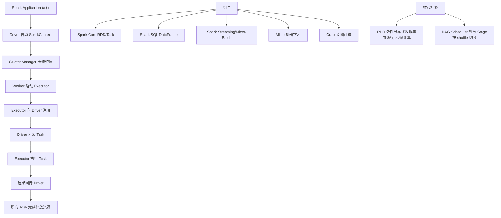

# 构建Spark Application的运行环境，启动SparkContext

### Spark Application 启动与运行环境构建

当构建 Spark Application 的运行环境并启动 SparkContext 时，整个流程涉及多个组件的交互。以下是详细的流程解析与架构图。

#### 1. 核心流程详解

1.  **构建运行环境**：
    -   应用程序启动，首先创建 `SparkEnv`，内部包含序列化器、网络管理器、内存管理器等基础组件。
    -   创建 `SparkContext`（或 `SparkSession`），它是应用程序通往集群的入口。

2.  **资源申请**：
    -   `SparkContext` 连接集群管理器。
    -   根据配置，向资源管理器申请 Executor 资源。
    -   资源管理器分配资源并在 Worker 节点上启动 `ExecutorBackend`（Standalone 模式下为 `CoarseGrainedExecutorBackend`）。

3.  **Executor 注册**：
    -   `ExecutorBackend` 反向注册到 `SparkContext` 中的 `Driver` 端。
    -   **细节**：Driver 会维护一个 `ExecutorDataMap`，记录所有存活的 Executor 信息。

4.  **任务调度准备**：
    -   用户代码触发 Action 算子，生成一个 Job。
    -   DAGScheduler 将 Job 划分为 Stage，并生成 TaskSet（一组任务）。
    -   TaskScheduler 接收 TaskSet 并准备分发。

```text
   Application (Driver)
   +-----------------------+
   |   SparkContext (SC)   |
   |   +-----------------+  |
   |   | DAGScheduler    |  |
   |   +--------+--------+  |
   |            |           |
   |   +--------v--------+  |
   |   | TaskScheduler   |  |
   +---+--------+---------+  |
       ^        |            |
       | 注册   | 申请 Task   | 分发 Task
       |        v            v
   +---+--------------------+----------------+
   | Cluster Manager (Yarn/Mesos/Standalone) |
   +---+--------------------+----------------+
       | 启动                     | 启动
   +---v--------+          +-----v-------+
   |  Worker 1  |          |  Worker 2   |
   | +--------+ |          | +----------+ |
   | |Executor| | <------> | | Executor | |
   | |Backend | |          | | Backend  | |
   | +---+----+ |          | +----+-----+ |
   +-----|------+          +------|------+
         |                         |
      运行 Task                运行 Task
```

#### 2. 关键细节
-   **资源分配策略**：在 Yarn 模式下，Spark 可以支持动态分配，根据负载动态增减 Executor 数量（需配置 `spark.dynamicAllocation.enabled`）。
-   **序列化**：在分发应用程序 Jar 和配置到 Executor 时，涉及到广播变量的传输和类的反序列化，默认使用 Java 序列化，推荐使用 Kryo 序列化以提升性能。

**实战案例**：在 YARN Cluster 模式下提交作业时，曾出现 `ClassNotFoundException`。排查发现是依赖的 Jar 包没有通过 `--jars` 参数正确分发，且 `SparkContext` 初始化时 Driver 无法找到本地类。解决方法是使用 `spark-submit --packages` 打入依赖或将 Jar 上传至 HDFS 并在配置中指定 `spark.yarn.dist.jars`。

**代码示例**：
```scala
// 初始化 SparkContext (通常在 SparkSession 中封装)
val conf = new SparkConf()
  .setAppName("MyApp")
  .setMaster("yarn") // 或 spark://host:port
  .set("spark.serializer", "org.apache.spark.serializer.KryoSerializer") // 性能优化关键
val sc = new SparkContext(conf)

// 获取运行时配置信息验证环境
println("Executor Memory: " + sc.getConf.get("spark.executor.memory"))
```

| 组件 | 职责 | 关键配置/参数 |
| :--- | :--- | :--- |
| **Driver** | 运行 main()，创建 SparkContext，DAG 生成器 | spark.driver.memory, spark.driver.cores |
| **SparkContext** | 程序入口，申请资源，分发任务 | N/A (对象实例) |
| **Cluster Manager** | 资源调度与管理 (YARN, K8s, Standalone) | spark.deploy.mode (client/cluster) |
| **Executor** | 运行 Task，存储数据，汇报心跳 | spark.executor.memory, spark.executor.cores |
| **Worker** | 物理节点，管理 Executor 的生命周期 | (Standalone模式特有) |

## 常见考点
1.  **SparkContext 的主要作用是什么？**
    *   答案：它是应用程序的入口，负责申请集群资源、任务调度、监控 Executor。


## 核心架构图


## 核心知识点图


## 记忆要点

- 启动流程：创建 SparkEnv -> 连接 Cluster Manager -> 申请并启动 Executor。
- 注册机制：Executor 启动后会反向注册到 Driver 端。
- 调度准备：Action 触发 Job -> DAGScheduler 切分 Stage -> TaskScheduler 分发。
- 优化建议：序列化器推荐配置为 KryoSerializer 以提升网络与磁盘性能。

## 结构化回答

**30 秒电梯演讲：** 程序入口，申请资源并构建DAG调度。打个比方，施工总指挥向甲方申请地皮，安排施工队。

**展开框架：**
1. **启动流程** — 创建 SparkEnv -> 连接 Cluster Manager -> 申请并启动 Executor。
2. **注册机制** — Executor 启动后会反向注册到 Driver 端。
3. **调度准备** — Action 触发 Job -> DAGScheduler 切分 Stage -> TaskScheduler 分发。

**收尾：** 这三点都能配合实战聊。您想深入聊原理、对比还是避坑？

## 视频脚本

> 预计时长：2 分钟 | 由浅入深

| 时间 | 画面/字幕 | 口播台词 | 讲解要点 |
|------|----------|----------|----------|
| 0:00 | 标题卡：构建Spark Applicatio… | "构建Spark Application的运行环境，启动SparkContext？一句话——施工总指挥向甲方申请地皮，安排施工队。" | 开场钩子 |
| 0:40 | 概念动画/示意图 | "程序入口，申请资源并构建DAG调度——施工总指挥向甲方申请地皮，安排施工队" | 核心定义 |
| 1:20 | 启动流程示意 | "创建 SparkEnv -> 连接 Cluster Manager -> 申请并启动 Executor。" | 要点1 |
| 2:00 | 总结卡 | "记住这几条，面试不慌。下期讲进阶追问。" | 收尾 |
