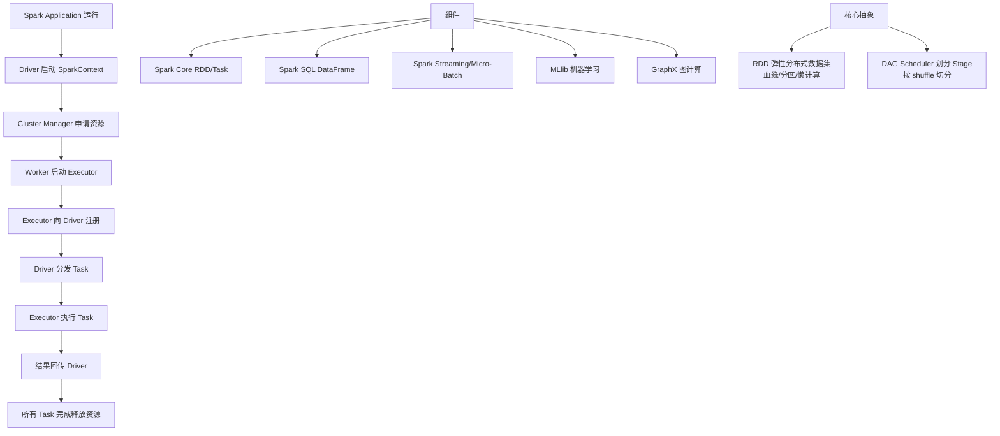

# Executor向SparkContext申请Task

### Executor 向 SparkContext 申请 Task 机制

这是 Spark 任务调度中非常关键的一步，涉及到 **推** 与 **拉** 两种调度策略的理解。

#### 1. 核心流程

在 Spark 运行时，Task 的分发实际上是 **Executor 主动拉取** 的过程，而非 Driver 盲目推送。这主要得益于 **推测执行** 和 **本地性优化**。

1.  **Task 反序列化与准备**：
    -   `SparkContext` 将应用程序代码和依赖文件发送给 Executor。
    -   Executor 端的 `ExecutorBackend` 接收到这些资源，并准备运行环境。

2.  **注册与反序列化**：
    -   Executor 启动后，向 Driver 反向注册。
    -   **细节**：Driver 维护一个 Executor 的内存映射表。Executor 内部启动了一个线程池，线程数由 `spark.executor.cores` 和 `spark.task.cpus` 决定。

3.  **发送 LaunchTask 请求**：
    -   **误区修正**：虽然流程图说“Executor 申请 Task”，更准确的描述是：Executor 启动后，会通过 RPC 反复向 Driver 发送状态更新和请求。
    -   Driver 端的 `TaskScheduler` 根据数据本地性等待合适的 Slot（计算核心）空闲。当 Slot 空闲时，`TaskScheduler` 会将序列化后的 Task 发送给 Executor 的 `LauncherThread`。

4.  **Task 运行**：
    -   Executor 接收到序列化的 Task 数据，反序列化，并从线程池中分配一个线程来执行该 Task。

```text
      Driver Side                                     Executor Side
+-------------------------+                     +----------------------+
|   TaskSchedulerImpl     |                     |   CoarseGrained     |
|                         |   1. Status Update |   ExecutorBackend    |
|  +-------------------+  | <------------------|                      |
|  | TaskSetManager    |  |                     |                      |
|  | (Manages Tasks)   |  |   2. Request Work  |                      |
|  +--------+----------+  | <------------------|                      |
|           |             |                     |                      |
|           |             |   3. LaunchTask    |                      |
|           | (Assign)    | ------------------> |                      |
|           v             |   (Serialized Task) | 4. Deserialize &    |
|    [Task Assignment]    |                     |    Execute           |
+-------------------------+                     +----------------------+
```

#### 2. 数据本地性
为什么不是 Driver 直接推过去？因为 Driver 需要根据数据存放的位置来决定将 Task 发给哪个 Executor。
-   **PROCESS_LOCAL**：数据就在 Executor 的内存中（最快）。
-   **NODE_LOCAL**：数据在同一节点的其他 Executor（如 HDFS Block）。
-   **RACK_LOCAL**：数据在同一机架。
-   **ANY**：跨机架。

#### 3. 实战深化

**实战案例**：
在某个 ETL 作业中，发现偶尔出现 **“节点本地性丢失”** 警告，且任务耗时波动大。经排查，是因为集群资源紧张，当节点空闲 Slot 被其他长期任务占满后，Driver 为了不饿死任务，被迫将 `NODE_LOCAL` 降级为 `RACK_LOCAL` 或 `ANY`，导致大量跨机架网络传输，拖慢了速度。

**代码示例**：
```scala
// SparkConf 中配置本地性等待时长（单位：毫秒）
// 适当延长等待时间可争取更好的数据本地性，但会增加作业延迟
val conf = new SparkConf()
  .set("spark.locality.wait", "3s")       // 默认 3s
  .set("spark.locality.wait.node", "5s")  // 节点级别等待更久一点
```


## 核心架构图


## 记忆要点

- 调度本质：Executor 空闲后主动汇报状态，Driver 结合数据本地性下发 LaunchTask。
- 五大本地性级别：PROCESS_LOCAL > NODE_LOCAL > RACK_LOCAL > ANY。
- 因为 Driver 要等最佳节点，所以通过 spark.locality.wait（默认3秒）控制降级等待。
- Executor 接收序列化 Task 后，由内部线程池反序列化并执行。

## 结构化回答

**30 秒电梯演讲：** 工作进程向Driver线程申请具体任务。打个比方，工人向工头喊话，主动领活干。

**展开框架：**
1. **调度本质** — Executor 空闲后主动汇报状态，Driver 结合数据本地性下发 LaunchTask。
2. **五大本地性级别** — PROCESS_LOCAL > NODE_LOCAL > RACK_LOCAL > ANY。
3. **通过 spark.locality.wait** — 因为Driver 要等最佳节点，所以通过 spark.locality.wait（默认3秒）控制降级等待。

**收尾：** 我在项目里踩过坑——在某个 ETL 作业中，发现偶尔出现 “节点本地性丢失” 警告，且任务耗时波动大。您想深入聊哪一段：原理、避坑还是对比选型？

## 视频脚本

> 预计时长：2 分钟 | 由浅入深

| 时间 | 画面/字幕 | 口播台词 | 讲解要点 |
|------|----------|----------|----------|
| 0:00 | 标题卡：Executor向SparkCont… | "Executor向SparkContext申请Task？一句话——工人向工头喊话，主动领活干。" | 开场钩子 |
| 0:40 | 概念动画/示意图 | "工作进程向Driver线程申请具体任务——工人向工头喊话，主动领活干" | 核心定义 |
| 1:20 | 调度本质示意 | "Executor 空闲后主动汇报状态，Driver 结合数据本地性下发 LaunchTask。" | 要点1 |
| 2:00 | 总结卡 | "记住这几条，面试不慌。下期讲进阶追问。" | 收尾 |
