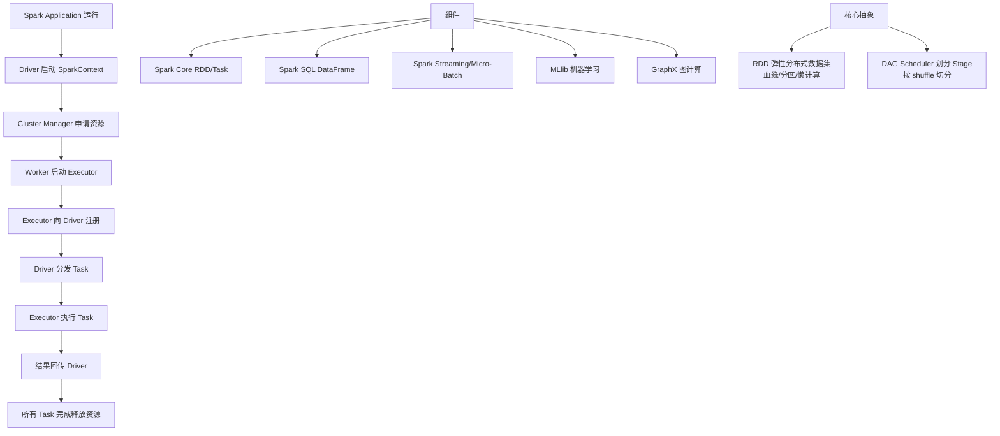

# SparkContext将应用程序分发给Executor

### SparkContext 将应用程序分发给 Executor

这一步主要解决的是 **代码和依赖的广播** 问题。如果 Executor 节点没有应用程序的代码逻辑，它是无法执行 Task 的。

#### 1. 分发内容与机制

当 SparkContext 向资源管理器申请到资源后，会执行以下分发操作：

1.  **Application Jar 分发**：
    -   Driver 将用户提交的主 Jar 包上传到 HDFS 或其他分布式文件系统（如果尚未在共享存储中）。
    -   通过 HTTP 协议或 RPC 机制，将 Jar 包发送给所有的 Executor。
    -   **细节**：实际上是发送了文件的 URL，Executor 端根据配置去下载或接收文件流。

2.  **依赖文件分发**：
    -   使用 `spark.files` 或 `--files` 指定的配置文件、数据文件。
    -   使用 `spark.jars` 或 `--jars` 指定的第三方依赖库。

3.  **闭包序列化**：
    -   如果 RDD 的算子中使用了外部变量（闭包），这些变量会被 Driver 序列化，随 Task 一起发送给 Executor。
    -   **注意**：如果外部变量不支持序列化（如数据库连接），会导致分发失败。

```text
+----------------------+          +-------------------------+
|   SparkContext (Driver) |          |      Executor 1          |
|  +------------------+  |          | +---------------------+ |
|  | App Jar & Deps   |  |  1. Send | | Working Directory  | |
|  +--------+---------+  | --------> | | +-----------------+ | |
|           |            |  (HTTP)  | | | App.jar         | | |
|           v            |          | | | Deps.lib        | | |
|  Task Serialization  |            | | +-----------------+ | |
+-----------+-----------+          +-----------------------+
            |
            | 2. Launch Task (含闭包变量)
            v
+-------------------------+
|      Executor 2          |
| +---------------------+ |
| | Working Directory  | |
| | +-----------------+ | |
| | | App.jar         | | |
| | | Deps.lib        | | |
| | +-----------------+ | |
| +---------------------+ |
+-------------------------+
```

#### 2. 广播变量的优化
如果有一个很大的只读变量（如配置表）需要发送给所有 Executor：
-   **普通闭包**：每个 Task 都会发送一份该变量的副本，网络开销巨大，且内存压力大。
-   **广播变量**：Driver 将该变量只发送给每个 Executor 一份，Executor 内部的所有 Task 共享这一份内存。

#### 3. 实战深化

**实战案例**：
曾遇到任务提交后 Executor 报 `NoClassDefFoundError`。原因是 `spark.jars` 中配置的 Jar 包名在不同版本中发生了变化，或者本地测试通过但集群缺少该依赖。解决方法是使用 `--packages` 自动从 Maven 仓库拉取，或者构建 FatJar（Shaded Jar）。

**对比表格**：

| 特性 | 普通闭包变量 | 广播变量 |
| :--- | :--- | :--- |
| **分发机制** | 随每个 Task 序列化发送 | Driver 发送至每个 Executor (一次) |
| **网络传输** | 频繁，大小 = Task数 × 变量大小 | 低频，大小 = Executor数 × 变量大小 |
| **Executor内存** | 每个线程独占一份副本 | 节点内所有线程共享一份 (堆外/堆内) |
| **适用场景** | 小变量，如配置参数 | 大变量，如字典表、ML模型特征 |
| **更新机制** | 只读（快照） | 只读（不可变） |

**代码示例**：
```scala
// 使用 Broadcast 分发大配置表
val broadcastConfig = sc.broadcast(loadLargeConfigFromDB())

rdd.mapPartitions { iter =>
  val config = broadcastConfig.value // 在 Executor 端获取
  iter.map(data => process(data, config))
}
```


## 核心架构图


## 核心知识点图


## 记忆要点

- 分发内容：不仅分发 App Jar，还要将闭包（外部变量）序列化后随 Task 发送。
- 注意坑点：闭包中若包含不支持序列化的对象（如数据库连接）会直接报错。
- 广播变量优化：大变量发给 Executor 一份共享，而普通闭包是发给每个 Task 一份。
- 依赖管理：外部依赖需通过 --jars 上传至 HDFS，供各 Executor 下载。

## 结构化回答

**30 秒电梯演讲：** 将代码和依赖序列化发送到各节点。打个比方，把图纸和工具快递给各个分工地。

**展开框架：**
1. **分发内容** — 不仅分发 App Jar，还要将闭包（外部变量）序列化后随 Task 发送。
2. **注意坑点** — 闭包中若包含不支持序列化的对象（如数据库连接）会直接报错。
3. **广播变量优化** — 大变量发给 Executor 一份共享，而普通闭包是发给每个 Task 一份。

**收尾：** 我在项目里踩过坑——曾遇到任务提交后 Executor 报 `NoClassDefFoundError`。您想深入聊哪一段：原理、避坑还是对比选型？

## 视频脚本

> 预计时长：2 分钟 | 由浅入深

| 时间 | 画面/字幕 | 口播台词 | 讲解要点 |
|------|----------|----------|----------|
| 0:00 | 标题卡：SparkContext将应用程序分… | "SparkContext将应用程序分发给Executor？一句话——把图纸和工具快递给各个分工地。" | 开场钩子 |
| 0:40 | 概念动画/示意图 | "将代码和依赖序列化发送到各节点——把图纸和工具快递给各个分工地" | 核心定义 |
| 1:20 | 分发内容示意 | "不仅分发 App Jar，还要将闭包（外部变量）序列化后随 Task 发送。" | 要点1 |
| 2:00 | 总结卡 | "记住这几条，面试不慌。下期讲进阶追问。" | 收尾 |
