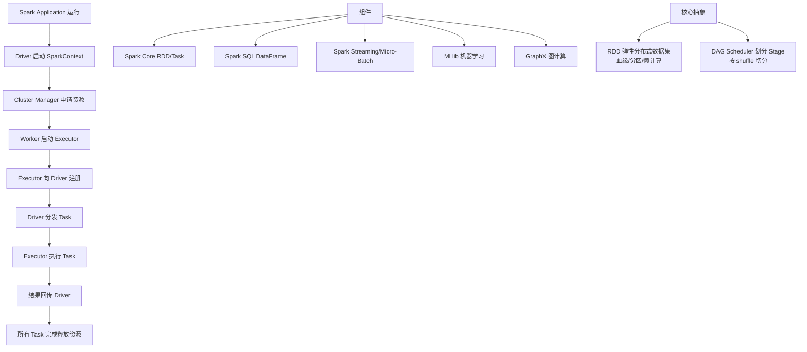

# Task在Executor上运行，运行完释放所有资源

### Task 在 Executor 上的运行与资源释放

这是 Spark 执行引擎的最后一步，涉及到具体的计算执行、结果回传以及 JVM 的生命周期管理。

#### 1. Task 运行核心流程

1.  **反序列化**：
    -   Executor 的 `ExecutorBackend` 接收到序列化的 Task 描述（包括 TaskBinary、数据分区的信息等）。
    -   使用 `ClassLoader` 反序列化代码和闭包变量。

2.  **内存管理**：
    -   Task 在执行前会向 `MemoryManager` 申请执行内存和存储内存。
    -   如果是 Shuffle Map Task，会申请写 Shuffle 文件的内存；如果是 Result Task，则申请用于聚合计算的内存。

3.  **执行计算**：
    -   调用 RDD 的 `compute` 方法。
    -   **关键点**：Task 会遍历该 RDD 的依赖链，一直回溯到数据源（如 HDFS 或缓存的 Partition），逐层计算。
    -   **Shuffle Write**：如果是 Shuffle 阶段的结束点，Task 会将中间结果写入本地磁盘（或内存，取决于 Tungsten 优化）。

4.  **结果回传**：
    -   **Result Task**：将结果直接通过 `Netty` 传回 Driver（`DirectTaskResult`）。
    -   **Shuffle Map Task**：将输出文件的 `MapStatus`（包含输出文件的大小和位置信息）传回 Driver 的 `DAGScheduler`，以便下一个 Stage 能够拉取数据。

```text
  Executor (JVM Process)
+------------------------------------------+
|         ThreadPool (Executor Threads)   |
|  +---------+   +---------+   +---------+ |
|  | Thread 1|   | Thread 2|   | Thread N| |
|  |  Task 1 |   |  Task 2 |   |  Task N | |
|  +----+----+   +----+----+   +----+----+ |
|       |             |             |      |
|       v             v             v      |
|  Compute RDD  Compute RDD  Compute RDD |
|       |             |             |      |
|  (Shuffle Write)  (Shuffle Write) ...   |
|       |             |             |      |
|       +-------------+-------------+      |
|                     |                    |
|  +------------------v------------------+ |
|  |         Memory Manager (Heap)       | |
|  +-------------------------------------+ |
|                     |                    |
+---------------------|--------------------+
                      |
               (Write Local Disk)
                      v
              /var/folders/.../shuffle_0_0
```

#### 2. 资源释放

-   **Task 级别释放**：Task 运行结束后，会释放申请的 Execution Memory，清空 ThreadLocal 中的缓冲区，尝试将数据块卸载到磁盘。
-   **Stage/Job 级别释放**：Stage 结束后，如果不持久化，中间产生的 Shuffle 文件会被标记为待删除。
-   **Executor 级别释放**：
    -   当 Spark Application 结束时，Executor 进程退出，所有资源（内存、文件、线程池）由 OS 回收。
    -   **动态分配**：如果开启了动态资源分配，当 Executor 空闲超过 `spark.executor.idleTimeout`，会被回收。

#### 3. 实战深化

**实战案例**：
在处理超大数据集时，Task 报 `Container killed by YARN for exceeding memory limits`。排查发现并非计算数据内存溢出，而是 Task 结束时，虽然释放了堆内内存，但 **堆外内存** 没有及时释放，或者由于 ThreadLocal 缓存未清理导致内存泄漏。解决方案是在 Task 结束逻辑中手动清理 ThreadLocal 缓存，或调整 `spark.memory.offHeap.enabled`。

**代码示例**：
```scala
// Task 执行的关键逻辑伪代码
def runTask(context: TaskContext): T = {
  try {
    // 1. 申请内存
    val memoryManager = SparkEnv.get.memoryManager
    memoryManager.acquireExecutionMemory(requiredBytes, context.taskAttemptId, MemoryMode.ON_HEAP)
    
    // 2. 执行计算 (RDD.compute)
    val result = rdd.iterator(partition, context)
    
    result
  } finally {
    // 3. 释放资源 (在 finally 块中确保执行)
    context.markTaskCompleted()
    // 释放所有通过 MemoryManager 获取的页面
    SparkEnv.get.memoryManager.releaseExecutionMemory(...)
  }
```


## 核心架构图


## 核心知识点图


## 记忆要点

- 运行流程：反序列化 Task -> 向 MemoryManager 申请内存 -> 调用 RDD 的 compute。
- 结果回传：Result Task 直接回传结果，而 Shuffle Map Task 回传 MapStatus 元数据。
- 资源释放：Task 释放执行内存，Application 结束时 Executor 进程退出。
- 实战避坑：Task 结束时若发生 OOM，需排查堆外内存溢出或 ThreadLocal 缓存泄漏。

## 结构化回答

**30 秒电梯演讲：** Spark应用从提交到任务执行的生命周期流程。打个比方，像盖楼：先申请地皮，再建好施工队（Executor），最后按图纸施工。

**展开框架：**
1. **运行流程** — 反序列化 Task -> 向 MemoryManager 申请内存 -> 调用 RDD 的 compute。
2. **结果回传** — Result Task 直接回传结果，而 Shuffle Map Task 回传 MapStatus 元数据。
3. **资源释放** — Task 释放执行内存，Application 结束时 Executor 进程退出。

**收尾：** 这三点都能配合实战聊。您想深入聊原理、对比还是避坑？

## 视频脚本

> 预计时长：2 分钟 | 由浅入深

| 时间 | 画面/字幕 | 口播台词 | 讲解要点 |
|------|----------|----------|----------|
| 0:00 | 标题卡：Task在Executor上运行，运… | "Task在Executor上运行，运行完释放所有资源？一句话——像盖楼：先申请地皮，再建好施工队（Executor），最后按图纸施工。" | 开场钩子 |
| 0:40 | 概念动画/示意图 | "Spark应用从提交到任务执行的生命周期流程——像盖楼：先申请地皮，再建好施工队（Executor），最后按图纸施工" | 核心定义 |
| 1:20 | 运行流程示意 | "反序列化 Task -> 向 MemoryManager 申请内存 -> 调用 RDD 的 compute。" | 要点1 |
| 2:00 | 总结卡 | "记住这几条，面试不慌。下期讲进阶追问。" | 收尾 |
