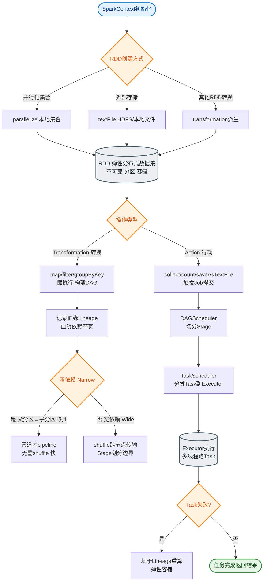

# Spark RDD 的创建方式与操作算子有哪些？

## RDD 的创建方式
1.  **从内存集合（集合）创建**：使用 `parallelize` 方法（或 `makeRDD`）。
    -   **细节**：底层会将集合切分为多个分区，分布到集群各节点。可指定分区数，若未指定则默认取决于 CPU 核数。
2.  **从外部存储创建**：从 HDFS、HBase、S3 等文件系统读取。使用 `textFile`, `wholeTextFiles` 等方法。
    -   **细节**：
        -   `textFile(path, minPartitions)`：默认情况下，HDFS 的一个 Block（默认 128MB）对应一个分区，但可以通过参数调整最小分区数。
        -   `wholeTextFiles`：针对小文件场景，每个文件作为一个记录，返回键值对（文件路径, 文件内容），避免产生大量分区。
3.  **从父 RDD 转换**：通过算子（如 `map`, `filter`, `join`）生成新 RDD。
    -   **细节**：Transformation 是懒执行的，仅记录 RDD 的 Lineage（血缘关系），不触发计算。

## RDD 的两种操作算子
1.  **Transformation（转换算子）**：懒执行，生成新 RDD。
    -   **分类**：
        -   **窄依赖**：父 RDD 的一个分区最多被子 RDD 的一个分区使用（如 `map`, `filter`, `union`）。支持流水线优化，不需要 Shuffle，计算效率高。
        -   **宽依赖**：父 RDD 的一个分区的数据被子 RDD 的多个分区使用（如 `groupByKey`, `reduceByKey`, `join`）。涉及 Shuffle，过程非常耗时。
2.  **Action（行动算子）**：触发作业执行，返回结果给 Driver 或写入存储。
    -   **常见算子**：
        -   `collect()`：将所有结果拉取回 Driver，内存不足会 OOM。
        -   `count()`：返回 RDD 元素总数。
        -   `take(n)`：返回前 n 个元素。
        -   `foreachPartition`：对每个分区执行操作，常用于写外部数据库（减少连接建立次数）。

## RDD 执行流程架构图

```text
Driver Program
│
├─ 1. 创建 RDD (sc.textFile / parallelize)
│
├─ 2. 构建 DAG (Directed Acyclic Graph)
│   └─ 记录: RDD A -> map -> RDD B -> reduceByKey -> RDD C
│
├─ 3. 触发 Action (如: count)
│
├─ 4. DAGScheduler (将 DAG 划分为 Stage)
│   ├─ Stage 1 (Narrow Dependencies: RDD A -> RDD B)
│   └─ Shuffle Map Stage (Shuffle Write)
│   └─ Stage 2 (Narrow Dependencies: Shuffle Read -> RDD C)
│
└─ 5. TaskScheduler (提交 Task 到 Executor)
    │
    ▼
Cluster (Executor Nodes)
    ┌──────────────┐     ┌──────────────┐
    │  Executor 1  │     │  Executor 2  │
    ├──────────────┤     ├──────────────┤
    │ Task (Thread)│ ... │ Task (Thread)│
    │ - 计算数据   │     │ - 计算数据   │
    │ - Shuffle W  │     │ - Shuffle R  │
    └──────────────┘     └──────────────┘
```

## 常见考点
1.  **RDD、DataFrame、DataSet 的区别**：RDD 面向对象，性能较差（序列化/反序列化开销）；DataFrame/Dataset 是 Spark SQL 的核心，利用 Catalyst 优化器进行优化，性能更好。
2.  **宽依赖与窄依赖对容错的影响**：窄依赖只需重算丢失的分区，而宽依赖可能需要重算整个 Stage。

## 实战深化

**实战案例**：
在使用 `groupByKey` 处理千万级 Key 的数据时，Executor 频繁 OOM。这是因为 `groupByKey` 会将所有相同 Key 的 Value 拉取到同一个内存 List 中，未进行 Map 端预聚合。将算子替换为 `reduceByKey` 后，利用 Map 端聚合大幅减少了 Shuffle 数据量，解决了 OOM 问题。

**代码示例**：
```scala
// 窄依赖示例 (不涉及 Shuffle)
val rdd1 = sc.parallelize(1 to 10)
val rdd2 = rdd1.map(_ * 2) // 窄依赖：一对一
val rdd3 = rdd2.filter(_ > 10) // 窄依赖

// 宽依赖示例 (涉及 Shuffle)
val pairs = rdd1.map(x => (x % 3, x))
// reduceByKey 会在 Shuffle 前进行 Map 端预聚合
val reduced = pairs.reduceByKey(_ + _) 

// 触发 Action
reduced.collect().foreach(println)
```

**对比表格**：

| 特性 | Transformation (转换算子) | Action (行动算子) |
| :--- | :--- | :--- |
| **执行时机** | 懒加载，不立即执行 | 立即触发 Job 执行 |
| **返回值** | 返回新的 RDD | 返回具体值 或 Unit (如 foreach) |
| **示例** | map, filter, flatMap, join | collect, count, saveAsTextFile |
| **DAG 构建** | 记录 Lineage，构建 DAG 图 | 生成 DAGScheduler 事件，切分 Stage |
| **Shuffle 发生** | 仅宽依赖算子定义 Shuffle | 触发实际的 Shuffle 读写过程 |


## 核心流程图


## 记忆要点

- 三大创建方式：集合 parallelize、外部存储 textFile、父 RDD 转换。
- Transformation 是懒执行仅记录血缘，而 Action 是触发作业的真实计算。
- 窄依赖不发生 Shuffle（如 map）效率高，而宽依赖必须跨节点 Shuffle（如 join）。
- 实战避坑：大量 Key 聚合时用 reduceByKey（预聚合），坚决不用 groupByKey 防止 OOM。

## 结构化回答

**30 秒电梯演讲：** 数据的来源与处理方式：创建与变换。打个比方，像面团：既可以从面粉（内存/文件）和，也可以从旧面团（转换）揉。

**展开框架：**
1. **三大创建方式** — 集合 parallelize、外部存储 textFile、父 RDD 转换。
2. **Transformation 是懒执行仅记录血缘** — 而 Action 是触发作业的真实计算。
3. **窄依赖不发生 Shuffle（如 map）效率高** — 而宽依赖必须跨节点 Shuffle（如 join）。

**收尾：** 我在项目里踩过坑——在使用 `groupByKey` 处理千万级 Key 的数据时，Executor 频繁 OOM。您想深入聊哪一段：原理、避坑还是对比选型？

## 视频脚本

> 预计时长：2 分钟 | 由浅入深

| 时间 | 画面/字幕 | 口播台词 | 讲解要点 |
|------|----------|----------|----------|
| 0:00 | 标题卡：Spark RDD 的创建方式与操作… | "Spark RDD 的创建方式与操作算子有哪些？一句话——像面团：既可以从面粉（内存/文件）和，也可以从旧面团（转换）揉。" | 开场钩子 |
| 0:40 | 概念动画/示意图 | "数据的来源与处理方式：创建与变换——像面团：既可以从面粉（内存/文件）和，也可以从旧面团（转换）揉" | 核心定义 |
| 1:20 | 三大创建方式示意 | "集合 parallelize、外部存储 textFile、父 RDD 转换。" | 要点1 |
| 2:00 | 总结卡 | "记住这几条，面试不慌。下期讲进阶追问。" | 收尾 |
