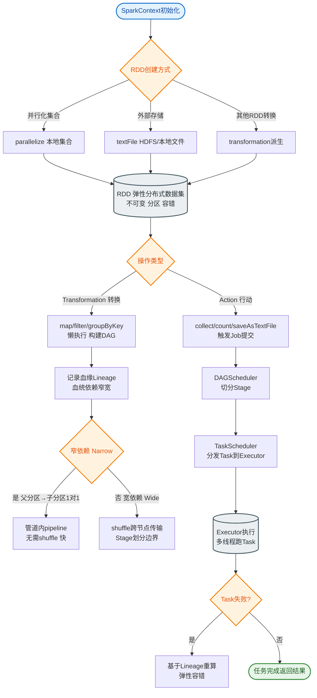

# Storm

27. Storm
27.1.1. 概念
Storm 是一个免费并开源的分布式实时计算系统。利用 Storm 可以很容易做到可靠地处理无限的数据流，像 Hadoop 批量处理大数据一样，Storm 可以实时处理数据。其核心设计目标是保证低延迟（毫秒级）和高容错性。

27.1.1. 集群架构

**核心组件详解**：

*   **27.1.1.1. Nimbus（Master 节点）**
    *   **职责**：负责资源分配、任务调度和故障监控。它不进行实际的数据计算，只是将运行 Topology 的代码分发到 Supervisor 节点，并监控它们的状态。
    *   **状态**：Nimbus 是无状态的，所有状态都存储在 ZooKeeper 中。这意味着如果 Nimbus 宕机，可以快速重启而不影响正在运行的 Topology（除了无法提交新作业和进行重平衡）。

*   **27.1.1.2. Supervisor（Slave 节点）**
    *   **职责**：监听 ZooKeeper 的分配任务，负责管理本机上的 Worker 进程。
    *   **配置**：通过 `supervisor.slots.ports` 配置项定义可用的 Worker 槽位。每个槽位对应一个端口，绑定一个 Worker 进程。
    *   **容错**：如果 Supervisor 宕机，Nimbus 会检测到并将其上的任务重新分配到其他 Supervisor。

*   **27.1.1.3. Worker（工作进程）**
    *   **职责**：具体的进程 JVM，属于某个 Topology。一个 Worker 进程中运行着属于该 Topology 的多个 Executor（线程）。
    *   **组件**：
        *   **Spout**：数据源，负责从外部读取数据（如 Kafka、MQ）并发射到 Topology 中。
        *   **Bolt**：处理逻辑，负责数据的转换、聚合、计算或存储。
    *   **Task**：Task 是实际执行数据处理的最小单元（线程内部的任务实例）。Executor 线程可以执行一个或多个同类型的 Task。

**流处理架构图**：

```text
   ZooKeeper (集群协调/状态存储)
   ┌───────────────────────────────┐
   │  - Topology 任务分配信息        │
   │  - 集群心跳状态                │
   │  - Supervisor/Worker 存活状态   │
   └──────────────┬────────────────┘
                  │ (Sync/Watch)
      ┌───────────┴───────────┐
      ▼                       ▼
┌───────────────┐    ┌──────────────────┐
│   Nimbus      │    │   Supervisor     │
│  (Master)     │◄───►│   (Slave)        │
│               │    │  ┌────────────┐  │
│ - 提交 Topo   │    │  │  Worker 1  │  │
│ - 分配代码    │    │  │ ┌────────┐  │  │
│ - 监控集群    │    │  │ │Spout   │  │  │
└───────────────┘    │  │ └────────┘  │  │
                     │  │ ┌────────┐  │  │
                     │  │ │Bolt A  │──┼──┼──► Tuple 流
                     │  │ └────────┘  │  │
                     │  └────────────┘  │
                     └──────────────────┘
```

## 常见考点
1.  **Storm 与 Flink/Spark Streaming 的区别**：

| 特性 | Apache Storm | Apache Flink | Spark Streaming |
| :--- | :--- | :--- | :--- |
| **处理模型** | 纯流式 | 纯流式 | 微批处理
| **延迟** | 极低 | 极低 | 秒级/亚秒级
| **吞吐量** | 中等 | 极高 | 高
| **状态管理** | 弱（需外部Redis） | 强（内置Backend） | 强（依赖RDD/Checkpoints）
| **容错机制** | ACKer机制（Tuple树追踪） | Checkpointing | 基于RDD血统Lineage
| **典型场景** | 实时告警、欺诈检测 | 复杂CEP、实时数仓 | 离线流批一体化 |

2.  **Storm 如何保证消息不丢失**：
    Storm 通过 **ACKer 机制** 和 **Tuple 树追踪** 来保证至少一次（At-least-once）的处理语义。
    *   **核心原理**：Storm 为每个 Spout 发送的 Tuple 分配一个唯一的 64bit ID。系统根据该 ID 构建一棵 Tuple 树。每当 Bolt 处理完一个 Tuple 并发射新的 Tuple 时，它会锚定到原 Tuple，从而更新树的结构。
    *   **ACK 流程**：当 Bolt 处理成功并调用 `outputCollector.ack(tuple)` 时，会向 ACKer 发送信号；如果处理失败调用 `fail`，ACKer 会通知 Spout 重发。
    *   **代码示例**：
        ```java
        // Bolt 处理逻辑中正确使用 Anchor 和 ACK
        public void execute(Tuple input, BasicOutputCollector collector) {
            String sentence = input.getString(0);
            String[] words = sentence.split(" ");
            for (String word : words) {
                // 使用 anchor 保留 Tuple 树追踪关系
                collector.emit(input, new Values(word)); 
            }
            // 显式确认处理完成
            collector.ack(input); 
        }
        ```
    *   **实战案例**：在金融交易实时风控中，曾遇到因 Bolt 逻辑抛出未捕获异常导致 Tuple 未 ACK，引发消息积压和重复消费。解决方案是：捕获所有异常并显式调用 `fail`，同时设置 `Config.TOPOLOGY_MAX_SPOUT_PENDING` 限流，防止压垮下游数据库。


## 核心流程图


## 记忆要点

- 角色划分：Nimbus（Master调度）与 Supervisor（Slave执行），状态全靠 ZooKeeper。
- 高容错性：Nimbus 无状态，其宕机不影响已运行的 Topology。
- 拓扑组件：Spout 负责读取数据源发射，Bolt 负责处理、聚合或存储数据。
- 容错机制：通过 ACKer 机制和 Tuple 树追踪，保证消息 At-least-once 不丢失。

## 结构化回答

**30 秒电梯演讲：** 分布式实时流计算系统，处理无限数据流。打个比方，像管道网络：Nimbus 是总控，Supervisor 是泵站，Worker 是水管。

**展开框架：**
1. **角色划分** — Nimbus（Master调度）与 Supervisor（Slave执行），状态全靠 ZooKeeper。
2. **高容错性** — Nimbus 无状态，其宕机不影响已运行的 Topology。
3. **拓扑组件** — Spout 负责读取数据源发射，Bolt 负责处理、聚合或存储数据。

**收尾：** 我在项目里踩过坑——在金融交易实时风控中，曾遇到因 Bolt 逻辑抛出未捕获异常导致 Tuple 未 ACK，引发消息积压和重复消费。您想深入聊哪一段：原理、避坑还是对比选型？

## 视频脚本

> 预计时长：2 分钟 | 由浅入深

| 时间 | 画面/字幕 | 口播台词 | 讲解要点 |
|------|----------|----------|----------|
| 0:00 | 标题卡：Storm | "Storm？一句话——像管道网络：Nimbus 是总控，Supervisor 是泵站，Worker 是水管。" | 开场钩子 |
| 0:40 | 概念动画/示意图 | "分布式实时流计算系统，处理无限数据流——像管道网络：Nimbus 是总控，Supervisor 是泵站，Worker 是水管" | 核心定义 |
| 1:20 | 角色划分示意 | "Nimbus（Master调度）与 Supervisor（Slave执行），状态全靠 ZooKeeper。" | 要点1 |
| 2:00 | 总结卡 | "记住这几条，面试不慌。下期讲进阶追问。" | 收尾 |
