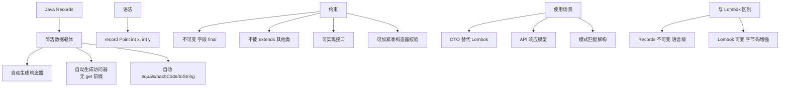

# 什么是Java Records？它解决了什么问题？有哪些使用限制？

Java Records是在Java 14预览、Java 16正式发布的语言特性（JEP 395）。它是一种特殊的不可变数据载体类，旨在以极简语法替代传统JavaBean中大量样板代码。在Records之前，创建一个简单的数据类需要手写构造方法、private final字段、getter方法、equals()、hashCode()和toString()——一个5字段的类可能需要40-60行代码。Records将这一切简化为一行声明。

```java
// 传统JavaBean需要大量样板代码
public class PersonBean {
    private final String name;
    private final int age;
    private final String email;
    
    public PersonBean(String name, int age, String email) {
        this.name = name;
        this.age = age;
        this.email = email;
    }
    public String getName() { return name; }
    public int getAge() { return age; }
    public String getEmail() { return email; }
    // 还需要手写equals(), hashCode(), toString()...
}

// Java Record：一行搞定
public record Person(String name, int age, String email) {}
```

当声明Record时，编译器自动生成：规范构造方法（接受所有组件）、private final字段、访问器方法（名为组件名，不带get前缀）、基于所有组件值比较的equals()、一致的hashCode()、以及可读的toString()。可以使用紧凑构造方法添加验证逻辑：

```java
public record Money(BigDecimal amount, String currency) {
    // 紧凑构造方法 - 验证逻辑
    public Money {
        Objects.requireNonNull(amount);
        Objects.requireNonNull(currency);
        if (amount.compareTo(BigDecimal.ZERO) < 0) {
            throw new IllegalArgumentException("Amount cannot be negative");
        }
        // 可以在此修改参数值（规范化），编译器之后自动赋值给字段
        currency = currency.toUpperCase();
    }
    
    // 可以添加实例方法和静态方法
    public Money add(Money other) { /* ... */ }
    public static Money zero(String currency) { /* ... */ }
}
```

**实战应用与序列化**：
Records 广泛用于微服务间的 DTO 传输。但在与 **Jackson/Gson** 结合时，默认序列化机制可能不完全符合预期（如字段顺序或命名策略）。
*   **代码示例**：使用 Jackson 自定义序列化
    ```java
    // 配置 ObjectMapper 支持 Record
    ObjectMapper mapper = new ObjectMapper();
    // 如果需要处理多态或忽略未知属性
    mapper.registerModule(new JavaTimeModule());
    // 实战：反序列化时，Record 缺乏无参构造，需 Jackson 2.12+ 支持
    String json = "{\"name\":\"Alice\", \"age\":30}";
    Person p = mapper.readValue(json, Person.class);
    ```

**Record vs Lombok @Value vs Class**：

| 特性 | Java Record | Lombok @Value | 传统 Class
| :--- | :--- | :--- | :---
| **标准化** | JDK 原生特性 (JVM 层面) | 第三方注解处理器 | 纯手写/IDE生成
| **API 命名** | `name()` (无前缀) | `getName()` | 可自定义
| **继承性** | 仅继承 java.lang.Record | 可继承类 | 任意继承
| **无参构造** | 不支持 | 可强制生成 | 支持
| **可变性** | 不可变 | 不可变 | 可变
| **用途** | 数据载体、DTO | 领域模型、内部数据 | 复杂业务逻辑、Entity


## 核心架构图


## 核心知识点图


## 记忆要点

- 一句话定义：Java 16发布的原生不可变数据载体类，一行代码替代几十行传统POJO样板。
- 组件对比：传统需手写无参构造和getter，而Record自动生成规范构造且访问器无get前缀。
- 语法限制：因为隐式继承Record类，所以无法被其他类继承，且字段不可变。
- 序列化实战：因为没有无参构造方法，所以反序列化时需确认Jackson等框架版本兼容性。

## 结构化回答

**30 秒电梯演讲：** 一种不可变数据载体类，用于替代样板代码。打个比方，像身份证模板：印好名字就自动完成，无需手写说明书。

**展开框架：**
1. **一句话定义** — Java 16发布的原生不可变数据载体类，一行代码替代几十行传统POJO样板。
2. **组件对比** — 传统需手写无参构造和getter，而Record自动生成规范构造且访问器无get前缀。
3. **语法限制** — 因为隐式继承Record类，所以无法被其他类继承，且字段不可变。

**收尾：** 这三点都能配合实战聊。您想深入聊原理、对比还是避坑？

## 视频脚本

> 预计时长：2 分钟 | 由浅入深

| 时间 | 画面/字幕 | 口播台词 | 讲解要点 |
|------|----------|----------|----------|
| 0:00 | 标题卡：什么是Java Records？它解… | "什么是Java Records？它解决了什么问题？有哪些使用限制？一句话——像身份证模板：印好名字就自动完成，无需手写说明书。" | 开场钩子 |
| 0:40 | 概念动画/示意图 | "一种不可变数据载体类，用于替代样板代码——像身份证模板：印好名字就自动完成，无需手写说明书" | 核心定义 |
| 1:20 | 一句话定义示意 | "Java 16发布的原生不可变数据载体类，一行代码替代几十行传统POJO样板。" | 要点1 |
| 2:00 | 总结卡 | "记住这几条，面试不慌。下期讲进阶追问。" | 收尾 |

---

## 延伸：Records（记录类）是什么？它解决了什么问题？

> 合并自 `sjdk-003`（相似度 67%）

🎯 本质：Records是JDK 16正式引入的透明数据载体，自动生成构造器、访问器、equals/hashCode/toString方法。

📊 Record vs 传统类：
| 特性 | 传统类 (Lombok/手动) | Record |
|------|---------------------|--------|
| 样板代码 | 多 (需注解/手写) | 零 (自动生成) |
| 不可变性 | 需手动保证 (final) | 强制不可变 |
| 继承 | 可继承 | 不能继承类 (final) |
| 实例字段 | 任意 | 仅隐式 final 组件 |
| 适用性 | 复杂业务逻辑 | 纯数据传输 (DTO) |

关键特性：
1. **不可变性**：所有字段都是 `private final`，仅提供访问器（无 `get` 前缀，直接 `x()`）。
2. **自动方法**：`equals`/`hashCode`/`toString` 由编译器基于所有组件生成，保证契约一致性。
3. **紧凑构造器**：用于验证逻辑，不包含参数列表（参数隐式可见）。
   ```java
   public record Range(int start, int end) {
       public Range { 
           if (start > end) throw new IllegalArgumentException(); 
       }
   }
   ```

**实战案例**：在微服务间调用时，我们用Record替代了所有的Request和Response DTO。以前处理`toString()`调试日志时，常因为Lombok生成的字段顺序变更导致日志 diff 失效。Record生成的`toString`严格按照定义顺序输出，极大地提高了日志追踪的可读性。此外，在结合Swagger使用时，Record天然支持JSON序列化，省去了POJO配置。

4. **可添加自定义方法/静态方法**：
   ```java
   public record Point(int x, int y) {
       public double distanceFromOrigin() { return Math.sqrt(x*x + y*y); }
   }
   ```

⚠️ **限制**：不可继承（隐式 `final`）、字段不可变、不能扩展其他类（但可实现接口，如 `implements Serializable`）。

**Record 内部原理**：
Record 继承自 `java.lang.Record` 类（所有 Record 的父类）。编译器生成的类结构如下：

```text
┌─────────────────────────────────────┐
│      public final class Point       │
│      extends java.lang.Record       │
├─────────────────────────────────────┤
│  private final int x;               │
│  private final int y;               │
├─────────────────────────────────────┤
│  Point(int x, int y) { ... }        │ // 规范构造器
│  public int x() { ... }             │ // 访问器
│  public int y() { ... }             │
│  public boolean equals(...) { ... } │
│  public int hashCode() { ... }      │
│  public String toString() { ... }   │
└─────────────────────────────────────┘
```

适用场景：DTO、值对象、配置记录、方法返回值包装器。Record 大幅减少了样板代码。

## 常见考点
1. **Record 可以有实例字段吗？**
   不可以。只能声明 Record 组件，它们自动成为 `final` 字段。可以在类体中声明 `static` 字段。
2. **Record 的 equals() 比较逻辑是什么？**
   是浅比较。如果 Record 包含可变对象（如数组），需警惕修改内部状态影响 hashCode。
3. **Record 可以作为 Map 的 Key 吗？**
   可以，只要保证其组件也是不可变的（或遵循 equals/hashCode 契约），否则 Key 值变化会导致无法找回 Entry。
4. **如何实现带继承行为的 Record？**
   Record 不能继承类，但可以实现多个接口，甚至实现 sealed interface 允许的受限继承。

## 记忆要点

- 定义：JDK 16引入的语法糖，专为纯数据载体(DTO/值对象)透明传输而生
- 对比传统POJO：隐式final修饰不可继承，强制所有字段private final
- 自动生成全套构造器、访问器(无get前缀)及equals/hashCode/toString
- 限制：不能继承其他类，但能实现接口，且仅允许定义static静态字段

## 结构化回答

**30 秒电梯演讲：** 不可变的数据载体，自动生成样板方法。打个比方，像填好的“标准表格”，只读不写，自带格式化说明。

**展开框架：**
1. **定义** — JDK 16引入的语法糖，专为纯数据载体(DTO/值对象)透明传输而生
2. **对比传统POJO** — 隐式final修饰不可继承，强制所有字段private final
3. **自动生成全套构造器、访问器(无get前缀)及eq** — uals/hashCode/toString
**收尾：** 我在项目里踩过坑——可添加自定义方法/静态方法：。您想深入聊哪一段：原理、避坑还是对比选型？

## 视频脚本

> 预计时长：2 分钟 | 由浅入深

| 时间 | 画面/字幕 | 口播台词 | 讲解要点 |
|------|----------|----------|----------|
| 0:00 | 标题卡：Records（记录类）是什么？它解… | "Records（记录类）是什么？它解决了什么问题？一句话——像填好的“标准表格”，只读不写，自带格式化说明。" | 开场钩子 |
| 0:40 | 概念动画/示意图 | "不可变的数据载体，自动生成样板方法——像填好的“标准表格”，只读不写，自带格式化说明" | 核心定义 |
| 1:20 | 定义示意 | "JDK 16引入的语法糖，专为纯数据载体(DTO/值对象)透明传输而生" | 要点1 |
| 2:00 | 总结卡 | "记住这几条，面试不慌。下期讲进阶追问。" | 收尾 |
