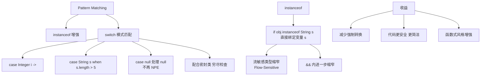

# 请解释Java 21中Pattern Matching for instanceof的工作原理和流敏感类型缩窄（Flow-Sensitive Type Narrowing）。

Pattern Matching for instanceof在Java 16正式发布（JEP 394）。它将传统的两步操作（先检查类型，再显式转换）合并为一个表达式。传统写法是if (shape instanceof Circle)然后另起一行Circle circle = (Circle) shape进行强制转换。这种两步操作不仅冗余，而且在长条件链中容易出现复制粘贴错误——instanceof检查的变量和cast的变量可能不一致。

```java
// 传统写法 - 冗长且容易出错
if (obj instanceof String) {
    String str = (String) obj;  // 重复且多余的转换
    System.out.println(str.toUpperCase());
}

// Pattern Matching - 一步到位
if (obj instanceof String str) {
    // str在此作用域内自动可用，类型为String
    System.out.println(str.toUpperCase());
}
```

流敏感类型缩窄是Pattern Matching的核心机制。编译器在成功匹配后，将绑定变量的类型缩窄为匹配的类型，并在该作用域内的所有后续引用中使用缩窄后的类型。

```java
// 与&&和||结合使用
public String processObject(Object obj) {
    // && 短路：只有instanceof为true时str才在作用域中
    if (obj instanceof String str && str.length() > 10) {
        return str.substring(0, 10) + "...";
    }
    return "default";
}
```

### 原理深度解析：类型流分析
编译器引入了"包含类型"的概念。在 `if (obj instanceof String str)` 中，`str` 被称为**模式变量**。它的作用域不仅受限于词法作用域，还受限于**流作用域**（Flow Scope）。

**实战案例：清理遗留类型转换代码**
在处理 JSON 解析结果（通常表现为 `Map<String, Object>` 或 `Object`）时，代码中充斥着大量的 `if-else` 和强制转换。
*   **代码示例**：
    ```java
    // 复杂的配置解析逻辑
    public void loadConfig(Object configValue) {
        if (configValue instanceof Map map) {
            // 编译器推断 map 为 Map 类型，无需强转
            Object timeout = map.get("timeout");
            if (timeout instanceof Integer i && i > 0) {
                setupTimeout(i); // 直接使用 i，类型安全
            } else if (timeout instanceof String s) {
                parseDuration(s); // 处理 "30s" 字符串
            }
        }
    }
    ```

**类型检查演进对比**：

| 特性 | Java 11 以前 | Java 16+ Pattern Matching
| :--- | :--- | :---
| **代码行数** | 3行 (Check + Cast + Assign) | 1行
| **变量作用域** | 需手动管理外部变量 | 自动引入流作用域变量
| **空指针安全** | 需显式 `null != obj` | `null` 直接匹配 false
| **类型声明** | 重复声明类型 | 类型推断


## 核心架构图


## 核心知识点图


## 记忆要点

- 核心机制：if (obj instanceof String str)，一步到位将类型检查与强转赋值合并。
- 流敏感类型缩窄：模式变量不仅在if块内有效，与&&结合时还受限于布尔短路逻辑作用域。
- 空指针安全：如果obj为null，instanceof直接返回false，避免显式null判断。
- 代码量对比：传统写法Check+Cast+Assign需3行，而Java 16模式匹配仅需1行。

## 结构化回答

**30 秒电梯演讲：** 在类型检查时自动进行类型转换和变量绑定。打个比方，像安检：过检后直接换上“内部员工”制服，不用再回更衣室。

**展开框架：**
1. **核心机制** — if (obj instanceof String str)，一步到位将类型检查与强转赋值合并。
2. **流敏感类型缩窄** — 模式变量不仅在if块内有效，与&&结合时还受限于布尔短路逻辑作用域。
3. **空指针安全** — 如果obj为null，instanceof直接返回false，避免显式null判断。

**收尾：** 我在项目里踩过坑——实战案例：清理遗留类型转换代码。您想深入聊哪一段：原理、避坑还是对比选型？

## 视频脚本

> 预计时长：2 分钟 | 由浅入深

| 时间 | 画面/字幕 | 口播台词 | 讲解要点 |
|------|----------|----------|----------|
| 0:00 | 标题卡：请解释Java 21中Pattern… | "请解释Java 21中Pattern Matching for instanceof的工作原理和流敏感类型缩窄（Flow-Sensitive Type Narrowing）。？一句话——像安检：过检后直接换上“内部员工”制服，不用再回更衣室。" | 开场钩子 |
| 0:40 | 概念动画/示意图 | "在类型检查时自动进行类型转换和变量绑定——像安检：过检后直接换上“内部员工”制服，不用再回更衣室" | 核心定义 |
| 1:20 | 核心机制示意 | "if (obj instanceof String str)，一步到位将类型检查与强转赋值合并。" | 要点1 |
| 2:00 | 总结卡 | "记住这几条，面试不慌。下期讲进阶追问。" | 收尾 |
