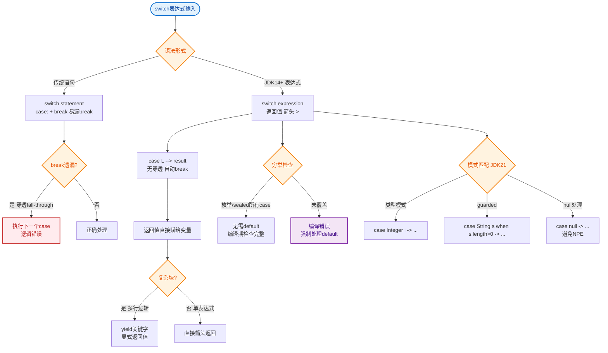

# Java 21的Switch表达式（Switch Expression）与Switch语句（Switch Statement）有什么区别？yield关键字的作用是什么？

Java 14正式发布了Switch表达式（JEP 361），Java 21对其进行了进一步增强（JEP 441加入模式匹配）。Java中现在有两种根本不同的switch构造：Switch语句和Switch表达式，它们有不同的语义、语法和适用场景。

Switch语句是传统的Java switch构造，执行代码作为副作用，不产生值。它使用冒号式case标签，默认行为是fall-through（除非用break显式阻止）。Switch语句可以修改作用域中的变量、调用方法、抛出异常。Switch语句不要求穷举所有可能值——未覆盖的case会默默不做任何事情。

Switch表达式是产生单一值的构造。它使用箭头式case标签（case X → result），case之间永远不会fall-through——每个case完全独立。编译器对Switch表达式强制执行穷举检查——每个可能的输入值都必须被某个case覆盖，或者有default分支。

**实战案例**：在一个金融风控规则引擎中，传统switch语句因漏写break导致风控规则穿透（即执行了当前case后又意外执行了下一个case的严控逻辑），造成大量误报。迁移到Switch表达式后，编译器的穷举性检查强制我们在新增支付类型时处理所有逻辑分支，彻底避免了此类运行时错误。

```java
// 传统switch语句 - 可能fall-through
String result;
switch (day) {
    case MONDAY:
    case FRIDAY:
    case SUNDAY:
        result = "休息日前后";
        break;  // 必须显式break
    case TUESDAY:
        result = "工作日";
        break;
    default:
        result = "其他";
        break;
}

// Java 21 Switch表达式 - 无fall-through，产生值
String result = switch (day) {
    case MONDAY, FRIDAY, SUNDAY → "休息日前后";
    case TUESDAY → "工作日";
    default → "其他";
};

// yield关键字：在块case中提供值
int numLetters = switch (day) {
    case MONDAY, FRIDAY, SUNDAY → 6;
    case TUESDAY → 7;
    case THURSDAY, SATURDAY → 8;
    case WEDNESDAY → 9;
    default → {
        // 需要多条语句时使用块，用yield返回值
        String s = day.toString();
        if (s.length() > 10) {
            yield s.length();
        } else {
            yield -1;
        }
    }
};
```

yield关键字是Switch表达式特有的，用于块case中指定该case产生的值。当case需要多条语句才能确定结果时（如声明局部变量、验证逻辑、日志记录），使用大括号块包裹多条语句，最后用yield表达式值作为结果。对于简单的单表达式case，箭头后直接写表达式即可，不需要yield。

关于yield是否是保留关键字——yield是上下文敏感关键字（context-sensitive keyword），只在Switch表达式块case的特定语法上下文中被识别为yield语句。在所有其他上下文中，yield是完全合法的标识符。

### 深度原理：穷举性检查

编译器如何确保穷举性？对于 `enum`、`sealed` 类（密封类）以及 `String`、`Integer` 等类型，编译器拥有足够的信息来推断所有可能的覆盖情况。

1. **Enum 类型**：如果 switch 覆盖了所有枚举常量，则不需要 default 分支。这保证了如果后续添加了新的枚举值，旧代码会在编译时报错，而不是静默失败。
2. **Sealed Classes**：结合模式匹配，Java 21 能够检查是否覆盖了密封类的所有允许的子类型。

### 对比表格：Switch 语句 vs Switch 表达式

| 特性 | Switch 语句 | Switch 表达式 |
| :--- | :--- | :--- |
| **核心目的** | 控制流导向 | 值导向
| **返回值** | 无 (Side-effects) | 有 (产生单一值)
| **Fall-through** | 默认穿透 (需break阻止) | 禁止穿透 (语法隔离)
| **标签语法** | `case X:` (冒号) | `case X ->` (箭头)
| **穷举性检查** | 不强制 | 编译器强制 (必须覆盖所有情况)
| **多行处理** | 直接编写代码块 | 需使用 `{ ... yield value }` |
| **变量作用域** | 共享作用域 (注意变量冲突) | 每个case独立作用域

### 架构图：Switch 表达式 vs 语句

```text
+---------------------+          +-----------------------+
| Switch Statement    |          | Switch Expression     |
| (控制流导向)         |          | (值导向)               |
+------------------   |          +-----------------------+
```


## 核心流程图


## 记忆要点

- 核心定位：语句是控制流导向且无返回值，而表达式是值导向且可直接赋值。
- 穿透对比：传统语句默认fall-through需手写break，而箭头表达式语法隔离禁止穿透。
- 穷举检查：因为编译器强制覆盖所有可能值，所以配合枚举或密封类时可省略default分支。
- yield关键字：仅在块状表达式中使用，用于处理复杂逻辑后向外部返回单一结果值。

## 结构化回答

**30 秒电梯演讲：** 能返回值的Switch，支持多行逻辑块和yield。打个比方，像函数映射：输入指令，吐出结果，不再只是跑流程。

**展开框架：**
1. **核心定位** — 语句是控制流导向且无返回值，而表达式是值导向且可直接赋值。
2. **穿透对比** — 传统语句默认fall-through需手写break，而箭头表达式语法隔离禁止穿透。
3. **穷举检查** — 因为编译器强制覆盖所有可能值，所以配合枚举或密封类时可省略default分支。

**收尾：** 我在项目里踩过坑——// 传统switch语句 - 可能fall-through。您想深入聊哪一段：原理、避坑还是对比选型？

## 视频脚本

> 预计时长：2 分钟 | 由浅入深

| 时间 | 画面/字幕 | 口播台词 | 讲解要点 |
|------|----------|----------|----------|
| 0:00 | 标题卡：Java 21的Switch表达式（… | "Java 21的Switch表达式（Switch Expression）与Switch语句（Switch Statement）有什么区别？yield关键字的作用是什么？一句话——像函数映射：输入指令，吐出结果，不再只是跑流程。" | 开场钩子 |
| 0:40 | 概念动画/示意图 | "能返回值的Switch，支持多行逻辑块和yield——像函数映射：输入指令，吐出结果，不再只是跑流程" | 核心定义 |
| 1:20 | 核心定位示意 | "语句是控制流导向且无返回值，而表达式是值导向且可直接赋值。" | 要点1 |
| 2:00 | 总结卡 | "记住这几条，面试不慌。下期讲进阶追问。" | 收尾 |

---

## 延伸：JDK 21中Switch表达式和语句有什么区别？有哪些新特性？

> 合并自 `sjdk-008`（相似度 66%）

🎯 本质：Switch表达式（JDK 14正式）让switch可以作为表达式返回值，同时引入箭头语法和fall-through控制。

📊 新旧对比与编译逻辑：
```java
// 旧语法 - 语句(statement)，容易漏写 break 导致 fall-through穿透
switch (day) {
    case MONDAY: result = 6; break; // 必须手动 break
    default: result = 0;
}

// 新语法 - 表达式(expression)，无 fall-through，直接赋值
int result = switch (day) {
    case MONDAY, FRIDAY, SUNDAY → 6; // 箭头语法，多标签合并
    case TUESDAY → 7;
    default → 0;
};

// 多行逻辑块使用 yield 返回值
int result = switch (day) {
    case MONDAY → {
        log("Monday");
        yield 6; // 必须显式 yield
    }
    default → 0;
};
```

**实战案例**：在策略模式或工厂模式重构中，以前需要写大量的 `if-else` 或 `Map` 映射。现在利用 switch 表达式配合 Record 模式匹配，可以在 5 行代码内完成对象构造并注入 Spring 上下文，且编译器会强制检查是否漏掉了某个枚举类型。

**🏗️ Switch 编译后的差异逻辑**：
```text
┌─────────────────────┐       ┌─────────────────────────┐
│   Old Switch Stmt   │       │   New Switch Expr       │
├─────────────────────┤       ├─────────────────────────┤
│ bytecode: tableswitch       │ bytecode: tableswitch/lookupswitch
│ - Case 0: goto label_a      │ - Case 0: push value 6; return
│ - Case 1: goto label_b      │ - Case 1: push value 7; return
│ - default: goto label_d     │ - default: push value 0; return
│                             │                          │
│ label_a: ... (fall-through) │ (箭头语法自动阻断)        │
│ label_b: break (pop stack)  │                          │
└─────────────────────┘       └─────────────────────────┘
```

关键改进与原理：
1. **箭头语法 (→) vs 冒号 (:)**：
   - `→` 右侧可以是表达式、块或 throw 语句。执行完箭头右侧后自动跳出，无需 break。
   - `:` 保持传统行为，仍需 break 防止穿透。
2. **yield 关键字**：用于在带 `{}` 的代码块中产生值。注意 `yield` 是受限标识符，仍可用作变量名但极不推荐。
3. **穷举检查**：作为表达式使用时，编译器强制要求覆盖所有可能的输入值（对于 enum，必须处理所有枚举值或 default；对于 sealed 类，如果覆盖了所有 permitted 子类则可不加 default）。
4. **类型兼容性**：整个 switch 表达式的结果类型必须与目标变量类型兼容（支持基本类型拓宽、拆箱等）。
5. **模式匹配集成（JDK 21）**：
   ```java
   // 结合 Record 模式匹配
   static String formatter(Object obj) {
       return switch (obj) {
           case Integer i -> String.format("int %d", i);
           case Long l    -> String.format("long %d", l);
           case Double d  -> String.format("double %f", d);
           case String s  -> String.format("String %s", s);
           default        -> obj.toString();
       };
   }
   ```

## 记忆要点

- 区别：Switch表达式(JDK14)作为赋值对象必须有返回值，且无fall-through穿透
- 语法：箭头(->)替代冒号(:)自动阻断穿透，多行代码块用yield返回值
- 安全：作表达式使用触发编译器强制穷举检查，避免漏写分支引发BUG
- 进化：JDK 21支持类型与Record模式匹配，并能用when添加灵活条件

## 结构化回答

**30 秒电梯演讲：** 增强Switch支持表达式返回值与模式匹配。打个比方，把Switch从单纯的“路口选择”升级为“能返回结果的计算器”。

**展开框架：**
1. **区别** — Switch表达式(JDK14)作为赋值对象必须有返回值，且无fall-through穿透
2. **语法** — 箭头(->)替代冒号(:)自动阻断穿透，多行代码块用yield返回值
3. **安全** — 作表达式使用触发编译器强制穷举检查，避免漏写分支引发BUG

**收尾：** 我在项目里踩过坑——┌─────────────────────┐       ┌─────────────────────────┐。您想深入聊哪一段：原理、避坑还是对比选型？

## 视频脚本

> 预计时长：2 分钟 | 由浅入深

| 时间 | 画面/字幕 | 口播台词 | 讲解要点 |
|------|----------|----------|----------|
| 0:00 | 标题卡：JDK 21中Switch表达式和语… | "JDK 21中Switch表达式和语句有什么区别？有哪些新特性？一句话——把Switch从单纯的“路口选择”升级为“能返回结果的计算器”。" | 开场钩子 |
| 0:40 | 概念动画/示意图 | "增强Switch支持表达式返回值与模式匹配——把Switch从单纯的“路口选择”升级为“能返回结果的计算器”" | 核心定义 |
| 1:20 | 区别示意 | "Switch表达式(JDK14)作为赋值对象必须有返回值，且无fall-through穿透" | 要点1 |
| 2:00 | 总结卡 | "记住这几条，面试不慌。下期讲进阶追问。" | 收尾 |
