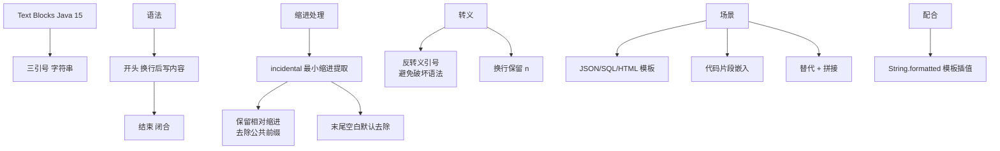

# 什么是Java 21的Text Blocks（文本块）？它如何处理缩进？有哪些实际应用场景？

Text Blocks在Java 15正式发布（JEP 378），允许多行字符串字面量而无需转义序列、拼接和手动换行符。文本块用三引号（""")界定，开头三引号后必须跟换行符。编译器会根据闭合分隔符的位置自动剥离偶然空白，同时保留内容的意图缩进。

```java
// 传统方式 - 冗长且难以阅读
String json = "{\n" +
    "  \"name\": \"Alice\",\n" +
    "  \"age\": 30,\n" +
    "  \"email\": \"alice@example.com\"\n" +
    "}";

// Text Blocks - 清晰直观
String json = """
        {
          "name": "Alice",
          "age": 30,
          "email": "alice@example.com"
        }
        """;
```

Text Blocks的缩进处理规则基于闭合"""的位置。编译器计算闭合"""之前的空白字符数作为最小缩进量，然后从每行去除等量的前导空白。这意味着闭合"""的缩进位置决定了内容中哪些空白被剥离（偶然空白）哪些被保留（意图缩进）。

#### 实战案例
在维护遗留系统时，经常需要编写复杂的SQL语句用于数据修复。直接在IDE中拼接SQL字符串极易因为引号转义错误导致语法异常。使用Text Blocks可以直接从SQL客户端粘贴SQL代码到Java文件中，且利用IDE的格式化功能保持SQL缩进，大大降低了手误率。

#### 动态拼接与格式化（实战代码）

```java
// 实战代码：结合 String.formatted 避免手动拼接
public String buildInsertScript(String tableName, List<String> columns) {
    String cols = String.join(", ", columns);
    return """
        INSERT INTO %s (%s)
        VALUES (?, ?, ?)
        ON CONFLICT (id) DO UPDATE SET updated_at = NOW();
        """.formatted(tableName, cols);
}
```

#### 对比表格：Text Blocks vs 字符串拼接

| 维度 | 字符串拼接 (+) | Text Blocks (""") |
| :--- | :--- | :--- |
| **可读性** | 差，充满转义符和换行符 | 极佳，所见即所得 |
| **维护性** | 修改结构需移动多个 `+` 号 | 直接编辑内容块 |
| **特殊字符** | `"` 需转义为 `\"` | `"` 无需转义（除 `"""` 自身） |
| **缩进处理** | 需手动加 `\n` 和空格 | 自动对齐，编译期剥离左侧空白 |
| **性能** | 编译期优化后无差异 | 编译期优化后无差异 |


## 核心架构图



## 记忆要点

- 语法规则：使用三引号“"""”界定，开头三引号后必须换行。
- 缩进处理机制：编译器依据闭合三引号的位置，自动剥离等量的左侧偶然空白保留意图缩进。
- 字符转义：传统拼接充满转义符，而文本块内部无需对双引号进行转义。
- 格式化实战：配合formatted()方法使用占位符，彻底避免繁琐的字符串加号拼接。

## 结构化回答

**30 秒电梯演讲：** 多行字符串字面量，自动处理缩进与转义。打个比方，像所见即所得的便签纸：怎么写排版，出来就是什么样。

**展开框架：**
1. **语法规则** — 使用三引号“"""”界定，开头三引号后必须换行。
2. **缩进处理机制** — 编译器依据闭合三引号的位置，自动剥离等量的左侧偶然空白保留意图缩进。
3. **字符转义** — 传统拼接充满转义符，而文本块内部无需对双引号进行转义。

**收尾：** 我在项目里踩过坑——在维护遗留系统时，经常需要编写复杂的SQL语句用于数据修复。您想深入聊哪一段：原理、避坑还是对比选型？

## 视频脚本

> 预计时长：2 分钟 | 由浅入深

| 时间 | 画面/字幕 | 口播台词 | 讲解要点 |
|------|----------|----------|----------|
| 0:00 | 标题卡：什么是Java 21的Text Bl… | "什么是Java 21的Text Blocks（文本块）？它如何处理缩进？有哪些实际应用场景？一句话——像所见即所得的便签纸：怎么写排版，出来就是什么样。" | 开场钩子 |
| 0:40 | 概念动画/示意图 | "多行字符串字面量，自动处理缩进与转义——像所见即所得的便签纸：怎么写排版，出来就是什么样" | 核心定义 |
| 1:20 | 语法规则示意 | "使用三引号“"""”界定，开头三引号后必须换行。" | 要点1 |
| 2:00 | 总结卡 | "记住这几条，面试不慌。下期讲进阶追问。" | 收尾 |
