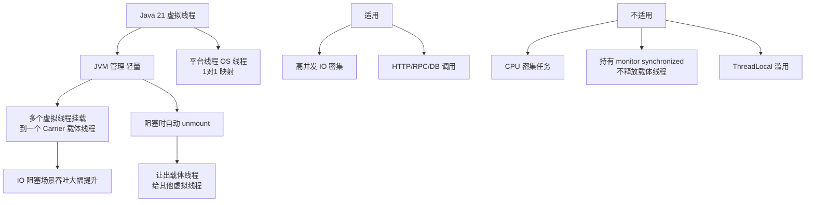

# 什么情况下虚拟线程不适用？使用虚拟线程时有哪些常见的陷阱和最佳实践？

虚拟线程虽然强大，但并非万能。理解其局限性对于正确使用至关重要。虚拟线程不适用于以下场景：

**1. CPU密集型任务**：虚拟线程在I/O阻塞时才会被卸载释放载体线程。对于CPU密集型计算，虚拟线程不会阻塞，载体线程会被一直占用，此时使用虚拟线程没有优势，反而增加调度开销。

**2. synchronized块内阻塞I/O（线程固定问题）**：当虚拟线程在synchronized块或方法内执行阻塞操作时，JVM无法卸载虚拟线程，导致载体线程被固定，浪费资源。

```java
// 问题代码 - synchronized导致线程固定
public synchronized String fetchData() {
    return httpClient.send(request, BodyHandlers.ofString());
}

// 正确做法 - 使用ReentrantLock替代synchronized
private final ReentrantLock lock = new ReentrantLock();

public String fetchData() {
    lock.lock();
    try {
        return httpClient.send(request, BodyHandlers.ofString());
    } finally {
        lock.unlock();
    }
}
```

**3. 大量使用ThreadLocal**：虚拟线程可以访问ThreadLocal变量，但单JVM可能支持数百万虚拟线程，每个虚拟线程如果都有ThreadLocal数据，内存开销将非常大。推荐使用Scoped Values（JEP 446预览特性）或显式传参。

**4. 使用池化虚拟线程的陷阱**：虚拟线程设计为用完即弃，不应该被池化。错误做法是为虚拟线程创建固定大小的池。正确做法是每个任务创建一个新的虚拟线程。

#### 实战案例
某系统在引入虚拟线程后，监控发现Carrier Thread（ForkJoinPool）长期处于100%负载。排查发现是因为代码中存在`ThreadLocal`缓存了大量大对象（如 SimpleDateFormat），虽然虚拟线程数量庞大，但因为线程固定问题，所有任务实际上挤占了少量的Carrier Thread，导致内存飙升且吞吐量下降。改用`DateTimeFormatter`（不可变对象）后解决。

#### 实战代码：使用 ThreadLocal 的替代方案

```java
// 错误：每个虚拟线程都创建一个连接池
// ThreadLocal<Connection> connHolder = ... 

// 正确：使用共享资源或 Scoped Values
private static final ConnectionPool SHARED_POOL = new ConnectionPool();

public void handleRequest() {
    // 直接从共享池获取，使用完归还，不依赖线程绑定
    try (var conn = SHARED_POOL.getConnection()) {
        conn.executeQuery(...);
    }
}
```

#### 对比表格：虚拟线程陷阱与解决方案

| 陷阱场景 | 问题现象 | 解决方案 |
| :--- | :--- | :--- |
| **synchronized 阻塞** | 载体线程被固定，无法卸载，吞吐下降 | 改用 `ReentrantLock` 或去除 `synchronized` |
| **ThreadLocal 滥用** | 堆内存溢出 | 使用 Scoped Value 或 共享不可变对象 |
| **CPU 密集型** | 调度开销增加，性能不如平台线程 | 切回传统线程池处理计算任务 |
| **池化虚拟线程** | 限制并发能力，违背设计初衷 | 使用 `newVirtualThreadPerTaskExecutor` |
| **文件 I/O** | 部分文件操作可能导致 Pin | 确保使用 NIO (Channel/Buffer) 而非阻塞 IO |

**最佳实践总结**：
1. 虚拟线程用于I/O密集型任务
2. 平台线程用于CPU密集型任务
3. 用ReentrantLock替代synchronized进行I/O操作的互斥控制
4. 不要池化虚拟线程，每个任务一个虚拟线程
5. 避免大量使用ThreadLocal，考虑Scoped Values
6. 使用-Djdk.tracePinnedThreads检测线程固定问题


## 核心架构图


## 记忆要点

- 场景不适：因为不阻塞不释放载体，所以CPU密集型任务不适用虚拟线程。
- 线程固定陷阱：因为在synchronized内执行IO阻塞会导致载体被钉死，所以必须替换为ReentrantLock。
- 内存陷阱：百万虚拟线程叠加ThreadLocal极易OOM，推荐使用Scoped Values或共享不可变对象。
- 使用禁忌：虚拟线程设计为用完即弃，所以严禁使用传统池化策略去复用它。

## 结构化回答

**30 秒电梯演讲：** 轻量级线程适合IO密集型，避雷CPU密集型、synchronized和池化。打个比方，像千万个“纸片人”过独木桥，适合排队等( IO )，不适合搬砖( CPU )。

**展开框架：**
1. **场景不适** — 因为不阻塞不释放载体，所以CPU密集型任务不适用虚拟线程。
2. **线程固定陷阱** — 因为在synchronized内执行IO阻塞会导致载体被钉死，所以必须替换为ReentrantLock。
3. **内存陷阱** — 百万虚拟线程叠加ThreadLocal极易OOM，推荐使用Scoped Values或共享不可变对象。

**收尾：** 这三点都能配合实战聊。您想深入聊原理、对比还是避坑？

## 视频脚本

> 预计时长：3 分钟 | 由浅入深

| 时间 | 画面/字幕 | 口播台词 | 讲解要点 |
|------|----------|----------|----------|
| 0:00 | 标题卡：什么情况下虚拟线程不适用？使用虚拟线… | "什么情况下虚拟线程不适用？使用虚拟线程时有哪些常见的陷阱和最佳实践？一句话——像千万个“纸片人”过独木桥，适合排队等( IO )，不适合搬砖( CPU )。" | 开场钩子 |
| 0:45 | 概念动画/示意图 | "轻量级线程适合IO密集型，避雷CPU密集型、synchronized和池化——像千万个“纸片人”过独木桥，适合排队等( IO )，不适合搬砖( CPU )" | 核心定义 |
| 1:30 | 场景不适示意 | "因为不阻塞不释放载体，所以CPU密集型任务不适用虚拟线程。" | 要点1 |
| 2:15 | 线程固定陷阱示意 | "因为在synchronized内执行IO阻塞会导致载体被钉死，所以必须替换为ReentrantLock。" | 要点2 |
| 3:00 | 总结卡 | "记住这几条，面试不慌。下期讲进阶追问。" | 收尾 |
