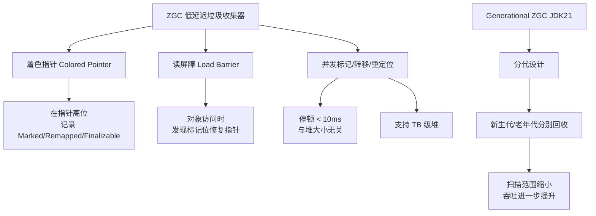
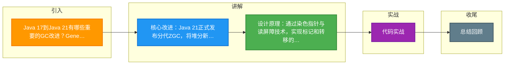

# Java 17到Java 21有哪些重要的GC改进？Generational ZGC带来了什么变化？

Java 17到Java 21在垃圾回收领域有重大进展，其中最重要的是Generational ZGC（分代ZGC）的引入（JEP 439，Java 21正式发布）。

**ZGC回顾**：ZGC（Z Garbage Collector）在Java 11引入（实验性），Java 15成为生产可用，Java 17进一步稳定。ZGC的核心设计目标是：无论堆大小如何，GC暂停时间都低于10毫秒（通常低于1毫秒）。ZGC通过以下技术实现这一目标：1）染色指针（Colored Pointers）——在64位指针中嵌入GC元数据；2）读屏障——拦截对象访问并在对象移动时更新引用；3）完全并发压缩——标记、转移、引用更新全部与应用线程并发执行。

**Generational ZGC**：Java 21之前ZGC是非分代的——所有对象不分老年代和新生代统一管理。但实际应用中，绝大多数对象都是朝生夕灭的（如请求级别的临时对象），分代回收可以显著提高效率。Generational ZGC将堆分为年轻代和老年代，年轻代收集频繁、老年代收集稀少。

```bash
# 启用Generational ZGC（JDK 21+默认启用分代模式）
java -XX:+UseZGC -Xmx16g -jar app.jar

# JDK 21中如果需要显式控制
java -XX:+UseZGC -XX:+ZGenerational -Xmx16g -jar app.jar

# JDK 23+移除了非分代ZGC，分代成为唯一模式
```

**实战案例**：在一家电商大促场景中，我们将16G堆的订单服务从G1升级到Java 21的Generational ZGC。高峰期API P99延迟从300ms（G1 Full GC导致）降低至5ms以内，且吞吐量不仅未下降反而提升了约5%，因为大量促销产生的临时对象在Young GC中迅速回收，避免了频繁的全堆扫描。

**性能对比**：
```
GC方案对比（典型Web应用，堆大小16GB）
┌─────────────────────┬────────────┬────────────┬────────────────┐
│  收集器              │ 平均暂停     │ P99暂停     │ 吞吐量          │
├─────────────────────┼────────────┼────────────┼────────────────┤
│  G1 GC (Java 17)    │ 50-200ms   │ 200-500ms  │ ~95%           │
│  ZGC (Java 17)      │ <1ms       │ <10ms      │ ~85-90%        │
│  Gen ZGC (Java 21)  │ <1ms       │ <1ms       │ ~90-95%        │
│  Shenandoah (J21)   │ <10ms      │ <10ms      │ ~90-95%        │
└─────────────────────┴────────────┴────────────┴────────────────┘
```

Generational ZGC的关键改进：1）分配率提升——年轻代回收比全堆回收快得多，减少了分配停顿；2）吞吐量改善——减少了对读屏障的依赖频率；3）内存开销降低——更高效的标记和转移策略；4）适合大堆——即使在数百GB堆上也能保持亚毫秒级暂停。

**Shenandoah GC**也值得关注。Shenandoah由Red Hat开发，通过Brooks转发指针实现并发转移和压缩，暂停时间通常在10毫秒以下且与堆大小无关。Shenandoah在Red Hat生态系统中成熟稳定，适合交互式系统和中大型堆（8-64GB）。Java 21中Shenandoah也支持分代模式。

**JVM调优建议**：ZGC几乎不需要调优，建议保持默认配置。关键监控指标：暂停时间分布（关注P95/P99而非平均值）、分配速率、并发周期持续时间、CPU使用率。使用-XX:+UseZGC -Xlog:gc*记录GC日志，通过GCeasy等工具分析。

## 技术原理

- **ZGC 的染色指针（Colored Pointer）**：64 位指针中高位原本未使用，ZGC 借用其中 4 位存 GC 元数据（Marked0/Marked1/Remapped/Finalizable）。每次 GC 周期切换"活跃颜色"，标记阶段遍历对象图时修改指针的颜色位。这让 ZGC 无需修改对象头就能知道"这个引用是否已被标记/是否需要重定向"。但染色指针要求 64 位平台 + 多虚拟地址映射（Linux 的 `mmap` 多次映射同一物理页到不同虚拟地址），32 位平台无法用。
- **读屏障（Load Barrier）实现并发转移**：ZGC 在每次 `对象引用读取` 时插入屏障代码（JIT 生成）——若读到的指针"颜色不对"（指向已转移的旧地址），屏障原地修复指针指向新地址，并更新引用。这让对象移动与业务线程**完全并发**——业务线程读对象时若发现对象已搬家，顺手把引用更新到新地址。停顿只在**GC 根扫描的初始标记**和**最终标记**两个极短阶段（<1ms）发生。
- **非分代 ZGC 的性能瓶颈**：Java 21 前的 ZGC 把所有对象统一管理，每次 GC 扫描全堆。但实际应用中"朝生夕灭的临时对象"占绝大多数（如 HTTP 请求对象、字符串），把它们和老对象一起扫描浪费——年轻代对象死亡率高，单独高频回收效率更好。**这是 ZGC 引入分代的核心动机**。
- **Generational ZGC 的改进**：①堆分为 Young/Old，Young GC 只扫年轻代（几十 MB），频率高但每次极快；Old GC 扫老年代，频率低。②引入**记忆集（Remembered Set）**——记录"老年代指向年轻代"的跨代引用，Young GC 时只扫 RS 而非全堆。③减少读屏障开销——非分代 ZGC 每次读对象都过屏障，分代 ZGC 在 Young GC 频率高但扫描范围小，整体屏障开销下降。结果：吞吐量从 85% 提到 90-95%，停顿仍 <1ms。

## 对比/选型

| 收集器 | 平均停顿 | P99 停顿 | 吞吐量 | 适用堆 | JDK |
|--------|---------|---------|--------|--------|-----|
| G1 | 50-200ms | 200-500ms | 95% | 4-64GB | 9+ |
| ZGC（非分代） | <1ms | <10ms | 85-90% | 4-16TB | 15+ |
| **Gen ZGC** | <1ms | <1ms | 90-95% | 4-16TB | 21+ |
| Shenandoah | <10ms | <10ms | 90-95% | 8-64GB | 17+ |
| Parallel | 100-500ms | 1s+ | 99% | 任意 | 默认 |

## 命令演示

```bash
# 启用 Generational ZGC（JDK 21+，默认就是分代）
java -XX:+UseZGC -Xmx16g -Xlog:gc*=info:file=gc.log:time,uptime,level,tags -jar app.jar

# JDK 21 显式开启分代（默认已开）
java -XX:+UseZGC -XX:+ZGenerational -Xmx16g -jar app.jar

# JDK 23+ 非分代 ZGC 已移除，分代成为唯一模式
# 无需 -XX:+ZGenerational 标志

# 关键参数（ZGC 几乎免调优，但可监控）
-XX:+UseZGC
-XX:ZUncommitDelay=300s        # 内存归还 OS 的延迟
-XX:SoftMaxHeapSize=12g        # 软上限，ZGC 尽力保持堆不超此值
-XX:ConcGCThreads=4            # 并发 GC 线程数（默认 CPU 核数的 12.5%）
-XX:ParallelGCThreads=16       # STW 阶段线程数

# 监控 GC 停顿（关键：关注 P99 而非平均）
jcmd <pid> GC.async_log        # 异步日志查看停顿分布
# 或用 Prometheus + Micrometer 监控 jvm_gc_pause_seconds{action="end of minor GC"}

# 大堆测试（验证 ZGC 的"堆大小无关停顿"承诺）
java -XX:+UseZGC -Xmx512g -jar app.jar
# 即使 512GB 堆，停顿仍 <1ms（这是 ZGC 的杀手锏）
```

## 常见坑/注意事项

- **ZGC 的吞吐量代价**：分代前 ZGC 吞吐量比 G1 低 5-10%（读屏障开销）。分代 ZGC 基本追平 G1，但极致吞吐场景（如批处理 ETL）仍可能用 Parallel 或 G1。选型要权衡——延迟敏感选 ZGC，吞吐敏感选 G1/Parallel。
- **内存占用略高**：ZGC 的染色指针和记忆集需要额外内存（约堆的 10-15%）。512GB 堆可能多占 50-75GB。容器化部署要预留这部分。
- **不要在 JDK 21 前用 ZGC 做生产**：JDK 11-17 的 ZGC 仍是实验性或早期版本，分代前吞吐量损失明显。JDK 21 的 Gen ZGC 才是"既快又稳"的版本。
- **临时对象分配率过高仍可能 OOM**：ZGC 停顿虽短，但若对象分配速度超过 GC 回收速度，堆仍会涨满。监控分配速率（`jvm_gc_allocation_bytes_total`），异常增长时排查业务代码（如循环内创建大对象）。
- **与容器/cgroup 的兼容性**：早期 ZGC 在容器内可能误判 CPU 核数（导致 ConcGCThreads 过多或过少）。JDK 21 已修复，但低版本要手动指定 `-XX:ConcGCThreads` 和 `-XX:ParallelGCThreads`。
- **Shenandoah 的替代选型**：Red Hat 生态（OpenJDK 17/21）默认带 Shenandoah，停顿 10ms 级，吞吐略高于 ZGC。若用 Red Hat 版 OpenJDK，Shenandoah 是合理选择；Oracle/OpenJDK 主线选 ZGC。


## 核心架构图



## 记忆要点

- 核心改进：Java 21正式发布分代ZGC，将堆分新老年代以提升吞吐并降低开销。
- 设计原理：通过染色指针与读屏障技术，实现标记和转移的完全并发。
- 关键指标：无论堆大小如何，ZGC垃圾回收暂停时间均稳定在亚毫秒级（<1ms）。
- 实战调优：大促高并发下，用Gen ZGC替换G1，避免了Full GC的长尾延迟并提升P99响应。

## 结构化回答

**30 秒电梯演讲：** ZGC加入分代机制，兼顾低延迟与高吞吐。打个比方，把垃圾分“新垃圾”和“旧垃圾”处理，只频繁打扫容易脏的地方。

**展开框架：**
1. **核心改进** — Java 21正式发布分代ZGC，将堆分新老年代以提升吞吐并降低开销。
2. **设计原理** — 通过染色指针与读屏障技术，实现标记和转移的完全并发。
3. **关键指标** — 无论堆大小如何，ZGC垃圾回收暂停时间均稳定在亚毫秒级（<1ms）。

**收尾：** 我在项目里踩过坑——GC方案对比（典型Web应用，堆大小16GB）。您想深入聊哪一段：原理、避坑还是对比选型？

## 视频脚本

> 预计时长：3 分钟 | 由浅入深

| 时间 | 画面/字幕 | 口播台词 | 讲解要点 |
|------|----------|----------|----------|
| 0:00 | 标题卡：Java 17到Java 21有哪些… | "Java 17到Java 21有哪些重要的GC改进？Generational ZGC带来了什么变化？一句话——把垃圾分“新垃圾”和“旧垃圾”处理，只频繁打扫容易脏的地方。" | 开场钩子 |
| 0:45 | 概念动画/示意图 | "ZGC加入分代机制，兼顾低延迟与高吞吐——把垃圾分“新垃圾”和“旧垃圾”处理，只频繁打扫容易脏的地方" | 核心定义 |
| 1:30 | 核心改进示意 | "Java 21正式发布分代ZGC，将堆分新老年代以提升吞吐并降低开销。" | 要点1 |
| 2:15 | 设计原理示意 | "通过染色指针与读屏障技术，实现标记和转移的完全并发。" | 要点2 |
| 3:00 | 总结卡 | "记住这几条，面试不慌。下期讲进阶追问。" | 收尾 |

### 视频流程图



