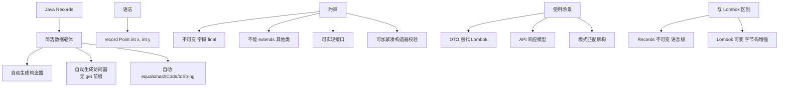

# 什么是Record Patterns（记录模式）？它如何实现嵌套解构？请举例说明。

Record Patterns是Java 21正式发布的特性（JEP 440），允许在模式匹配中解构Record的组件。它是Java模式匹配体系的重要拼图，使得开发者可以像函数式语言一样优雅地处理嵌套数据结构。Record Patterns可以与instanceof和switch表达式结合使用，支持嵌套解构。

```java
public record Point(int x, int y) {}
public record Shape(String type, Point center, double size) {}
public record ColoredLine(Line line, String color) {}
```

**基本Record Pattern（与instanceof结合）**：
```java
public void printPoint(Object obj) {
    if (obj instanceof Point(int x, int y)) {
        System.out.println("x=" + x + ", y=" + y);
    }
}
```

**嵌套Record Pattern**：
```java
public void processShape(Object obj) {
    if (obj instanceof Shape(String type, Point(int cx, int cy), double size)) {
        System.out.println(type + " at (" + cx + "," + cy + ") size=" + size);
    }
}
```

**实战案例**：在处理复杂的JSON响应解析时，我们定义了嵌套Record结构（如`Response(Result(Data(String value)))`）。使用Record Pattern配合Switch，在Service层直接解构出核心业务数据，替代了原有的一层层`if (obj instanceof X) { x.get... }`样板代码，代码行数减少了40%且逻辑清晰度大幅提升。

**Record Pattern与Switch表达式结合**：
```java
public sealed interface Tree<T> permits Leaf, Node {}
public record Leaf<T>(T value) implements Tree<T> {}
public record Node<T>(Tree<T> left, Tree<T> right) implements Tree<T> {}

public static <T> int countLeaves(Tree<T> tree) {
    return switch (tree) {
        case Leaf<T>(var v) → 1;
        case Node<T>(var left, var right) → countLeaves(left) + countLeaves(right);
    };
}
```

## 常见考点
1. **Record Pattern 在解构时如果组件类型不匹配会发生什么？**
   - 如果 instanceof 右侧的 Record Pattern 中声明的组件类型（如 `Point(int x, int y)`）与实际 Record 组件类型不一致，匹配直接失败，不会抛出 `ClassCastException`，这提供了类型安全。
2. **Record Pattern 是否支持 var 类型推导？**
   - 支持。例如 `instanceof Point(var x, var y)`，编译器会根据 Record 组件的定义自动推导 x 和 y 的类型。若 Record 组件本身是泛型，var 可能会捕获通配符类型，需谨慎使用。
3. **如何在 Switch 中处理 null 值？**
   - Java 21 的 Switch 模式匹配允许单独的 `case null` 标签。如果 Record Pattern 匹配的对象为 null，且没有 `case null`，则会抛出 `NullPointerException`。


## 核心架构图


## 记忆要点

- Java 21正式特性，核心价值是像函数式语言一样优雅解构Record组件数据
- 支持嵌套解构，底层能自动推导var类型，且类型不匹配仅返回false不报错
- 常与Switch表达式结合，利用case null安全处理空值，替代冗长的if-else
- 因减少了强转样板代码，处理复杂JSON响应时代码行数可大幅缩减

## 结构化回答

**30 秒电梯演讲：** 在模式匹配中直接解构Record组件，支持嵌套提取。打个比方，像拆快递，一层层剥开包装，直接拿到里面的商品数据。

**展开框架：**
1. **Java 21正式特性** — 核心价值是像函数式语言一样优雅解构Record组件数据
2. **支持嵌套解构** — 底层能自动推导var类型，且类型不匹配仅返回false不报错
3. **常与Switch表达式结合** — 利用case null安全处理空值，替代冗长的if-else

**收尾：** 我在项目里踩过坑——public sealed interface Tree<T> permits Leaf, Node {}。您想深入聊哪一段：原理、避坑还是对比选型？

## 视频脚本

> 预计时长：3 分钟 | 由浅入深

| 时间 | 画面/字幕 | 口播台词 | 讲解要点 |
|------|----------|----------|----------|
| 0:00 | 标题卡：什么是Record Patterns… | "什么是Record Patterns（记录模式）？它如何实现嵌套解构？请举例说明。？一句话——像拆快递，一层层剥开包装，直接拿到里面的商品数据。" | 开场钩子 |
| 0:45 | 概念动画/示意图 | "在模式匹配中直接解构Record组件，支持嵌套提取——像拆快递，一层层剥开包装，直接拿到里面的商品数据" | 核心定义 |
| 1:30 | Java 21正式特性示意 | "核心价值是像函数式语言一样优雅解构Record组件数据" | 要点1 |
| 2:15 | 支持嵌套解构示意 | "底层能自动推导var类型，且类型不匹配仅返回false不报错" | 要点2 |
| 3:00 | 总结卡 | "记住这几条，面试不慌。下期讲进阶追问。" | 收尾 |
