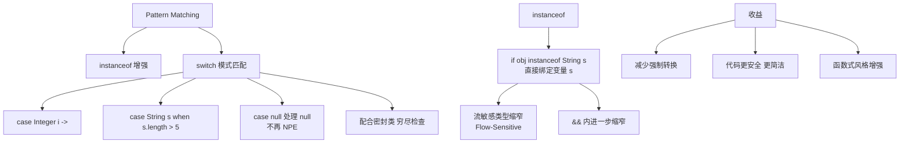

# JDK 21的Pattern Matching（模式匹配）有哪些重要改进？

🎯 **本质**：模式匹配让Java代码更简洁安全，减少冗余的类型检查和转换。

📊 **主要特性**：
1. **instanceof模式匹配**（JDK 16正式）
```java
// 新: if (obj instanceof String s) { ... }
```

2. **Switch模式匹配**（JDK 21正式）
```java
return switch (o) {
    case null      → "Oops, null";
    case Integer i → String.format("int %d", i);
    case String s  → String.format("String %s", s);
    default        → o.toString();
};
```

3. **Record模式**（JDK 21正式）
```java
if (obj instanceof Point(int x, int y)) { System.out.println(x + y); }
```

4. **卫语句**
```java
switch (shape) {
    case Circle c when c.radius() > 100 → "large";
    case Circle c                        → "small";
}
```

**实战案例**：在支付回调处理逻辑中，以前需要写一堆 `if-else` 配合 `instanceof` 判断不同的支付渠道对象（支付宝、微信、银联），然后强转后获取订单号。使用 Switch 模式匹配后，代码变成了一个清晰的 Switch 块，利用卫语句 `when channel.status() == SUCCESS` 直接过滤无效状态，不仅减少了NPE风险，还使得新增渠道只需增加一个 case 分支。

## 常见考点
1. **Switch 模式匹配的 `null` 处理有什么变化？**
   - 在旧版 Switch 中，传 `null` 会直接抛出 NPE。在模式匹配 Switch 中，必须显式处理 `case null`，或者由类型模式隐式处理（如果是对象引用类型）。如果没有 `null` 处理分支且传入了 `null`，会抛出 `NullPointerException`，但这发生在运行时匹配失败时，编译器允许这种情况。
2. **卫语句中的 `when` 表达式必须是常量吗？**
   - 不是。`when` 后面可以跟任意布尔表达式，能够访问 case 标签中捕获的变量（如 `when s.length() > 5`）。这提供了比枚举常量更灵活的条件过滤能力。
3. **模式匹配是否覆盖了基本类型？**
   - 部分覆盖。Switch 表达式现在支持直接匹配基本类型（如 `case int i`），但要注意如果传入的是 `Integer` 对象，依然需要进行拆箱匹配，且要注意处理 `null` 的情况（基本类型 case 不能匹配 null）。

## 技术原理

Pattern Matching 的本质是**把"类型检查 + 类型转换 + 变量绑定"三步合并为一个原子操作**，让 Java 在语法上接近 Scala/Kotlin 的表达力。它的演进分四个里程碑，每次都在消除一种样板代码。

- **instanceof 模式匹配（JDK 16）——消除强转样板**：旧写法 `if (obj instanceof String) { String s = (String) obj; ... }` 要写两次 String（判断一次、强转一次）。新写法 `if (obj instanceof String s) { ... }` 判断成功后 s 自动绑定且作用域正确。编译器在 `instanceof` 成立的分支里自动把 obj 当作 String 类型，避免重复强转和潜在的类型不安全。
- **Switch 模式匹配（JDK 21 转正）——消除 if-else 链**：旧代码处理多种类型用一长串 `if-else if (obj instanceof X) {...}`，可读性差且易遗漏分支。新 Switch 支持直接 `case Integer i → ...` 匹配类型，并且**编译器会检查穷举性**（sealed 类必须覆盖所有子类，否则要 default）。这把"忘记处理某个子类"从运行时 NPE 变成编译期错误。
- **Record 模式（JDK 21）——直接解构数据**：`if (obj instanceof Point(int x, int y))` 直接把 Record 的组件变量提取出来，不用再 `getXxx()`。嵌套 Record 还能递归解构（`case Line(Point(int x1,int y1), Point(int x2,int y2))`），处理树状数据极简。
- **卫语句 `when`（JDK 21）——条件过滤**：`case Circle c when c.radius() > 100` 让分支除了类型匹配还加布尔条件，避免在 case 体内再写 if。卫语句短路求值，匹配失败会继续向下匹配其他 case。

## 代码示例

```java
// 1. instanceof 模式匹配：消除强转
Object obj = "hello";

// 旧写法（冗余且易错）
if (obj instanceof String) {
    String s = (String) obj;     // 强转，可能出错
    System.out.println(s.length());
}

// 新写法（JDK 16+，类型检查+绑定+作用域一次完成）
if (obj instanceof String s) {
    System.out.println(s.length());   // s 作用域仅在本分支
} else if (obj instanceof Integer i) {
    System.out.println(i * 2);
}

// 配合 && 短路（s 只在条件成立时绑定）
if (obj instanceof String s && s.length() > 3) {
    System.out.println(s.toUpperCase());
}
```

```java
// 2. Switch 模式匹配 + 穷举性检查（sealed 类强校验）
sealed interface Shape permits Circle, Square, Triangle {}
record Circle(double radius) implements Shape {}
record Square(double side) implements Shape {}
record Triangle(double base, double height) implements Shape {}

String describe(Shape s) {
    // 编译器检查：sealed 类的所有子类都覆盖了吗？
    return switch (s) {
        case Circle c -> "圆，半径 " + c.radius();
        case Square sq -> "方，边长 " + sq.side();
        case Triangle t -> "三角形，底" + t.base();
        // 没有 default：如果新增 Shape 子类忘了处理，编译失败
    };
}
```

```java
// 3. Record 解构 + 卫语句 when
record Point(int x, int y) {}
record Line(Point start, Point end) {}

String classify(Object obj) {
    return switch (obj) {
        case null -> "空";                                    // 显式 null
        case Point(int x, int y) when x == y -> "对角点";
        case Point(int x, int y) -> "普通点(" + x + "," + y + ")";
        case Line(Point(int x1, int y1), Point(int x2, int y2))
            when x1 == x2 && y1 == y2 -> "零长度线";          // 嵌套解构+卫语句
        case Line(Point s, Point e) -> "线段";
        default -> "其他";
    };
}
```

```java
// 4. 实战：支付回调处理（旧 vs 新对比）
sealed interface PayCallback permits AlipayCallback, WechatCallback, UnionPayCallback {}

// 旧写法：一堆 if-else + 强转
class OldStyle {
    void handle(PayCallback cb) {
        if (cb instanceof AlipayCallback) {
            AlipayCallback a = (AlipayCallback) cb;
            if (a.getStatus() == SUCCESS) { processOrder(a.getOrderId()); }
        } else if (cb instanceof WechatCallback) {
            WechatCallback w = (WechatCallback) cb;
            if (w.getStatus() == SUCCESS) { processOrder(w.getOrderId()); }
        }
        // 新增渠道要改这里，容易漏
    }
}

// 新写法：Switch 模式匹配 + 卫语句
class NewStyle {
    void handle(PayCallback cb) {
        switch (cb) {
            case AlipayCallback a when a.getStatus() == SUCCESS ->
                processOrder(a.getOrderId());
            case WechatCallback w when w.getStatus() == SUCCESS ->
                processOrder(w.getOrderId());
            case UnionPayCallback u when u.getStatus() == SUCCESS ->
                processOrder(u.getOrderId());
            case PayCallback other -> log.warn("未处理回调: {}", other);
        }
    }
}
```

## 对比选型

| 特性 | 旧 if-else+instanceof | Switch 模式匹配 | 访问者模式 |
| :--- | :--- | :--- | :--- |
| **类型分支** | 手写 if 链 | 编译器语法支持 | 双分派 |
| **强转** | 必须 | 不需要 | 不需要 |
| **穷举性检查** | 无（漏分支运行时才发现） | 有（sealed 类编译期校验） | 有（接口约定） |
| **条件过滤** | 体内 if | 卫语句 when | 不支持 |
| **新增类型** | 改原方法 | 改原 Switch（编译器提醒） | 加新 visit 方法（不改原类） |
| **可读性** | 差（嵌套深） | 好（扁平） | 中（双分派绕） |

## 常见坑

- **null 必须显式 case**：模式匹配 Switch 里如果没写 `case null`，传入 null 会抛 NPE（不像旧 Switch 的默认行为）。所以要么显式 `case null`，要么提前判空。
- **case 顺序敏感**：`case Circle c when c.radius() > 100` 必须在 `case Circle c` 之前，否则永远匹配不到（卫语句版本的会被通配版本短路）。编译器不报错，是逻辑陷阱。
- **卫语句只支持 `when` 不支持 `if`**：`case Circle c if c.radius() > 100` 是旧 Preview 语法，正式版改成了 `when`。混用会编译失败。
- **基本类型匹配要拆箱**：`case int i` 匹配的是基本类型，传 `Integer` 对象会先拆箱。如果 `Integer` 是 null，拆箱抛 NPE——所以基本类型 case 必须配 `case null` 兜底。
- **Record 解构依赖组件顺序**：`Point(int x, int y)` 的 x、y 严格对应 Record 声明顺序，写反了不会报错但语义错误。
- **sealed 类的 permits 列表要完整**：sealed 类必须列出所有允许的实现类，且这些类必须 `final` 或 `sealed` 或 `non-sealed`。漏一个会导致编译失败。


## 核心架构图



## 记忆要点

- 核心目的：消除冗余的类型检查与强转，新instanceof直接绑定局部变量
- Switch增强：JDK 21转正，支持复杂对象匹配且必须显式处理case null
- 卫语句：用when结合布尔表达式，提供比枚举常量更灵活的条件过滤
- 模式分类：涵盖类型模式、Record解构模式，大幅简化多分支业务逻辑

## 结构化回答

**30 秒电梯演讲：** 将类型检查与数据绑定合二为一，消除样板代码。打个比方，像安检仪，过检的同时直接把身份证信息读出来，不用再查册子。

**展开框架：**
1. **核心目的** — 消除冗余的类型检查与强转，新instanceof直接绑定局部变量
2. **Switch增强** — JDK 21转正，支持复杂对象匹配且必须显式处理case null
3. **卫语句** — 用when结合布尔表达式，提供比枚举常量更灵活的条件过滤

**收尾：** 这三点都能配合实战聊。您想深入聊原理、对比还是避坑？

## 视频脚本

> 预计时长：2 分钟 | 由浅入深

| 时间 | 画面/字幕 | 口播台词 | 讲解要点 |
|------|----------|----------|----------|
| 0:00 | 标题卡：JDK 21的Pattern Mat… | "JDK 21的Pattern Matching（模式匹配）有哪些重要改进？一句话——像安检仪，过检的同时直接把身份证信息读出来，不用再查册子。" | 开场钩子 |
| 0:40 | 概念动画/示意图 | "将类型检查与数据绑定合二为一，消除样板代码——像安检仪，过检的同时直接把身份证信息读出来，不用再查册子" | 核心定义 |
| 1:20 | 核心目的示意 | "消除冗余的类型检查与强转，新instanceof直接绑定局部变量" | 要点1 |
| 2:00 | 总结卡 | "记住这几条，面试不慌。下期讲进阶追问。" | 收尾 |
