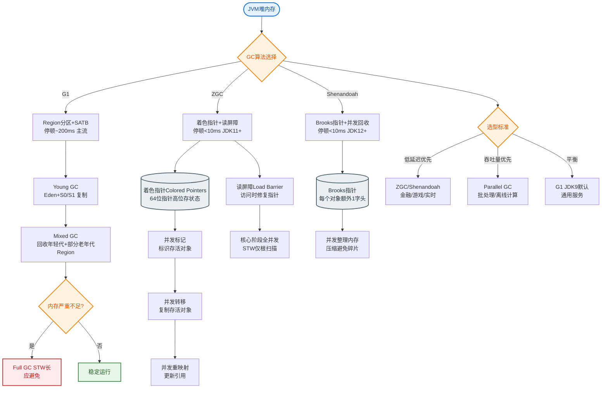
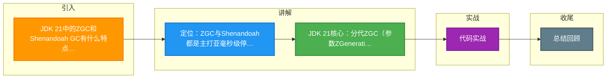

# JDK 21中的ZGC和Shenandoah GC有什么特点？如何选择GC？

🎯 本质：ZGC 和 Shenandoah 都是低延迟垃圾收集器，目标是将 GC 暂停时间控制在亚毫秒级。

📊 对比：
| 特性 | ZGC | Shenandoah | G1 |
|------|-----|------------|-----|
| 暂停时间 | <1ms (亚毫秒) | <10ms | 10-200ms |
| 堆大小支持 | 16TB+ | 数百GB | 数十GB |
| 核心技术 | 染色指针+读屏障 | Brooks 指针+转发指针 | 分区+混合回收 |
| 负载均衡 | 好 (多线程并发) | 一般 | 好 |
| JDK21改进 | 分代 ZGC (JEP439) | - | - |

🔧 **分代 ZGC（JDK 21 最重要改进）**：
1. 将堆分为年轻代和老年代，大幅减少需要扫描的对象（利用弱分代假说）。
2. 显著降低 CPU 开销（之前不分代 ZGC 的吞吐量有时低于 G1）。
3. 启用：`java -XX:+UseZGC -XX:+ZGenerational -jar app.jar`
4. 不再需要调优参数，开箱即用（自适应调整）。

**实战案例**：在高频交易系统中，G1 的偶尔 200ms 停顿会导致丢包，切换到 ZGC 后 P99 延迟稳定在 2ms 以内，但需注意 ZGC 在小堆（<4GB）下可能因 CPU Barrier 开销导致吞吐量略低于 G1。

**ZGC 染色指针原理**：
ZGC 利用 64 位指针的闲置位存储颜色信息，实现并发整理。

```text
┌───────────────────────────────────────────────────────┐
│                   64-bit Address                      │
├──────┬───────┬───────────┬────────────────────────────┤
│ Unused│ Finalizable│  Remapped │  View  │  Physical   │
│  4bits│   1bit   │    1bit   │ 1bit   │   Address    │
│      │         │           │        │    (42-bit)   │
└──────┴───────┴───────────┴────────┴──────────────────┘
```
- **Remapped/Marked0/Marked1**: 标记对象状态。
- 读屏障：JIT 在读取对象引用时插入一小段代码，检查指针颜色，若对象正在移动则触发自愈。

选择建议：
- 低延迟服务（交易系统、实时风控）→ ZGC（分代）
- 高吞吐+低延迟（大数据处理，且无法迁移到较新 JDK）→ Shenandoah
- 通用场景（Web 应用）→ G1
- JDK 8/11 老系统 → G1

调优要点：堆大小设为容器内存的 50-75%，`-Xmx`=`-Xms` 避免动态扩展开销。

## 常见考点
1. **ZGC 能在 32 位 JVM 运行吗？**
   不能。ZGC 依赖染色指针，需要 64 位地址空间（实际支持 46 位物理地址，预留高位做颜色）。
2. **Shenandoah 的 Brooks Pointer 是什么？**
   它是在对象头中存储一个 Forwarding Pointer。相比 ZGC 的染色指针，它不依赖 CPU 指针宽度的闲置位，因此对操作系统兼容性更好，但增加了对象的内存开销（多了引用字段）。
3. **分代 ZGC 为什么能提升吞吐量？**
   因为大部分对象朝生夕死，年轻代 GC 频繁且只需扫描少量区域，避免了全堆扫描的高昂 Barrier 成本。


## 核心流程图


## 记忆要点

- 定位：ZGC与Shenandoah都是主打亚毫秒级停顿的并发低延迟垃圾收集器
- JDK 21核心：分代ZGC(参数ZGenerational)落地，利用弱分代假说提升吞吐
- ZGC原理：依赖64位染色指针与读屏障自愈，而Shenandoah依赖转发指针
- 选型：低延迟选ZGC，兼顾吞吐选Shenandoah，Web通用场景选G1

## 结构化回答

**30 秒电梯演讲：** 低延迟收集器，目标停顿<1ms，支持分代回收。打个比方，像“吸尘器”，工作时人几乎感觉不到停顿。

**展开框架：**
1. **定位** — ZGC与Shenandoah都是主打亚毫秒级停顿的并发低延迟垃圾收集器
2. **JDK 21核心** — 分代ZGC(参数ZGenerational)落地，利用弱分代假说提升吞吐
3. **ZGC原理** — 依赖64位染色指针与读屏障自愈，而Shenandoah依赖转发指针

**收尾：** 我在项目里踩过坑——ZGC 利用 64 位指针的闲置位存储颜色信息，实现并发整理。您想深入聊哪一段：原理、避坑还是对比选型？

## 视频脚本

> 预计时长：3 分钟 | 由浅入深

| 时间 | 画面/字幕 | 口播台词 | 讲解要点 |
|------|----------|----------|----------|
| 0:00 | 标题卡：JDK 21中的ZGC和Shenan… | "JDK 21中的ZGC和Shenandoah GC有什么特点？如何选择GC？一句话——像“吸尘器”，工作时人几乎感觉不到停顿。" | 开场钩子 |
| 0:45 | 概念动画/示意图 | "低延迟收集器，目标停顿<1ms，支持分代回收——像“吸尘器”，工作时人几乎感觉不到停顿" | 核心定义 |
| 1:30 | 定位示意 | "ZGC与Shenandoah都是主打亚毫秒级停顿的并发低延迟垃圾收集器" | 要点1 |
| 2:15 | JDK 21核心示意 | "分代ZGC(参数ZGenerational)落地，利用弱分代假说提升吞吐" | 要点2 |
| 3:00 | 总结卡 | "记住这几条，面试不慌。下期讲进阶追问。" | 收尾 |

### 视频流程图



